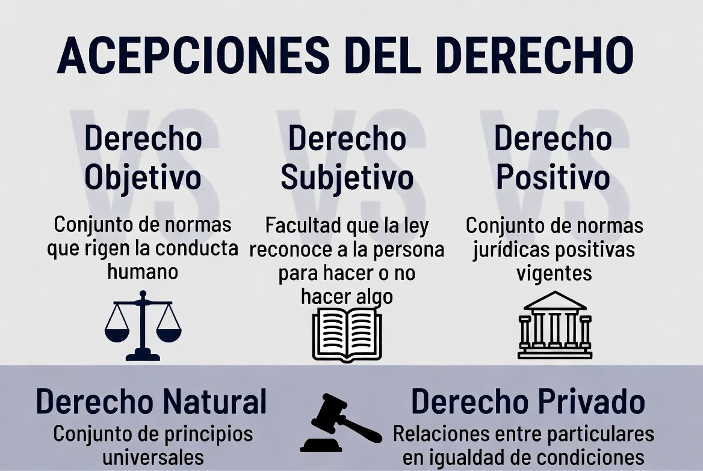
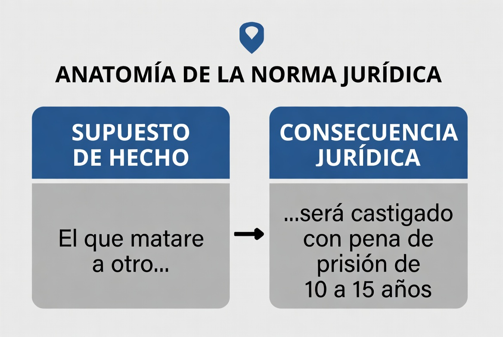
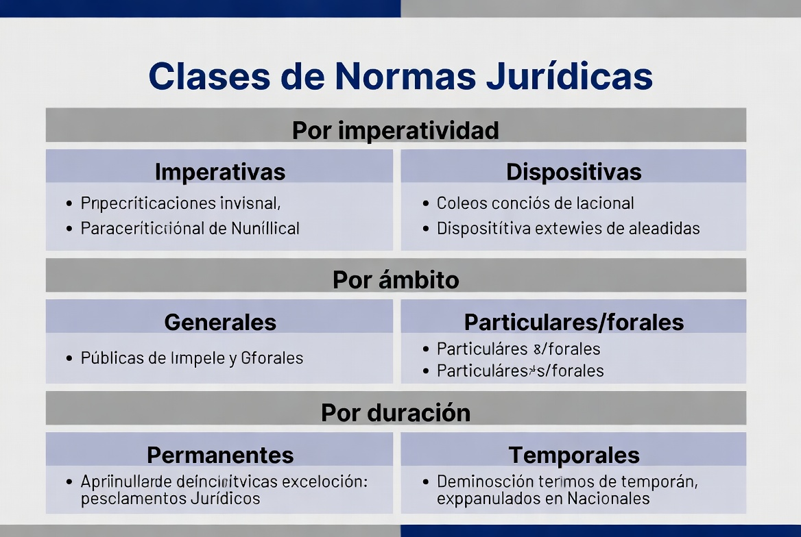
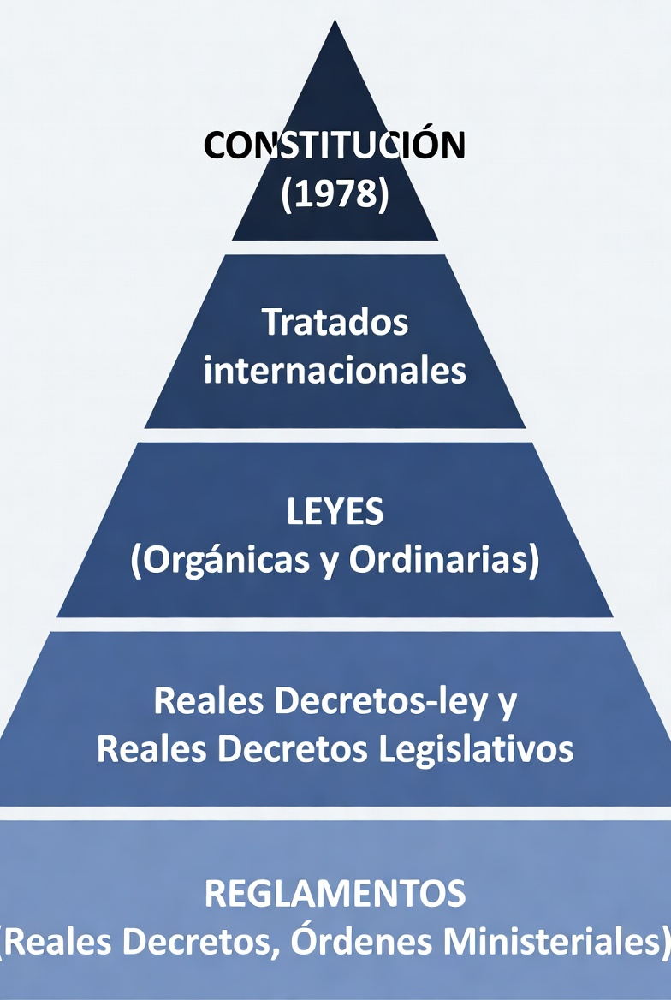
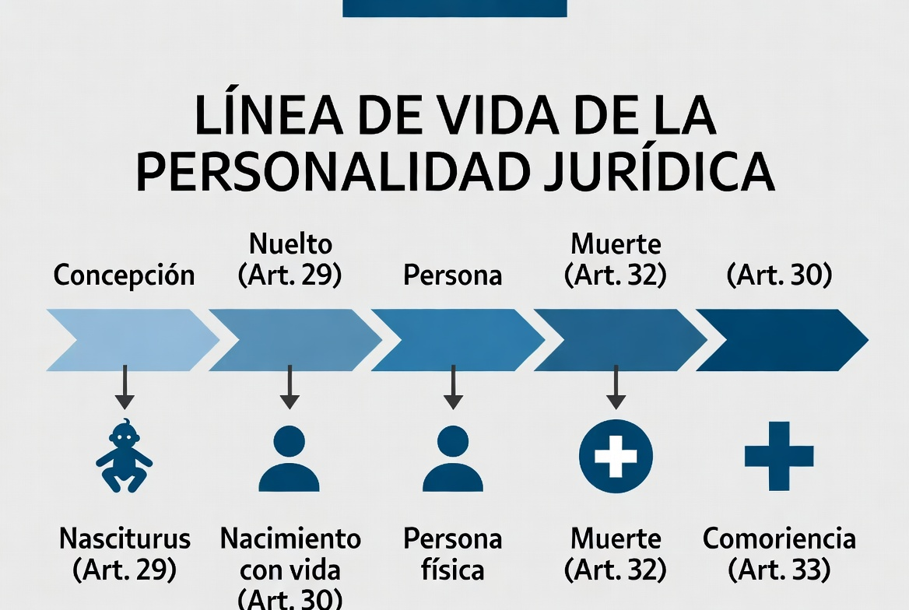
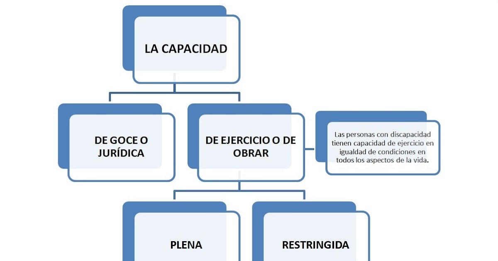
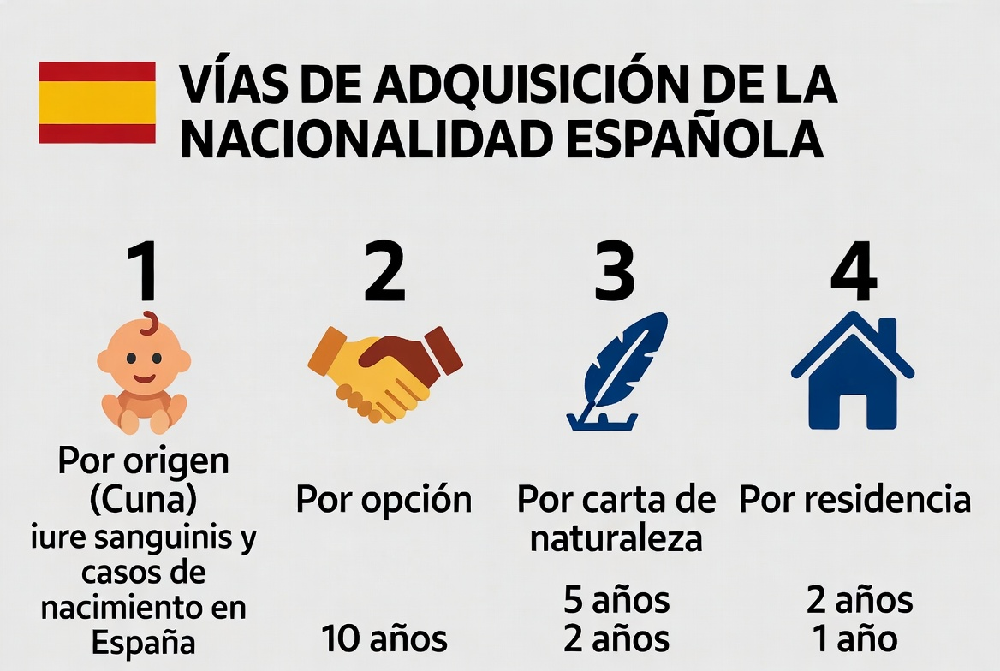
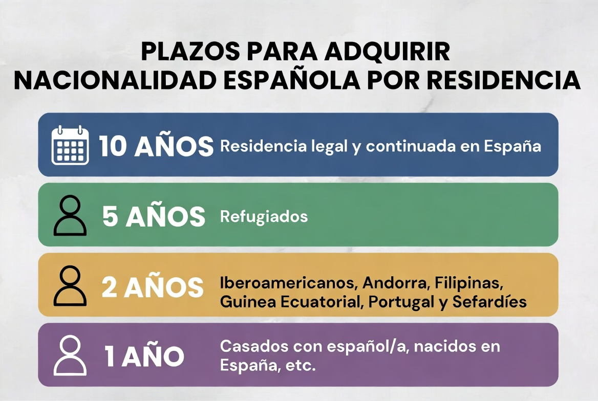
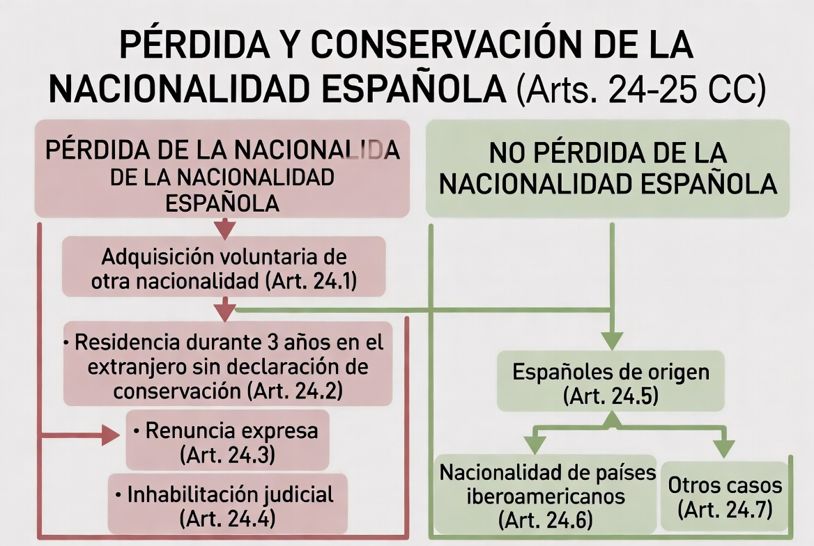
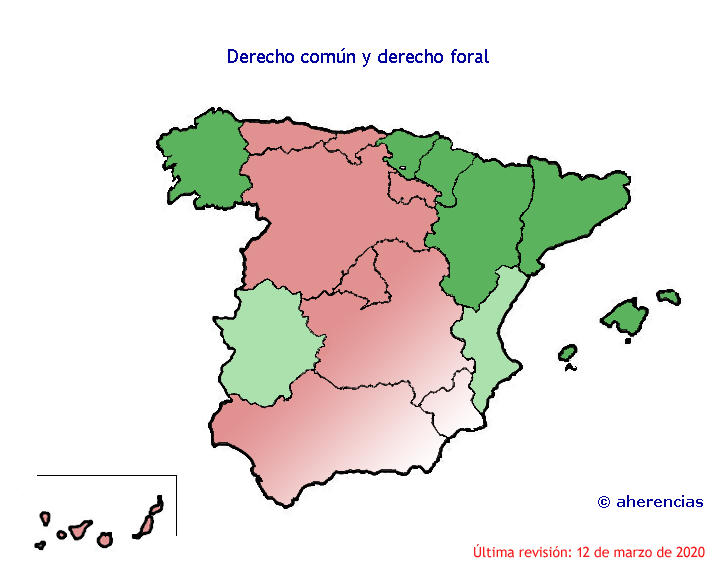

# TEMA 1 · EL DERECHO
### Policía Nacional · Escala Básica · Bloque A: Ciencias Jurídicas
🛡️ **ACADEMIA EN VIGOR** · *El temario que nunca descansa*
📚 **Versión EL ATESTADO** — temario completo para estudiar, comprender y preparar el examen. [Cómo se relaciona con El Parte](../../docs/parte-y-atestado.md)

---

# 📋 FICHA DE CONTROL

**Programa oficial 2026:** El Derecho: concepto y acepciones. Las normas jurídicas positivas: concepto, estructura, clases y caracteres. El principio de jerarquía normativa. La persona en sentido jurídico: concepto y clases; su nacimiento y extinción; capacidad jurídica y capacidad de obrar. Adquisición, conservación y pérdida de la nacionalidad española. El domicilio. La vecindad civil.

| Epígrafe oficial | Desarrollo en este Atestado |
|---|---|
| Derecho: concepto y acepciones | Apartados 1 y 2 |
| Normas jurídicas positivas | Apartados 3 a 6 |
| Jerarquía normativa | Apartado 7 |
| Persona: concepto y clases | Apartado 8 |
| Nacimiento y extinción | Apartado 9 |
| Capacidad jurídica y capacidad de obrar | Apartado 10 |
| Nacionalidad española | Apartados 12 a 20 |
| Domicilio | Apartado 21 |
| Vecindad civil | Apartado 22 |

**Fuentes principales revisadas:**

- [Programa oficial de la convocatoria 2026 — BOE-A-2026-15055](https://www.boe.es/diario_boe/txt.php?id=BOE-A-2026-15055)
- [Código Civil, texto consolidado — BOE-A-1889-4763](https://www.boe.es/buscar/act.php?id=BOE-A-1889-4763)
- [Constitución Española — BOE-A-1978-31229](https://www.boe.es/buscar/act.php?id=BOE-A-1978-31229)
- [Ley 8/2021, de apoyo a las personas con discapacidad — BOE-A-2021-9233](https://www.boe.es/buscar/act.php?id=BOE-A-2021-9233)
- [Ley 20/2011, del Registro Civil — BOE-A-2011-12628](https://www.boe.es/buscar/act.php?id=BOE-A-2011-12628)
- [Ley 50/1997, del Gobierno — BOE-A-1997-25336](https://www.boe.es/buscar/act.php?id=BOE-A-1997-25336)
- [Real Decreto 1004/2015, procedimiento de nacionalidad por residencia — BOE-A-2015-12047](https://www.boe.es/buscar/act.php?id=BOE-A-2015-12047)
- [Orden JUS/1625/2016, tramitación del procedimiento — BOE-A-2016-9314](https://www.boe.es/buscar/act.php?id=BOE-A-2016-9314)

**Criterio de examen:** cuando una clasificación sea doctrinal se indicará como tal. Cuando dependa directamente de un precepto, se citará su artículo.

**Estructura del tema (6 bloques de estudio):**

1. El Derecho y sus acepciones.
2. La norma jurídica, las fuentes y su eficacia.
3. La jerarquía normativa.
4. La persona y la capacidad.
5. Nacionalidad española.
6. Domicilio, vecindad civil y entrenamiento de examen.

---

# 🟦 PARTE 1 · EL DERECHO Y SUS ACEPCIONES

# 📖 1. CONCEPTO DE DERECHO

El Derecho puede definirse como el **sistema de normas, principios e instituciones que ordena la convivencia, reconoce facultades y deberes, resuelve conflictos y permite imponer legítimamente sus decisiones**.

No es únicamente una colección de prohibiciones. Cumple varias funciones:

- **ordenadora:** organiza la convivencia y las instituciones;
- **protectora:** tutela bienes y derechos;
- **resolutiva:** ofrece procedimientos para solucionar conflictos;
- **legitimadora y limitadora del poder:** atribuye potestades y fija sus límites;
- **promocional:** impulsa determinados fines sociales y constitucionales.

La coercibilidad es característica del Derecho: el ordenamiento prevé mecanismos públicos para reaccionar frente al incumplimiento. Esto no significa que toda norma se cumpla por la fuerza ni que toda infracción termine en una sanción penal.

> 💡 **ACLARACIÓN**
> El Derecho no es solo una lista de castigos. También decide quién puede actuar, cómo se crea una ley, cómo se celebra un contrato, cómo se adquiere la nacionalidad y qué procedimiento debe respetar la Administración.

# 📖 2. ACEPCIONES Y DIVISIONES DEL DERECHO

## 2.1. Derecho objetivo y derecho subjetivo

- **Derecho objetivo:** conjunto de normas que integran el ordenamiento. Ejemplo: el Derecho español regula la detención.
- **Derecho subjetivo:** poder, facultad o pretensión reconocida a una persona por el Derecho objetivo. Ejemplo: derecho a la tutela judicial efectiva.

El derecho subjetivo suele presentar:

- un **titular**;
- un **objeto** sobre el que recae;
- un **contenido** de facultades;
- una persona o colectividad frente a la que puede hacerse valer;
- mecanismos de protección.

## 2.2. Derecho positivo y Derecho natural

- **Derecho positivo:** normas vigentes en un lugar y tiempo concretos, producidas o reconocidas por el sistema.
- **Derecho natural:** principios de justicia que se consideran anteriores o superiores a la decisión del legislador. Es una categoría filosófica, no una fuente enumerada por el artículo 1 del Código Civil.

⚠️ Que una regla se considere injusta no hace que deje automáticamente de pertenecer al Derecho positivo. Su validez se combate mediante los procedimientos previstos por el propio ordenamiento.

## 2.3. Derecho público y Derecho privado

| Derecho público | Derecho privado |
|---|---|
| Regula la organización pública y actuaciones con potestad de imperio | Regula principalmente relaciones entre particulares |
| Predominan normas imperativas | Existe mayor espacio para la autonomía de la voluntad |
| Constitucional, administrativo, penal, procesal, tributario | Civil y mercantil |

La separación no es absoluta. Una Administración puede contratar bajo reglas privadas y una relación entre particulares puede estar atravesada por normas públicas imperativas.

## 2.4. Derecho común y Derecho especial

- **Común:** regula de forma general una materia y puede actuar supletoriamente.
- **Especial:** regula un sector, colectivo o supuesto específico.

Ejemplo: el Código Civil contiene Derecho civil común; los Derechos civiles forales o especiales rigen en sus respectivos ámbitos. Una norma especial desplaza a la general en aquello que regula específicamente, pero no la deroga por completo.

## 2.5. Derecho general y Derecho particular

- **General:** se aplica en todo el territorio o a una generalidad de sujetos.
- **Particular:** se aplica en un territorio o ámbito determinado.

> 🚔 **EN LA CALLE**
> La actuación policial muestra ambas caras. La ley atribuye una potestad pública para identificar en supuestos tasados, pero también reconoce al ciudadano derechos subjetivos frente a la actuación estatal. Potestad y garantía nacen del mismo ordenamiento.

---

# 🟦 PARTE 2 · LA NORMA JURÍDICA, LAS FUENTES Y SU EFICACIA

# 📖 3. LA NORMA JURÍDICA POSITIVA
📅 **Ha caído:** 2025-2 · 2023 · 2021.

## 3.1. Concepto

La norma jurídica positiva es una **regla de conducta o de organización, vigente y reconocida por el ordenamiento, que atribuye consecuencias jurídicas a un supuesto**.

No todas las normas ordenan o prohíben. Algunas:

- permiten actuar;
- atribuyen competencias;
- definen conceptos;
- crean órganos;
- establecen procedimientos;
- reconocen derechos;
- fijan consecuencias por incumplimiento.

## 3.2. Estructura

El esquema clásico distingue:

1. **Supuesto de hecho:** realidad o conducta prevista.
2. **Consecuencia jurídica:** efecto que el ordenamiento liga a ese supuesto.

Ejemplo sencillo: si una persona alcanza los dieciocho años, comienza su mayoría de edad. El supuesto es cumplir dieciocho años; la consecuencia es la mayoría de edad.

La norma puede estar repartida entre varios artículos. No debe confundirse **norma** con **artículo**: un artículo puede contener varias normas y una norma completa puede necesitar varios preceptos.

## 3.3. Caracteres

- **Generalidad:** se dirige a categorías de personas o situaciones.
- **Abstracción:** formula un supuesto tipo que puede repetirse.
- **Obligatoriedad:** vincula dentro de su ámbito.
- **Coercibilidad:** su cumplimiento o consecuencia puede asegurarse mediante mecanismos legítimos.
- **Heteronomía:** procede de una voluntad externa al destinatario.
- **Bilateralidad:** suele relacionar facultades de unos con deberes de otros.
- **Legitimidad formal:** debe proceder del órgano competente y seguir el procedimiento establecido.

⚠️ Generalidad y abstracción no impiden que existan normas para grupos concretos o actos singulares de aplicación.

## 3.4. Clases doctrinales

| Criterio | Clases | Clave |
|---|---|---|
| Posibilidad de pacto | Imperativas / dispositivas | La dispositiva actúa si las partes no pactan otra cosa |
| Mandato | Preceptivas / prohibitivas / permisivas | Ordenan, prohíben o permiten |
| Ámbito | Generales / particulares | Todo el ámbito o uno limitado |
| Materia | Comunes / especiales | Regla general o sector específico |
| Duración | Permanentes / temporales | Sin plazo final o con vigencia limitada |
| Consecuencia | Perfectas / menos que perfectas / imperfectas | Nulidad, otra sanción o ausencia de sanción específica |
| Flexibilidad | Rígidas / de equidad | Consecuencia cerrada o margen de ponderación |

> 💡 **ACLARACIÓN**
> Imperativa no significa penal. Una norma civil puede ser imperativa y declarar nulo un pacto. Dispositiva tampoco significa opcional: si las partes no han pactado válidamente otra solución, la norma se aplica.

# 📖 4. FUENTES DEL ORDENAMIENTO

Aunque el programa destaca las normas positivas, el sistema de fuentes ayuda a comprender de dónde proceden y cómo se integran.

## 4.1. Qué significa «fuente del Derecho»

La expresión **fuente del Derecho** se utiliza en varios sentidos. Distinguirlos evita responder de memoria con una lista que no contesta exactamente a la pregunta:

- **fuentes de producción:** sujetos u órganos con potestad para crear normas, como las Cortes Generales, el Gobierno dentro de su potestad reglamentaria o los parlamentos autonómicos en sus competencias;
- **fuentes formales:** formas mediante las que se manifiestan las normas, como la ley, la costumbre y los principios generales;
- **fuentes de conocimiento:** medios en los que puede conocerse el Derecho, como el BOE o los diarios oficiales autonómicos;
- **fuentes materiales:** fuerzas sociales, políticas o económicas que influyen en el contenido de las normas, aunque por sí mismas no produzcan una norma válida.

Otra clasificación doctrinal habla de **fuentes directas**, que contienen reglas aplicables, y **fuentes indirectas**, que ayudan a identificarlas, interpretarlas o completarlas. En el sistema civil español, la respuesta legal de referencia sigue siendo la del artículo 1 CC.

<!-- 🎨 · img/t01-fuentes-derecho.png · Esquema de fuentes de producción, formales, materiales y de conocimiento, diferenciando la enumeración del artículo 1 CC. -->

## 4.2. Ley, costumbre y principios generales

El artículo 1.1 CC enumera:

1. **Ley**, entendida aquí en sentido amplio como norma escrita.
2. **Costumbre**, que rige en defecto de ley aplicable, debe probarse y no puede ser contraria a la moral o al orden público.
3. **Principios generales del Derecho**, aplicables en defecto de ley o costumbre y con función informadora.

Orden práctico: primero se busca una norma escrita; si falta, una costumbre válida y probada; si también falta, los principios generales permiten resolver.

La enumeración está ordenada y sometida a dos ideas esenciales:

1. La costumbre no puede desplazar una ley aplicable.
2. Los principios generales no son simples opiniones personales sobre lo justo: son criterios jurídicos reconocibles en el ordenamiento, aplicables en defecto de ley o costumbre y con función informadora de todo el sistema.

### La ley en sentido formal y material

- **Ley en sentido formal:** norma aprobada con forma de ley por el órgano legislativo siguiendo el procedimiento correspondiente.
- **Ley en sentido material:** regla general y abstracta, cualquiera que sea el nombre formal de la disposición que la contiene.

El artículo 1 CC emplea «ley» en un sentido amplio de norma escrita. Sin embargo, al estudiar jerarquía debe diferenciarse la **ley parlamentaria** del **reglamento administrativo**: ambos son normas escritas, pero no tienen el mismo rango ni proceden del mismo poder.

### La costumbre y los usos jurídicos

La costumbre nace de una práctica social reiterada acompañada de la convicción de que resulta jurídicamente obligatoria. Para aplicarla debe:

- faltar una ley aplicable al caso;
- no ser contraria a la moral ni al orden público;
- resultar probada, salvo que las partes estén conformes sobre su existencia y contenido y no afecte al orden público.

Los **usos jurídicos** que no sean meramente interpretativos de una declaración de voluntad tienen consideración de costumbre. En cambio, un hábito social o una cortesía repetida no se convierten automáticamente en norma jurídica.

### Los principios generales

Cumplen una doble función:

- **autónoma o integradora:** permiten resolver cuando no existen ley ni costumbre aplicables;
- **informadora:** orientan la creación, interpretación y aplicación del ordenamiento.

Legalidad, buena fe, igualdad, proporcionalidad o prohibición del enriquecimiento injusto son ejemplos de ideas que pueden actuar como principios en su ámbito, pero su contenido debe concretarse jurídicamente; no basta invocarlos de forma retórica.

## 4.3. Tratados internacionales

Las normas de un tratado no son directamente aplicables en España hasta su publicación íntegra oficial. Una vez válidamente celebrados y publicados forman parte del ordenamiento interno.

El artículo 96 CE añade que sus disposiciones solo pueden ser derogadas, modificadas o suspendidas en la forma prevista en los propios tratados o conforme a las normas generales del Derecho internacional. Si un tratado contiene estipulaciones contrarias a la Constitución, su celebración exige la previa revisión constitucional.

## 4.4. Jurisprudencia

La jurisprudencia **no aparece como fuente directa** en el artículo 1.1 CC. Complementa el ordenamiento mediante la doctrina reiterada del Tribunal Supremo al interpretar y aplicar ley, costumbre y principios generales.

⚠️ Una única sentencia del Tribunal Supremo puede tener enorme relevancia, pero la formulación del artículo 1.6 habla de doctrina reiterada.

No debe confundirse la jurisprudencia del Tribunal Supremo a la que se refiere el Código Civil con la doctrina del Tribunal Constitucional. Esta última interpreta la Constitución y vincula en los términos previstos por la Constitución y su ley orgánica. Tampoco toda resolución judicial crea jurisprudencia por el mero hecho de ser firme.

## 4.5. Deber de resolver, equidad y lagunas

Los jueces y tribunales deben resolver los asuntos de los que conozcan conforme al sistema de fuentes. La falta de una regla escrita exacta no permite dejar el conflicto sin respuesta.

La **equidad** debe ponderarse al aplicar las normas, pero una resolución solo puede descansar exclusivamente en ella cuando la ley lo permita expresamente. La equidad adapta la respuesta a las circunstancias del caso; no autoriza a ignorar una regla imperativa.

Una **laguna legal** es la falta de regulación concreta de un supuesto que jurídicamente necesita respuesta. No equivale a una laguna del ordenamiento: el sistema ofrece integración mediante costumbre, principios generales y, cuando se cumplen sus requisitos, analogía.

> 💡 **ACLARACIÓN**
> El BOE es fuente de conocimiento, no una cuarta fuente formal del artículo 1 CC. Publica leyes y otras disposiciones; no todas las páginas del BOE tienen la misma naturaleza jurídica.

# 📖 5. APLICACIÓN E INTERPRETACIÓN

## 5.1. Entrada en vigor y derogación

- Regla supletoria: las leyes entran en vigor a los **veinte días** de su publicación completa en el BOE, si no disponen otra cosa.
- Solo se derogan por normas posteriores.
- La derogación puede ser **expresa** o **tácita por incompatibilidad**.
- La derogación de una norma no hace revivir automáticamente las normas que aquella derogó.
- Las leyes no tienen efecto retroactivo salvo que dispongan lo contrario, sin perjuicio de las prohibiciones constitucionales de retroactividad.

## 5.2. Interpretación

El artículo 3.1 CC obliga a atender conjuntamente a:

- sentido de las palabras;
- contexto;
- antecedentes históricos y legislativos;
- realidad social del tiempo;
- espíritu y finalidad de la norma.

No son métodos aislados ni existe una regla automática que permita escoger solo el más conveniente.

## 5.3. Analogía

La analogía permite aplicar a un supuesto no regulado la solución prevista para otro semejante cuando exista **identidad de razón**.

No cabe extender por analogía:

- leyes penales;
- leyes excepcionales;
- leyes de ámbito temporal;

a supuestos o momentos distintos de los expresamente comprendidos.

## 5.4. Cómputo civil de plazos

Reglas generales del artículo 5 CC:

- los plazos señalados por días excluyen el día inicial y comienzan al siguiente;
- los fijados por meses o años se computan de fecha a fecha;
- si en el mes de vencimiento no existe día equivalente, vence el último día del mes;
- en el cómputo civil no se excluyen los días inhábiles.

⚠️ No traslades automáticamente estas reglas al procedimiento administrativo o procesal: cada ámbito puede tener reglas propias.

# 📖 6. EFICACIA DE LAS NORMAS
📅 **Ha caído:** 2021 — ignorancia de las leyes.

## 6.1. Ignorancia y error de Derecho

La ignorancia de las leyes **no excusa de su cumplimiento**. El error de Derecho solo produce los efectos que la ley determine.

La regla no presume que toda persona conoce materialmente todo el BOE. Impide convertir el desconocimiento en una excusa general.

## 6.2. Renuncia de derechos

La exclusión voluntaria de la ley aplicable y la renuncia de derechos solo son válidas si:

- no contradicen el interés u orden público;
- no perjudican a terceros.

## 6.3. Actos contrarios a normas imperativas o prohibitivas

Son nulos de pleno derecho, salvo que la propia norma establezca un efecto diferente.

## 6.4. Fraude de ley

Existe cuando se usa formalmente una norma de cobertura para alcanzar un resultado prohibido o contrario al ordenamiento. La consecuencia es aplicar la norma que se intentó eludir.

## 6.5. Buena fe y abuso del derecho

Los derechos deben ejercerse conforme a la buena fe. El ordenamiento no protege el ejercicio antisocial o manifiestamente excesivo de un derecho que cause daño a tercero.

> 🚔 **EN LA CALLE**
> Legalidad no es encontrar una frase aislada que parezca permitir una actuación. Hay que comprobar competencia, finalidad, procedimiento, proporcionalidad y respeto a derechos. Usar una potestad para un fin distinto del previsto puede convertir una apariencia formal de legalidad en una actuación inválida.

---

# 🟦 PARTE 3 · EL PRINCIPIO DE JERARQUÍA NORMATIVA

# 📖 7. JERARQUÍA, COMPETENCIA Y RELACIÓN ENTRE NORMAS

## 7.1. Fundamento

- **Artículo 9.3 CE:** garantiza, entre otros, legalidad, jerarquía normativa, publicidad, seguridad jurídica, responsabilidad e interdicción de la arbitrariedad.
- **Artículo 1.2 CC:** carecen de validez las disposiciones contrarias a otra de rango superior.

## 7.2. Esquema básico

1. **Constitución Española**, norma suprema del ordenamiento interno.
2. **Normas con rango o fuerza de ley:**
   - leyes orgánicas;
   - leyes ordinarias;
   - decretos-leyes;
   - decretos legislativos;
   - leyes autonómicas dentro de su competencia.
3. **Reglamentos:**
   - reales decretos;
   - órdenes ministeriales;
   - otras disposiciones reglamentarias inferiores.

Este esquema necesita tres precisiones:

<!-- 🎨 · img/t01-jerarquia-estatal-autonomica.png · Mapa en dos ejes: rango normativo y distribución de competencias Estado-comunidades autónomas. -->

### A. Ley orgánica y ley ordinaria

No existe superioridad jerárquica general de la ley orgánica. La relación es de **competencia material y procedimiento**.

La ley orgánica se reserva, según el artículo 81 CE, al desarrollo de derechos fundamentales y libertades públicas, Estatutos de Autonomía, régimen electoral general y demás materias previstas constitucionalmente. Su aprobación, modificación o derogación exige mayoría absoluta del Congreso en votación final sobre el conjunto.

### B. Derecho de la Unión Europea

La primacía del Derecho de la Unión opera en las materias atribuidas a la Unión. No debe representarse sin matices como un escalón ordinario de la pirámide nacional. Si una norma interna entra en conflicto con Derecho de la Unión aplicable, el órgano competente debe garantizar la efectividad de este dentro del sistema europeo.

### C. Tratados internacionales

Una vez válidamente celebrados y publicados forman parte del ordenamiento interno. Su posición y efectos se explican por la Constitución, especialmente los artículos 93 a 96, y no mediante la idea simplista de que todos los tratados ocupan exactamente el mismo escalón.

## 7.3. Normas con rango de ley

### Leyes aprobadas por las Cortes Generales

Las Cortes ejercen la potestad legislativa del Estado. Las cámaras funcionan en Pleno y por comisiones. Pueden delegar en las comisiones legislativas permanentes la aprobación de proyectos o proposiciones de ley, pero el Pleno puede recabar el debate y votación. No cabe esa delegación para:

- reforma constitucional;
- cuestiones internacionales;
- leyes orgánicas y de bases;
- Presupuestos Generales del Estado.

La **ley ordinaria** es la forma legislativa común para las materias no reservadas a ley orgánica ni a otra forma específica. Se aprueba por la mayoría que corresponda según el procedimiento parlamentario, normalmente mayoría simple en la votación pertinente.

La **ley orgánica** queda reservada a las materias del artículo 81 CE. Su rasgo decisivo no es su nombre, sino la combinación de **materia reservada** y **mayoría absoluta del Congreso en una votación final sobre el conjunto**.

<!-- 🎨 · img/t01-tipos-ley.png · Cuadro comparativo de ley orgánica, ordinaria, decreto-ley y decreto legislativo: autor, presupuesto, límites y control. -->

### Decreto legislativo: legislación delegada

Las Cortes pueden delegar en el Gobierno la potestad de dictar normas con rango de ley sobre materias determinadas que no estén reservadas a ley orgánica. La delegación debe ser:

- **expresa**;
- para **materia concreta**;
- con **plazo fijado**;
- sin posibilidad de subdelegación a autoridades distintas del Gobierno.

Hay dos modalidades:

| Finalidad | Norma de delegación | Resultado |
|---|---|---|
| Formar un texto articulado | Ley de bases | Real decreto legislativo con texto articulado |
| Refundir varios textos legales | Ley ordinaria de autorización | Real decreto legislativo con texto refundido |

La ley de bases delimita objeto, alcance, principios y criterios. No puede autorizar que la propia ley de bases sea modificada ni facultar para dictar normas retroactivas. La autorización para refundir debe precisar si se limita a reunir textos o permite regularizarlos, aclararlos y armonizarlos.

La delegación se agota con su ejercicio mediante la publicación de la norma correspondiente. Los tribunales controlan los excesos de delegación, además de los controles que pueda establecer la ley delegante.

### Decreto-ley: legislación de urgencia

El Gobierno puede dictar disposiciones legislativas provisionales en caso de **extraordinaria y urgente necesidad**. El decreto-ley no puede afectar:

- al ordenamiento de las instituciones básicas del Estado;
- a los derechos, deberes y libertades de los ciudadanos regulados en el título I CE;
- al régimen de las comunidades autónomas;
- al Derecho electoral general.

Debe someterse inmediatamente al Congreso, que en el plazo de **treinta días** decide expresamente sobre su convalidación o derogación. Durante ese plazo las Cortes pueden tramitarlo como proyecto de ley por el procedimiento de urgencia.

Convalidar no transforma el decreto-ley en ley ordinaria: mantiene su naturaleza. Su tramitación posterior como proyecto de ley sí puede producir una ley que lo sustituya o modifique.

### Formas legislativas de articulación territorial

El artículo 150 CE contempla tres instrumentos que suelen confundirse:

1. **Leyes marco:** las Cortes atribuyen a todas o alguna comunidad autónoma la facultad de dictar normas legislativas, dentro de principios, bases y directrices fijados por una ley estatal, en materias de competencia estatal.
2. **Leyes orgánicas de transferencia o delegación:** el Estado transfiere o delega facultades correspondientes a materias estatales que por su naturaleza sean susceptibles de ello; deben prever medios financieros y formas de control.
3. **Leyes de armonización:** establecen principios para armonizar disposiciones autonómicas cuando lo exija el interés general; esa necesidad debe apreciarse por mayoría absoluta de cada Cámara.

Las **leyes autonómicas** tienen rango de ley dentro de su ordenamiento y ámbito competencial. No son reglamentos subordinados de modo general a la ley estatal. Si una norma estatal y otra autonómica chocan, primero debe examinarse quién tiene la competencia; la simple cronología no resuelve el conflicto.

## 7.4. Potestad reglamentaria

El reglamento es una norma general dictada por la Administración en ejercicio de la potestad reglamentaria. Está subordinado a la Constitución y a la ley, y no puede regular materias reservadas al legislador ni tipificar delitos, penas o sanciones fuera de la cobertura legal exigida.

Por su relación con la ley, suelen distinguirse doctrinalmente:

- **ejecutivos:** desarrollan o completan una ley;
- **independientes:** regulan materias no reservadas a la ley dentro del espacio permitido;
- **de necesidad:** responden a situaciones excepcionales cuando el ordenamiento los habilita, con alcance y duración limitados.

En el Gobierno de la Nación, la Ley 50/1997 ordena los reglamentos así:

1. disposiciones aprobadas por **real decreto** del Presidente del Gobierno o acordado en Consejo de Ministros;
2. disposiciones aprobadas por **orden ministerial**.

Por debajo pueden existir otras disposiciones administrativas según su normativa organizativa, pero una instrucción o circular interna no puede innovar el ordenamiento como si fuera un reglamento sin la competencia y el procedimiento necesarios.

La forma externa tampoco basta para conocer la naturaleza. «Real decreto» puede contener un reglamento o una decisión singular; lo decisivo es su contenido y fundamento. En cambio, **real decreto-ley** y **real decreto legislativo** designan normas gubernamentales con rango de ley previstas por la Constitución.

## 7.5. Principios para resolver conflictos

| Principio | Regla | Ejemplo |
|---|---|---|
| Jerarquía | La inferior no contradice a la superior | Un reglamento no contradice una ley |
| Competencia | Cada órgano regula las materias atribuidas | Estado y comunidad autónoma |
| Cronología | Entre normas del mismo rango y ámbito, la posterior desplaza a la anterior incompatible | Ley posterior |
| Especialidad | La especial se aplica preferentemente a su supuesto | Régimen sectorial |
| Prevalencia | Opera en los casos previstos constitucionalmente | Conflictos territoriales determinados |

El principio cronológico no sana una incompetencia ni permite a una norma inferior derogar una superior.

Orden mental recomendado ante un conflicto:

1. identificar los ámbitos territorial, temporal, material y personal;
2. comprobar la competencia del órgano;
3. comparar el rango;
4. determinar si una norma es especial respecto de la otra;
5. usar la cronología solo entre normas válidas y compatibles en competencia y rango;
6. aplicar, cuando proceda, los criterios constitucionales de prevalencia o supletoriedad sin convertirlos en una jerarquía universal.

## 7.6. Control de validez

- La constitucionalidad de las leyes corresponde al **Tribunal Constitucional** por las vías previstas.
- Los jueces y tribunales controlan la potestad reglamentaria y la legalidad de la actuación administrativa.
- La Administración puede revisar sus actos y disposiciones únicamente mediante los procedimientos legalmente establecidos.

> 💡 **ACLARACIÓN**
> Antes de decir que una norma gana por ser posterior, pregunta: ¿tienen el mismo rango?, ¿regulan la misma materia?, ¿proceden de órganos competentes? Si una respuesta es negativa, la cronología puede no resolver nada.

## 🎯 Trampas frecuentes de jerarquía

- Ley orgánica no equivale a ley superior.
- Real decreto no siempre significa norma con rango de ley: el **real decreto-ley** y el **real decreto legislativo** sí tienen fuerza de ley; un **real decreto** ordinario es reglamentario.
- Una resolución posterior no puede derogar una orden ministerial o una ley.
- Publicación y entrada en vigor no son lo mismo.
- Jurisprudencia no aparece como fuente directa en el artículo 1.1 CC.

---

# 🟦 PARTE 4 · LA PERSONA Y LA CAPACIDAD

# 📖 8. PERSONA EN SENTIDO JURÍDICO

Persona es el sujeto al que el ordenamiento reconoce aptitud para ser titular de relaciones jurídicas.

Clases:

- **persona física o natural:** todo ser humano;
- **persona jurídica:** organización o entidad a la que el Derecho atribuye personalidad independiente.

## 8.1. Personas jurídicas

El artículo 35 CC incluye:

- corporaciones, asociaciones y fundaciones de interés público reconocidas por la ley;
- asociaciones de interés particular, civiles, mercantiles o industriales, cuando la ley les conceda personalidad independiente.

Su capacidad depende de sus normas creadoras, estatutos o reglas fundacionales. Pueden adquirir bienes, contraer obligaciones y ejercitar acciones conforme a su régimen.

La persona jurídica se distingue de las personas físicas que la integran: tiene patrimonio, derechos, deberes y responsabilidad propios, sin perjuicio de los casos en que la ley permita exigir responsabilidad a administradores o miembros.

Su extinción puede producirse, entre otras causas, por vencimiento del plazo, cumplimiento o imposibilidad del fin, además de las causas de su legislación específica.

### Nacimiento y capacidad de la persona jurídica

La personalidad no surge igual en todas las entidades. En las corporaciones de Derecho público puede nacer directamente de su norma creadora; en asociaciones y fundaciones intervienen el negocio constitutivo y los requisitos de su legislación específica, incluida, cuando corresponda, la inscripción registral.

El artículo 37 CC remite su capacidad civil a:

- las leyes que las crean o reconocen, en corporaciones;
- sus estatutos, en asociaciones;
- las reglas de su institución, en fundaciones.

El artículo 38 CC reconoce que pueden adquirir y poseer bienes, contraer obligaciones y ejercitar acciones civiles o criminales conforme a las leyes y reglas de su constitución. Actúan necesariamente mediante **órganos** y personas físicas que forman su voluntad o la representan.

### Clases útiles para examen

Pueden clasificarse:

- por su base, en **corporaciones o asociaciones** —predomina un conjunto de personas— y **fundaciones** —un patrimonio queda afectado a un fin—;
- por su régimen, en personas jurídicas de **Derecho público** o de **Derecho privado**;
- por su finalidad, en entidades de **interés general** o **interés particular**, sin que la búsqueda de beneficio sea el único criterio posible.

La separación de personalidad implica, como regla, patrimonio y responsabilidad diferenciados. No es un blindaje absoluto: las leyes pueden imponer responsabilidad a administradores, socios o miembros, y los tribunales pueden reaccionar frente al uso abusivo o fraudulento de la forma societaria.

### Extinción y destino del patrimonio

El artículo 39 CC contempla, entre otras causas, el vencimiento del plazo de funcionamiento, la realización del fin o la imposibilidad de aplicarle actividad y medios. La extinción abre normalmente una fase de liquidación. El destino de los bienes se rige por la ley, los estatutos o las cláusulas fundacionales; si nada se previó, el Código orienta los bienes a fines análogos de interés regional, provincial o municipal.

> 💡 **ACLARACIÓN**
> Persona jurídica no significa «edificio» ni «documento». Es un centro de derechos y obligaciones distinto de sus integrantes. Una comisaría es una unidad administrativa; la personalidad corresponde a la Administración o entidad pública de la que forma parte.

# 📖 9. NACIMIENTO Y EXTINCIÓN DE LA PERSONA FÍSICA
📅 **Ha caído:** 2024 en archivo en cuarentena · 2022 · 2021.

## 9.1. Concebido no nacido

El nacimiento determina la personalidad. Sin embargo, el concebido se tiene por nacido para los efectos que le sean favorables, condicionado a que finalmente nazca con vida y se produzca el entero desprendimiento.

Esta protección permite reservarle beneficios, por ejemplo sucesorios, sin afirmar que ya tenga personalidad plena.

## 9.2. Adquisición de personalidad

La personalidad se adquiere:

- con **nacimiento con vida**;
- una vez producido el **entero desprendimiento del seno materno**.

No se exige:

- figura humana;
- veinticuatro horas de vida;
- inscripción registral como elemento constitutivo.

La inscripción acredita oficialmente el nacimiento, pero la personalidad surge por el hecho descrito en el artículo 30 CC.

## 9.3. Partos múltiples

La prioridad del nacimiento atribuye al primer nacido los derechos que la ley reconozca al primogénito.

## 9.4. Extinción

La personalidad civil se extingue por la **muerte**. La declaración de fallecimiento permite producir determinados efectos jurídicos cuando la muerte no ha podido comprobarse, conforme a sus requisitos.

## 9.5. Comoriencia

Si dos o más personas llamadas a sucederse mueren y no se prueba quién falleció primero:

- quien alegue una muerte anterior debe probarla;
- en ausencia de prueba se presumen muertas simultáneamente;
- no se transmiten derechos de una a otra.

> 💡 **ACLARACIÓN**
> No existe una presunción de que muere antes la persona de más edad, la más herida o la más débil. Sin prueba, el Código Civil presume simultaneidad únicamente a efectos de la transmisión entre quienes estaban llamados a sucederse.

## 9.6. Desaparición, ausencia legal y declaración de fallecimiento

La desaparición de una persona no extingue su personalidad. El Código Civil articula una protección gradual de la persona y su patrimonio:

1. **situación de desaparecido y defensa provisional**;
2. **declaración de ausencia legal**;
3. **declaración de fallecimiento** cuando concurren plazos o riesgos legalmente previstos.

No son tres estados que deban declararse siempre de manera sucesiva. Puede existir declaración de fallecimiento sin una previa declaración formal de ausencia si se cumplen sus requisitos.

<!-- 🎨 · img/t01-ausencia-fallecimiento.png · Línea temporal comparativa: desaparecido, ausencia legal y declaración de fallecimiento, con plazos principales. -->

### Defensa provisional del desaparecido

Cuando una persona desaparece sin noticias y es necesario atender asuntos urgentes, el letrado de la Administración de Justicia puede nombrar un **defensor** que la ampare y represente en juicio o en negocios que no admitan demora, salvo que ya esté legítimamente representada. También pueden adoptarse medidas para conservar su patrimonio.

Esta fase responde a la urgencia, no a una presunción de muerte ni a la certeza de una ausencia prolongada.

### Declaración de ausencia legal

Procede, con carácter general:

- transcurrido **un año** desde las últimas noticias o desde la desaparición si la persona no dejó apoderado con facultades de administración de todos sus bienes;
- transcurridos **tres años** si dejó encomendada por apoderamiento la administración de todos sus bienes.

La muerte, renuncia justificada o caducidad del mandato del apoderado hace nacer la ausencia legal si al producirse estas circunstancias se desconoce el paradero y ha transcurrido un año desde las últimas noticias o, en su defecto, desde la desaparición.

La declaración permite nombrar representante del ausente. El Código establece un orden preferente entre cónyuge, hijos, ascendientes y hermanos, con las condiciones legales, y admite en defecto de ellos una persona solvente y de buenos antecedentes. Sus funciones centrales son representar al ausente, buscarlo, proteger y administrar sus bienes y cumplir las obligaciones correspondientes.

La ausencia legal termina si aparece la persona, se prueba su muerte o se declara su fallecimiento. La aparición obliga a restituir el patrimonio, sin perjuicio de la rendición de cuentas y de las reglas sobre frutos percibidos.

### Declaración de fallecimiento: plazos generales

El artículo 193 CC permite declararla:

- transcurridos **diez años** desde las últimas noticias o, a falta de ellas, desde la desaparición;
- transcurridos **cinco años** si al expirar ese plazo la persona hubiera cumplido setenta y cinco años;
- transcurrido **un año** desde un riesgo inminente de muerte por causa de violencia contra la vida sin noticias posteriores; en caso de siniestro, el plazo se reduce a **tres meses**.

Para el cómputo de los plazos de cinco y diez años se cuenta desde la expiración del año natural en que se tuvieron las últimas noticias o se produjo la desaparición.

Existen reglas especiales para campañas bélicas, naufragios, desapariciones en el mar, siniestros aéreos y otros accidentes. En varios supuestos con evidencia racional de falta de supervivientes la declaración puede promoverse con gran rapidez; cuando solo consta la ausencia de noticias tras el siniestro, el Código fija plazos específicos. Para examen conviene identificar primero si la pregunta aplica el artículo 193 —regla general o riesgo— o el 194 —supuesto especial—.

### Efectos y reaparición

La declaración de fallecimiento:

- pone fin a la ausencia legal;
- fija la fecha desde la que se entiende producida la muerte, salvo prueba en contrario;
- abre la sucesión;
- permite la disolución del matrimonio por muerte o declaración de fallecimiento.

Como medida de cautela, los herederos no pueden disponer a título gratuito de los bienes durante **cinco años** y, con las excepciones legales, los legados tampoco se entregan durante ese periodo. Debe formarse inventario notarial detallado de los bienes.

Si reaparece la persona o se demuestra que vive, recupera sus bienes en el estado en que estén, el precio de los vendidos o los bienes adquiridos con ese precio. No puede reclamar a sus sucesores rentas, frutos o productos anteriores al día de su presencia o de la declaración de que no murió.

> 🚔 **EN LA CALLE**
> Una denuncia por desaparición activa actuaciones de búsqueda y protección, pero no convierte por sí misma a la persona en ausente legal ni fallecida. Esas declaraciones producen efectos civiles propios y requieren el procedimiento legal correspondiente.

# 📖 10. CAPACIDAD JURÍDICA Y CAPACIDAD DE OBRAR

## 10.1. Distinción clásica exigida por el programa

- **Capacidad jurídica:** aptitud para ser titular de derechos y obligaciones. Corresponde a toda persona y no se gradúa como si unas personas tuvieran más personalidad que otras.
- **Capacidad de obrar:** aptitud para ejercer válidamente por uno mismo derechos y obligaciones. Puede estar condicionada por la edad o por los requisitos concretos de cada acto.

La terminología moderna, especialmente tras la Ley 8/2021, insiste en que las personas con discapacidad ejercen su capacidad jurídica en igualdad de condiciones y, cuando sea preciso, con apoyos.

## 10.2. Mayoría de edad

- Comienza a los **dieciocho años cumplidos**.
- Para el cómputo se incluye completo el día del nacimiento.
- La persona mayor de edad puede realizar los actos de la vida civil salvo excepciones legales concretas.

## 10.3. Minoría de edad

El menor es titular de derechos y su autonomía se desarrolla progresivamente. No existe una incapacidad absoluta uniforme: distintos actos exigen edades, madurez, asistencia o representación diferentes.

## 10.4. Emancipación

Tiene lugar:

1. por mayoría de edad;
2. por concesión de quienes ejercen la patria potestad;
3. por concesión judicial.

La concesión de quienes ejercen la patria potestad exige:

- dieciséis años cumplidos;
- consentimiento del menor;
- escritura pública o comparecencia ante Registro Civil;
- inscripción para producir efectos frente a terceros;
- es irrevocable una vez concedida.

El emancipado rige en general su persona y bienes y puede comparecer solo en juicio. Hasta la mayoría necesita consentimiento para:

- tomar dinero a préstamo;
- gravar o enajenar inmuebles;
- gravar o enajenar establecimientos mercantiles o industriales;
- disponer de objetos de extraordinario valor.

<!-- 🎨 · img/t01-emancipacion.png · Mapa de vías de emancipación y actos patrimoniales que requieren consentimiento. -->

También se reputa emancipado, a efectos civiles, al hijo mayor de dieciséis años que con consentimiento de sus progenitores vive independientemente. En este caso el consentimiento puede revocarse, a diferencia de la emancipación formal concedida, que es irrevocable.

La emancipación judicial puede concederse al mayor de dieciséis que la pida, previa audiencia de los progenitores, en los supuestos legales relacionados con nuevas nupcias o convivencia del progenitor, separación de los progenitores o cualquier causa que entorpezca gravemente el ejercicio de la patria potestad. El menor sujeto a tutela puede obtener el beneficio de la mayor edad en los términos legales.

Para los actos patrimoniales limitados no se sustituye al emancipado: actúa él, pero necesita el consentimiento complementario de sus progenitores o, a falta de ambos, de su defensor judicial. Si está casado y el bien es común, puede bastar el consentimiento del cónyuge si este es mayor de edad; si el otro cónyuge también es menor, se necesita además el de los progenitores o defensor de ambos.

## 10.5. Personas con discapacidad y medidas de apoyo

La Ley 8/2021 sustituyó el sistema centrado en incapacitar y sustituir decisiones por otro basado en **apoyar el ejercicio de la capacidad jurídica**, respetando voluntad, deseos y preferencias.

Medidas principales:

- **medidas voluntarias:** organizadas por la propia persona;
- **guarda de hecho:** apoyo informal;
- **curatela:** apoyo formal continuado, normalmente asistencial;
- **defensor judicial:** apoyo ocasional, aunque pueda repetirse.

La representación es excepcional y debe justificarse. No debe afirmarse que toda persona con discapacidad tiene curador ni que el curador decide automáticamente por ella.

### Principios del sistema de apoyos

Las medidas deben inspirarse en la dignidad y tutela de derechos fundamentales. Han de:

- permitir que la persona desarrolle su propio proceso de toma de decisiones;
- atender a su voluntad, deseos y preferencias;
- ser necesarias y proporcionales;
- evitar conflictos de intereses e influencia indebida;
- aplicarse durante el plazo más corto posible y revisarse periódicamente.

Solo cuando, pese a un esfuerzo considerable, no pueda determinarse la voluntad de la persona, la medida representativa puede decidir atendiendo a su trayectoria vital, valores, creencias y factores que probablemente habría considerado. No se trata de decidir qué parece mejor desde fuera sin escucharla.

### Medidas voluntarias y poderes preventivos

La propia persona puede prever en escritura pública quién y cómo debe prestarle apoyo si en el futuro lo necesita. Puede establecer salvaguardas, controles y formas de revisión. Los poderes y mandatos preventivos permiten que ciertas facultades subsistan o comiencen si aparece una necesidad de apoyo.

Las medidas voluntarias tienen preferencia, siempre que resulten suficientes y no exista una situación que exija protección adicional.

### Guarda de hecho

Es una medida informal. Puede ser adecuada cuando funciona correctamente y cubre las necesidades de apoyo. El guardador acompaña o asiste en la vida ordinaria; para actuaciones representativas concretas necesita autorización judicial cuando la ley la exige. No convierte al guardador en representante general.

### Curatela

Se constituye por resolución judicial cuando el apoyo se necesita de modo continuado y no existen otras medidas suficientes. La resolución determina con precisión los actos para los que se requiere asistencia. Las facultades representativas son excepcionales y deben especificarse.

La curatela no priva globalmente de derechos. Tampoco puede incluir la mera prohibición de derechos como fórmula genérica. El curador debe mantener contacto personal, asistir en la toma de decisiones y fomentar que la persona pueda ejercer su capacidad con menos apoyo en el futuro.

### Defensor judicial

Se nombra para apoyos ocasionales, aunque la necesidad pueda repetirse, y en otros casos tasados: conflicto de intereses, imposibilidad temporal de quien presta apoyo o necesidad de administrar bienes hasta resolver otra medida, entre otros.

### Ajustes en la actuación pública

Los apoyos civiles no sustituyen los ajustes de comunicación y procedimiento. Una persona puede necesitar lenguaje claro, lectura fácil, más tiempo, apoyo de una persona de confianza o medios técnicos aunque no tenga una medida judicial. La actuación policial y administrativa debe valorar la situación concreta, no deducir incapacidad de un diagnóstico.

> 🚔 **EN LA CALLE**
> Una discapacidad intelectual no convierte a nadie en jurídicamente invisible. En una intervención hay que comunicarse de forma accesible, identificar los apoyos existentes y respetar las decisiones de la persona dentro del marco legal. Tutor de adulto e incapacitado son expresiones que ya no describen el modelo general vigente.

## 10.6. Cuadro comparativo

| Situación | Titularidad de derechos | Ejercicio |
|---|---|---|
| Recién nacido | Sí | Mediante representación en los actos que lo requieran |
| Menor no emancipado | Sí | Progresivo; representación o asistencia según el acto |
| Menor emancipado | Sí | Amplio, con límites patrimoniales concretos |
| Mayor de edad | Sí | Regla general de actuación propia |
| Persona con discapacidad | Sí, en igualdad | Por sí misma y, si lo precisa, con apoyos |

---

# 🟦 PARTE 5 · LA NACIONALIDAD ESPAÑOLA

# 📖 11. CONCEPTO Y BASE CONSTITUCIONAL

La nacionalidad es el vínculo jurídico que integra a una persona en el Estado y determina un estatuto de derechos y deberes.

La Constitución dispone que:

- la nacionalidad española se adquiere, conserva y pierde de acuerdo con la ley;
- ningún español de origen puede ser privado de ella;
- el Estado puede concertar tratados de doble nacionalidad con países iberoamericanos o especialmente vinculados.

⚠️ No ser privado no significa no poder perderla por los actos y condiciones previstos legalmente. **Privación sancionadora** y **pérdida legal** no son idénticas.

# 📖 12. MAPA DE FORMAS DE ADQUISICIÓN

| Vía | Naturaleza | Clave |
|---|---|---|
| Filiación o nacimiento en supuestos del art. 17 | De origen | Opera por circunstancias legalmente definidas |
| Adopción de menor por español | De origen | Desde la adopción |
| Opción a nacionalidad de origen en arts. 17.2 y 19.2 | De origen | Plazo de dos años |
| Opción general | Derivativa, salvo casos anteriores | Derecho del interesado |
| Carta de naturaleza | Derivativa | Discrecional por Real Decreto |
| Residencia | Derivativa | Concesión tras residencia y requisitos |
| Posesión de estado | Consolidación | Diez años, buena fe y título inscrito |

# 📖 13. ESPAÑOLES DE ORIGEN
📅 **Ha caído:** 2025-2.

Son españoles de origen:

1. Nacidos de padre o madre españoles.
2. Nacidos en España de padres extranjeros si al menos uno también nació en España, salvo hijos de funcionario diplomático o consular acreditado.
3. Nacidos en España si ambos progenitores carecen de nacionalidad o ninguna legislación atribuye nacionalidad al hijo.
4. Nacidos en España con filiación no determinada; se presume nacido en España el menor cuyo primer lugar conocido de estancia sea territorio español.

## 13.1. Determinación posterior a los dieciocho años

Si la filiación o el nacimiento en España se determina después de los dieciocho años, no se adquiere automáticamente la nacionalidad. Existe derecho a optar por la nacionalidad española de origen durante **dos años** desde la determinación.

# 📖 14. ADOPCIÓN
📅 **Ha caído:** 2023.

- Extranjero menor de dieciocho años adoptado por español: adquiere nacionalidad española de origen desde la adopción.
- Adoptado mayor de dieciocho: puede optar por la nacionalidad española de origen en los **dos años** siguientes a la constitución de la adopción.
- Si el menor conserva su nacionalidad conforme a su ley de origen, esta también es reconocida en España.

⚠️ El adoptado mayor de edad no adquiere automáticamente la nacionalidad: tiene un derecho de opción.

# 📖 15. CONSOLIDACIÓN POR POSESIÓN DE ESTADO

La posesión y uso continuados de la nacionalidad española durante **diez años**:

- con buena fe;
- basados en título inscrito en el Registro Civil;

consolidan la nacionalidad aunque después se anule el título que la originó.

No confundir:

- **diez años de residencia**, vía de adquisición general;
- **diez años de posesión y utilización**, consolidación de una nacionalidad aparentemente adquirida con título inscrito.

# 📖 16. OPCIÓN

Tienen derecho a optar:

- quienes estén o hayan estado sujetos a patria potestad de un español;
- quienes tengan padre o madre originariamente español y nacido en España;
- personas incluidas en los artículos 17.2 y 19.2.

## 16.1. Quién formula la declaración

- Menor de catorce años: representante legal, con los controles previstos.
- Mayor de catorce: el propio interesado asistido por su representante legal.
- Emancipado o mayor de dieciocho: por sí mismo.
- Persona con discapacidad: por sí misma con los apoyos y ajustes que precise.

## 16.2. Plazo general

La opción ejercitable por quien estuvo sujeto a patria potestad de español caduca, con carácter general, a los veinte años, con adaptación si la emancipación conforme a su ley personal se produce más tarde.

No están sometidas a ese límite general las opciones vinculadas a padre o madre originariamente español y nacido en España, sin perjuicio de los plazos específicos de los artículos 17.2 y 19.2.

## 16.3. Cómo se ejercita y cuándo produce efectos

La opción no opera automáticamente: exige una **declaración** ante el encargado del Registro Civil competente y, según el caso, asistencia o representación. Además deben cumplirse los requisitos del artículo 23 CC que correspondan e inscribirse la adquisición.

En el menor de catorce años la declaración la formula el representante legal. Si existe desacuerdo entre representantes o concurren circunstancias especiales se aplican los controles judiciales y registrales previstos. Desde los catorce años el interesado declara asistido. La persona con discapacidad actúa por sí misma con los apoyos y ajustes de procedimiento que necesite.

Caso práctico: una persona de treinta años cuya madre fue originariamente española y nació en España conserva el derecho del artículo 20.1.b CC; no debe aplicársele mecánicamente el límite general de veinte años. En cambio, la opción derivada únicamente de haber estado bajo patria potestad de un español sí está sujeta, como regla, a ese límite.

## 16.4. Opciones históricas o transitorias

Algunas leyes han abierto vías temporales de opción para colectivos concretos. Deben estudiarse separadas del régimen permanente del Código Civil:

- la Ley 52/2007 estableció una opción temporal para determinados descendientes;
- la disposición adicional octava de la Ley 20/2022, de Memoria Democrática, incluyó descendientes de españoles originarios afectados por el exilio, hijos nacidos fuera de España de mujeres españolas que perdieron la nacionalidad por matrimonio antes de la Constitución y determinados hijos mayores de quienes obtuvieron nacionalidad de origen por aquellas vías;
- esa vía de la Ley 20/2022 tuvo un plazo inicial de dos años y permitía una prórroga de uno, por lo que no debe presentarse como una opción permanente del artículo 20 CC.

Para el examen, la clave es distinguir una regla estable del Código Civil de una disposición temporal. Para una gestión real siempre debe comprobarse si el plazo especial sigue abierto.

# 📖 17. CARTA DE NATURALEZA

Se concede:

- discrecionalmente;
- mediante **Real Decreto**;
- cuando concurran circunstancias excepcionales.

No es un derecho automático por cumplir una tabla cerrada de requisitos. La solicitud y la concesión están sujetas a las reglas del Código Civil.

Las circunstancias excepcionales no están cerradas en una lista legal. El Gobierno valora el caso y la concesión se formaliza por real decreto. Incluso después de concedida, el interesado debe realizar en plazo los actos del artículo 23 CC —juramento o promesa, renuncia cuando proceda e inscripción—; de lo contrario, la concesión caduca a los ciento ochenta días.

La carta de naturaleza no debe confundirse con una concesión por residencia: en esta última existe un procedimiento reglado de comprobación de residencia, conducta e integración, aunque la resolución siga correspondiendo al Ministro de Justicia.

# 📖 18. NACIONALIDAD POR RESIDENCIA

La residencia debe ser **legal, continuada e inmediatamente anterior** a la solicitud.

| Plazo | Personas incluidas |
|---|---|
| **10 años** | Regla general |
| **5 años** | Personas que hayan obtenido la condición de refugiado |
| **2 años** | Nacionales de origen de países iberoamericanos, Andorra, Filipinas, Guinea Ecuatorial o Portugal; sefardíes |
| **1 año** | Supuestos tasados del art. 22.2 CC |

## 18.1. Supuestos de un año

1. Nacido en territorio español.
2. Quien no ejerció oportunamente la opción.
3. Quien haya estado sujeto legalmente durante dos años consecutivos a tutela, curatela con facultades de representación plena, guarda o acogimiento de ciudadano o institución españoles.
4. Quien lleve un año casado con español y no esté separado legalmente ni de hecho.
5. Viudo o viuda de español si al fallecimiento no existía separación legal ni de hecho.
6. Nacido fuera de España de padre, madre, abuelo o abuela originariamente españoles.

Además se exige justificar:

- buena conducta cívica;
- suficiente integración en la sociedad española.

## 18.2. Trampas de los plazos

- Ser nacional de Francia, Italia o Mónaco no coloca por sí solo en el plazo de dos años.
- Casarse con español no concede automáticamente nacionalidad: reduce a un año la residencia exigida si se cumplen todas las condiciones.
- Nacer en España no siempre hace español de origen; puede reducir a un año la residencia.
- Refugiado no es lo mismo que cualquier solicitante de asilo.
- El plazo privilegiado se refiere a nacionales **de origen** de los países enumerados.

> 💡 **ACLARACIÓN**
> La tabla 10-5-2-1 solo responde cuánto tiempo de residencia se exige. No sustituye el resto del expediente ni transforma la concesión en automática.

## 18.3. Procedimiento de nacionalidad por residencia

El procedimiento se regula por el Código Civil, el Real Decreto 1004/2015 y la Orden JUS/1625/2016. Se inicia a solicitud del interesado, normalmente de forma electrónica, y se instruye por la **Dirección General de Seguridad Jurídica y Fe Pública**. La concesión corresponde al **Ministro de Justicia**.

<!-- 🎨 · img/t01-procedimiento-nacionalidad.png · Flujo: solicitud, comprobaciones, pruebas o dispensas, informes, propuesta, resolución, jura y Registro Civil. -->

Secuencia de estudio:

1. **Solicitud y documentación.** Se acredita identidad, situación personal y residencia, y se aportan los documentos exigibles al supuesto.
2. **Comprobaciones.** La Administración consulta o recaba antecedentes, datos de residencia y otros informes, incluidos los que sean necesarios de órganos de seguridad.
3. **Integración.** Se comprueba por las pruebas y medios legalmente previstos, con exenciones, dispensas y ajustes cuando correspondan.
4. **Instrucción y propuesta.** El órgano directivo analiza si concurren residencia legal, buena conducta cívica y suficiente integración.
5. **Resolución.** El Ministro de Justicia concede o deniega de forma motivada.
6. **Actos posteriores.** Dentro de los ciento ochenta días desde la notificación de la concesión deben cumplirse los requisitos aplicables del artículo 23 e inscribirse la nacionalidad.

La Administración puede requerir la subsanación de defectos. La mera presentación no concede nacionalidad ni asegura una resolución favorable. Los antecedentes penales son relevantes, pero la **buena conducta cívica** es un concepto más amplio que la simple ausencia de condenas.

### Pruebas de integración

Con carácter general interviene el Instituto Cervantes mediante:

- **CCSE:** conocimientos constitucionales y socioculturales de España;
- **DELE**, nivel mínimo A2: conocimiento de lengua española.

Determinados nacionales de países en los que el español es lengua oficial están exentos del DELE conforme a la normativa. Existen dispensas o adaptaciones para situaciones previstas legalmente, así como ajustes razonables para personas con discapacidad o dificultades de aprendizaje. No debe confundirse **exención de DELE** con exención de CCSE ni con la excepción a renunciar a la nacionalidad anterior.

Los certificados y documentos tienen sus propias reglas de vigencia. Para estudiar basta retener el esquema; para tramitar un expediente real deben consultarse los requisitos actualizados del Ministerio de Justicia y del Instituto Cervantes.

### Residencia legal, continuada e inmediatamente anterior

- **Legal:** amparada por una autorización o situación que compute conforme a la normativa; no basta la permanencia de hecho.
- **Continuada:** debe mantenerse la vinculación residencial. Las salidas no producen siempre el mismo efecto, pero ausencias prolongadas o incompatibles con la continuidad pueden frustrar el requisito.
- **Inmediatamente anterior:** el periodo exigido debe llegar hasta la solicitud; no sirve haberlo completado años antes y romper después la residencia.

> 💡 **ACLARACIÓN**
> Empadronamiento, residencia administrativa y residencia civil son conceptos relacionados, pero no intercambiables. Estar empadronado puede servir como dato probatorio; por sí solo no demuestra toda la residencia legal exigida para nacionalidad.

# 📖 19. REQUISITOS COMUNES DE OPCIÓN, CARTA Y RESIDENCIA

Para la validez de la adquisición:

1. El mayor de catorce años con aptitud para declarar jura o promete fidelidad al Rey y obediencia a la Constitución y las leyes.
2. Declara renuncia a la nacionalidad anterior, salvo nacionales de los países exceptuados legalmente y sefardíes originarios de España.
3. La adquisición se inscribe en el Registro Civil español.

⚠️ La nacionalidad por residencia o carta caduca si no se cumplen los requisitos posteriores dentro de los **ciento ochenta días** desde la notificación de la concesión.

La renuncia exigida por el artículo 23 no se pide a nacionales de origen de países iberoamericanos, Andorra, Filipinas, Guinea Ecuatorial o Portugal ni a sefardíes originarios de España. Esta lista cumple una función distinta de la tabla de plazos del artículo 22: aunque se solapan ampliamente, nunca deben mezclarse las preguntas «¿qué residencia necesita?» y «¿debe declarar renuncia?».

La inscripción registral es esencial en estas adquisiciones derivativas. La jura o promesa se exige a quien sea mayor de catorce años y capaz de prestar una declaración por sí; tras la reforma en materia de discapacidad debe facilitarse que la persona declare con los apoyos y ajustes necesarios.

## 19.1. El régimen especial de sefardíes: qué sigue vigente

La Ley 12/2015 creó un procedimiento especial y temporal para sefardíes originarios de España, sin exigencia de residencia. Su plazo de solicitudes terminó y no debe presentarse como una vía ordinaria abierta indefinidamente.

Sí permanecen en el Código Civil dos efectos distintos:

- los sefardíes pueden acogerse al plazo reducido de **dos años de residencia** del artículo 22;
- están exceptuados de la declaración de renuncia a la nacionalidad anterior en el artículo 23.

Esta distinción es una trampa muy útil: la finalización del procedimiento especial no borró las reglas permanentes del Código Civil.

# 📖 20. CONSERVACIÓN, PÉRDIDA Y RECUPERACIÓN

## 20.1. Pérdida del artículo 24

Pierden la nacionalidad española los emancipados que residen habitualmente en el extranjero y:

- adquieren voluntariamente otra nacionalidad; o
- usan exclusivamente la nacionalidad extranjera que tenían antes de emanciparse.

La pérdida se produce tras **tres años**, respectivamente desde la adquisición o desde la emancipación. Puede evitarse declarando dentro del plazo la voluntad de conservar ante Registro Civil.

La adquisición por un español de origen de la nacionalidad de países iberoamericanos, Andorra, Filipinas, Guinea Ecuatorial o Portugal no basta para provocar esta pérdida.

También pierden la nacionalidad quienes:

- renuncian expresamente, si tienen otra nacionalidad y residen habitualmente en el extranjero;
- habiendo nacido y residiendo en el extranjero, son españoles por ser hijos de padre o madre españoles también nacidos fuera, reciben la nacionalidad del país de residencia y no declaran conservación dentro de los tres años desde mayoría o emancipación.

No se pierde por estas causas si España se encuentra en guerra.

## 20.2. Supuestos de españoles no originarios

Quienes no sean españoles de origen pierden además la nacionalidad:

- si durante tres años usan exclusivamente la nacionalidad a la que declararon renunciar;
- si entran voluntariamente al servicio de armas o ejercen cargo político en Estado extranjero contra prohibición expresa del Gobierno.

## 20.3. Falsedad, ocultación o fraude

La sentencia firme que declare falsedad, ocultación o fraude en la adquisición produce la **nulidad** de la adquisición. No perjudica a terceros de buena fe. La acción debe ejercitarla el Ministerio Fiscal dentro de **quince años**.

⚠️ Técnicamente no es una pérdida ordinaria: se declara inválida la adquisición obtenida fraudulentamente.

## 20.4. Recuperación
📅 **Ha caído:** 2022.

Requisitos:

1. Residencia legal en España.
2. Declaración de voluntad de recuperar ante Registro Civil.
3. Inscripción de la recuperación.

La residencia no se exige a emigrantes ni hijos de emigrantes y puede ser dispensada por el Ministro de Justicia cuando existan circunstancias excepcionales.

Quienes se encuentren en los supuestos del artículo 25 necesitan habilitación discrecional previa del Gobierno.

## 20.5. Tabla de precisión

| Idea | Regla correcta |
|---|---|
| Español de origen | No puede ser privado de la nacionalidad |
| Conservación | Declaración dentro del plazo legal |
| Renuncia | Exige otra nacionalidad y residencia habitual en el extranjero |
| Fraude | Nulidad por sentencia firme; acción en 15 años |
| Recuperación | Residencia, declaración e inscripción, con excepciones |

> 🚔 **EN LA CALLE**
> Un DNI o pasaporte es un documento de identificación y prueba, pero las adquisiciones, opciones, conservaciones y recuperaciones se formalizan en el Registro Civil. Documento y estado civil están relacionados, pero no son la misma cosa.

## 20.6. Conservación y pérdida: método para resolver casos

Ante un supuesto práctico, sigue este orden:

1. determina si la persona es española **de origen** o no;
2. comprueba si está emancipada y dónde reside habitualmente;
3. identifica si adquiere otra nacionalidad, usa exclusivamente una anterior o renuncia expresamente;
4. revisa si el país está dentro de las excepciones legales;
5. calcula el plazo de tres años y comprueba si hubo declaración de conservación;
6. separa una pérdida del artículo 24 o 25 de una nulidad por fraude.

Ejemplo: un español de origen emancipado que reside habitualmente en el extranjero y adquiere voluntariamente una nacionalidad no exceptuada puede evitar la pérdida declarando su voluntad de conservar dentro de tres años. Si adquiriera la nacionalidad de un país iberoamericano, esa adquisición por sí sola no bastaría para la pérdida prevista en el artículo 24.1.

La conservación es una declaración de voluntad, no la renovación de un documento. Del mismo modo, recuperar la nacionalidad no significa recuperar automáticamente un pasaporte: primero se recupera el estado civil conforme al artículo 26 y después se documenta.

---

# 🟦 PARTE 6 · DOMICILIO, VECINDAD CIVIL Y EXAMEN

# 📖 21. EL DOMICILIO

## 21.1. Domicilio civil de la persona física

Para ejercer derechos y cumplir obligaciones civiles, es el lugar de la **residencia habitual**, salvo domicilios determinados legalmente.

Elementos habituales:

- residencia efectiva;
- habitualidad o estabilidad;
- consideración jurídica como centro de relaciones.

<!-- 🎨 · img/t01-domicilios.png · Comparación visual entre domicilio civil, fiscal, administrativo, electoral y constitucional. -->

El domicilio cumple funciones de localización jurídica: puede determinar competencia territorial, lugar de cumplimiento de determinadas obligaciones, comunicaciones o ejercicio de derechos. Una persona puede tener varias residencias, pero la residencia **habitual** expresa una conexión estable que actúa como domicilio civil general.

Doctrinalmente se distingue:

- **domicilio real o voluntario:** deriva de la residencia habitual elegida;
- **domicilio legal o necesario:** lo fija directamente la ley para una finalidad;
- **domicilio electivo:** lo señalan las partes para una relación o acto concreto, por ejemplo para notificaciones contractuales.

El domicilio electivo no sustituye necesariamente al domicilio general para todos los efectos. Su alcance depende de la declaración y de la ley aplicable.

## 21.2. Diplomáticos

El domicilio de los diplomáticos que residan en el extranjero por razón de su cargo y gocen de extraterritorialidad será el último que tuvieron en territorio español.

## 21.3. Personas jurídicas

Primero se atiende a:

1. ley creadora o de reconocimiento;
2. estatutos;
3. reglas fundacionales.

Si nada fijan, será el lugar de la representación legal o donde se ejerzan las funciones principales.

## 21.4. Conceptos que no deben confundirse

| Concepto | Función |
|---|---|
| Domicilio civil | Centro jurídico vinculado a residencia habitual |
| Residencia | Lugar donde se vive con cierta estabilidad |
| Empadronamiento | Inscripción administrativa municipal |
| Domicilio fiscal | Lugar fijado por la normativa tributaria para la relación con la Administración fiscal |
| Domicilio electoral | Referencia determinada por la inscripción censal y normativa electoral |
| Domicilio constitucional | Espacio de vida privada protegido frente a entradas |
| Paradero | Lugar concreto donde alguien se encuentra |

Una habitación de hotel puede ser domicilio constitucional sin ser domicilio civil habitual.

> 🚔 **EN LA CALLE**
> Para una entrada policial importa el concepto constitucional de domicilio, más amplio y funcional. Para este epígrafe del tema 1, la respuesta literal normalmente está en los artículos 40 y 41 CC.

## 21.5. Domicilio, residencia y localización policial

No conocer el domicilio civil de una persona no significa que carezca de personalidad o derechos. Tampoco el domicilio que figura en un documento demuestra de forma irrebatible dónde reside habitualmente. Los registros y documentos aportan indicios sometidos a sus reglas propias.

En protección constitucional importa si el espacio sirve para desarrollar vida privada, incluso de forma temporal. Por eso una habitación de hotel, una caravana utilizada como morada o determinados camarotes pueden quedar protegidos, mientras que un local abierto al público no queda íntegramente protegido del mismo modo. Este concepto constitucional no modifica la definición civil del artículo 40 CC: responde a otra finalidad.

# 📖 22. LA VECINDAD CIVIL
📅 **Ha caído:** 2024 en archivo en cuarentena · 2021.

## 22.1. Concepto

La vecindad civil determina la sujeción:

- al Derecho civil común;
- o a un Derecho civil especial o foral.

No equivale a:

- nacionalidad;
- domicilio;
- residencia;
- vecindad administrativa;
- empadronamiento.

## 22.2. Atribución al nacer o ser adoptado

Si ambos progenitores tienen la misma vecindad, esa corresponde al hijo.

Si tienen distinta vecindad:

1. la del progenitor respecto del cual se determinó antes la filiación;
2. en defecto, la del lugar de nacimiento;
3. en último término, la de Derecho común.

Los progenitores o quien ejerza patria potestad pueden atribuir la vecindad de cualquiera de ellos dentro de los **seis meses** siguientes al nacimiento o adopción.

El adoptado no emancipado adquiere la vecindad de los adoptantes.

La atribución efectuada por los progenitores dentro de los seis meses debe constar con las garantías registrales correspondientes. No debe confundirse con un cambio de domicilio del hijo: lo que se elige es uno de los regímenes civiles vinculados a sus progenitores.

## 22.3. Opción del hijo

Desde los catorce años y hasta un año después de la emancipación puede optar por:

- la vecindad del lugar de nacimiento;
- la última vecindad de cualquiera de sus progenitores.

Si no está emancipado necesita asistencia de su representante legal.

## 22.4. Matrimonio

El matrimonio no altera la vecindad civil. El cónyuge no separado puede optar en cualquier momento por la vecindad del otro.

## 22.5. Adquisición por residencia

- **Dos años** de residencia continuada con declaración de voluntad.
- **Diez años** de residencia continuada sin declaración en contrario.

Las declaraciones constan en Registro Civil y no necesitan reiterarse.

En caso de duda prevalece la vecindad del lugar de nacimiento.

La residencia que produce cambio de vecindad debe ser continuada. El plazo de dos años no basta por sí solo: requiere declaración positiva. En el de diez años, el cambio se produce si no hubo declaración en contrario durante ese periodo. Las declaraciones no necesitan repetirse, de modo que una oposición válidamente formulada impide que cada nuevo periodo de diez años cambie automáticamente la vecindad.

Ejemplo: una persona con vecindad civil aragonesa que reside continuadamente tres años en Madrid no adquiere vecindad común si no declara quererla. Si reside diez años continuados y no consta declaración en contrario, la regla general conduce al cambio.

## 22.6. Extranjero que adquiere nacionalidad española

Al inscribir la nacionalidad debe optar, según las reglas aplicables, por:

- vecindad del lugar de residencia;
- vecindad del lugar de nacimiento;
- última vecindad de cualquiera de sus progenitores o adoptantes;
- vecindad del cónyuge.

En carta de naturaleza, el Real Decreto determina la vecindad teniendo en cuenta la opción y circunstancias. Recuperar la nacionalidad lleva consigo recuperar la vecindad que se tenía al perderla.

> 💡 **ACLARACIÓN**
> La nacionalidad responde a qué Estado pertenece jurídicamente la persona. La vecindad civil responde a cuál de los Derechos civiles españoles coexistentes se le aplica. Una persona puede ser española, vivir en Madrid y conservar vecindad civil catalana.

## 22.7. Cuadro de cierre

| Situación | Regla de vecindad civil |
|---|---|
| Progenitores con igual vecindad | El hijo adquiere esa vecindad |
| Progenitores con distinta vecindad | Filiación determinada antes; después lugar de nacimiento; finalmente Derecho común |
| Atribución por progenitores | Vecindad de cualquiera, dentro de seis meses |
| Opción del hijo | Desde 14 años hasta un año después de emancipación |
| Matrimonio | No cambia automáticamente; cabe optar por la del cónyuge no separado |
| Residencia con declaración | Dos años continuados |
| Residencia sin declaración en contrario | Diez años continuados |
| Recuperación de nacionalidad | Recupera la vecindad que tenía al perderla |

> 🎯 **TRAMPA DE EXAMEN**
> Vivir diez años en un territorio puede cambiar la vecindad civil sin declaración positiva, pero empadronarse, casarse o trasladar el domicilio no la cambian automáticamente. Cada concepto tiene su propia regla.

# 🎯 23. LO QUE CAE

## 23.1. Preguntas verificadas

En los cuatro exámenes actualmente validados constan **10 preguntas** del tema:

- **2025-2:** españoles de origen del artículo 17; concepto de norma jurídica positiva.
- **2023:** adopción de mayor de edad y opción en dos años; normas relacionadas con adquisición de nacionalidad.
- **2022:** declaración de nacimiento fuera de centro hospitalario; recuperación de nacionalidad.
- **2021:** juramento desde los catorce años; artículo 30 CC; ignorancia de la ley; vecindad de hijo de progenitores con distinta vecindad.

Las cuatro preguntas del archivo duplicado 2024/2025-1 permanecen en cuarentena y no se suman a las estadísticas hasta confirmar el examen correcto.

## 23.2. Puntos calientes

1. Personalidad: nacimiento con vida y entero desprendimiento.
2. Ignorancia de las leyes y fraude de ley.
3. Ley orgánica frente a ley ordinaria.
4. Diferencia entre real decreto, decreto-ley y decreto legislativo.
5. Capacidad y medidas de apoyo tras la Ley 8/2021.
6. Nacionalidad de origen de los artículos 17 y 19.
7. Plazos 10-5-2-1.
8. Opción del adoptado mayor: dos años.
9. Pérdida, conservación y recuperación.
10. Vecindad civil: seis meses, dos años, diez años y opción desde catorce.

## 23.3. Mnemotecnias

- Nacionalidad por residencia: **10 mundo, 5 refugio, 2 vínculo histórico, 1 vínculo directo**.
- Países de dos años: **Iberoamérica + A-Fi-Gui-Por + sefardíes**.
- Vecindad por residencia: **2 si declaras, 10 si callas**.
- Personalidad: **vida + desprendimiento**.
- Norma: **supuesto + consecuencia**.
- Emancipado: **préstamo, inmueble, empresa y extraordinario valor necesitan apoyo**.

# 🧪 24. TEST FINAL

## Preguntas

1. El Derecho subjetivo es:
   a) El conjunto completo de normas vigentes  
   b) La facultad reconocida a un sujeto por el ordenamiento  
   c) Un principio moral no escrito

2. La consecuencia jurídica:
   a) Es el efecto ligado por la norma al supuesto de hecho  
   b) Coincide siempre con una pena  
   c) Solo existe en normas imperativas

3. Según el artículo 1 CC, la costumbre:
   a) Prevalece sobre la ley especial  
   b) Rige en defecto de ley, debe probarse y respetar moral y orden público  
   c) Es jurisprudencia reiterada

4. La jurisprudencia del Tribunal Supremo:
   a) Complementa el ordenamiento mediante doctrina reiterada  
   b) Figura como primera fuente del artículo 1.1 CC  
   c) Puede derogar leyes

5. Salvo previsión distinta, una ley entra en vigor:
   a) El día de publicación  
   b) A los quince días  
   c) A los veinte días de su publicación completa

6. La analogía:
   a) Permite extender delitos a casos semejantes  
   b) Exige semejanza e identidad de razón  
   c) Deroga la norma general

7. Entre ley orgánica y ordinaria existe principalmente una relación de:
   a) Jerarquía  
   b) Competencia  
   c) Antigüedad

8. Un real decreto ordinario:
   a) Tiene siempre fuerza de ley  
   b) Es una norma reglamentaria  
   c) Solo puede aprobarlo el Congreso

9. La personalidad se adquiere:
   a) Tras veinticuatro horas  
   b) Con la inscripción registral  
   c) Al nacer con vida tras el entero desprendimiento

10. Si no se prueba quién murió antes entre personas llamadas a sucederse:
    a) Se presume que murió antes la de más edad  
    b) Se presume muerte simultánea sin transmisión entre ellas  
    c) Se presume que murió antes quien tenía peor estado de salud

11. La mayoría de edad empieza:
    a) A los dieciséis años  
    b) A los dieciocho años cumplidos  
    c) El día siguiente al cumpleaños dieciocho

12. Una medida formal de apoyo continuado es:
    a) La curatela  
    b) La patria potestad prorrogada  
    c) La incapacitación

13. Es español de origen:
    a) Todo nacido en España  
    b) El nacido de padre o madre españoles  
    c) Todo residente durante cinco años

14. El adoptado por español con más de dieciocho años:
    a) Adquiere automáticamente nacionalidad derivativa  
    b) Puede optar a nacionalidad de origen durante dos años  
    c) Necesita diez años de residencia en todo caso

15. La carta de naturaleza se concede:
    a) Por Real Decreto ante circunstancias excepcionales  
    b) Por orden ministerial de forma reglada  
    c) Automáticamente tras un año

16. El plazo de residencia para una persona con condición de refugiado es:
    a) Diez años  
    b) Cinco años  
    c) Dos años

17. El plazo de dos años se aplica por razón de origen a nacionales de:
    a) Francia  
    b) Italia  
    c) Portugal

18. La residencia para nacionalidad debe ser:
    a) Legal, continuada e inmediatamente anterior  
    b) Solo efectiva, aunque irregular  
    c) Intermitente durante el plazo

19. La pérdida por adquisición voluntaria de otra nacionalidad puede evitarse:
    a) Declarando conservación dentro de tres años  
    b) Renovando el DNI  
    c) Empadronándose en España

20. La vecindad civil se adquiere por residencia:
    a) Dos años con declaración o diez sin declaración en contrario  
    b) Un año con empadronamiento  
    c) Cinco años automáticamente

## Respuestas razonadas

1. **b.** El objetivo es el sistema; el subjetivo, la facultad del titular.  
2. **a.** Puede ser sanción, derecho, deber, nulidad o cualquier efecto jurídico.  
3. **b.** Son los requisitos del artículo 1.3 CC.  
4. **a.** Complementa; no sustituye al legislador ni figura en el artículo 1.1.  
5. **c.** Es la regla supletoria del artículo 2.1 CC.  
6. **b.** No cabe extensión analógica de normas penales a supuestos no previstos.  
7. **b.** Cada tipo de ley tiene su materia y procedimiento.  
8. **b.** No confundirlo con real decreto-ley o real decreto legislativo.  
9. **c.** No se exigen veinticuatro horas ni inscripción constitutiva.  
10. **b.** Es la regla de comoriencia del artículo 33 CC.  
11. **b.** El artículo 240 CC incluye completo el día del nacimiento para el cómputo.  
12. **a.** La curatela se usa cuando el apoyo se precisa de modo continuado.  
13. **b.** Nacer en España solo basta en los supuestos adicionales del artículo 17.  
14. **b.** Es opción a nacionalidad de origen durante dos años desde la adopción.  
15. **a.** Es discrecional y exige circunstancias excepcionales.  
16. **b.** Cinco años.  
17. **c.** Portugal está en la lista legal; Francia e Italia no.  
18. **a.** Las tres condiciones son acumulativas.  
19. **a.** La declaración se formula ante Registro Civil dentro del plazo.  
20. **a.** Dos años con voluntad expresa; diez sin oposición.

# 🎙️ 25. GUION PARA RECURSOS DERIVADOS

Para generar recursos con NotebookLM sin perder trazabilidad:

1. **Audio 1:** concepto, acepciones y divisiones.
2. **Audio 2:** norma, fuentes, aplicación y eficacia.
3. **Audio 3:** jerarquía, competencia y tipos normativos.
4. **Audio 4:** persona, personalidad, capacidad y apoyos.
5. **Audio 5:** adquisición de nacionalidad.
6. **Audio 6:** pérdida, recuperación, domicilio y vecindad.

**Vídeo principal sugerido:** recorrido visual desde la pirámide normativa hasta las tablas 10-5-2-1 y 2/10 de vecindad.

**Resumen de última vuelta:** artículos 1, 2, 6, 14, 17, 19, 20, 22 a 26, 29, 30, 32, 33, 35, 40, 41, 239, 240, 247, 249 y 250 CC; artículos 9.3, 11.2, 12 y 81 CE.

---

*Tema 1 · v1.1 (El Atestado) · Fuente principal para El Parte y recursos derivados · Contrastado con el programa oficial 2026 y los textos consolidados del BOE consultados el 13-7-2026 · Estado: borrador pendiente de revisión humana final.*
