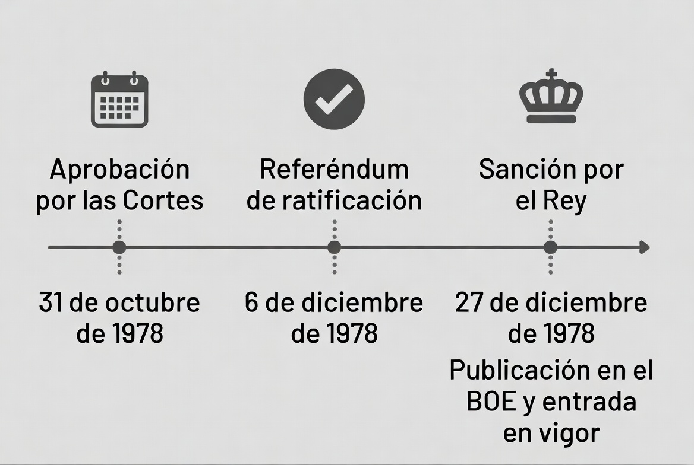
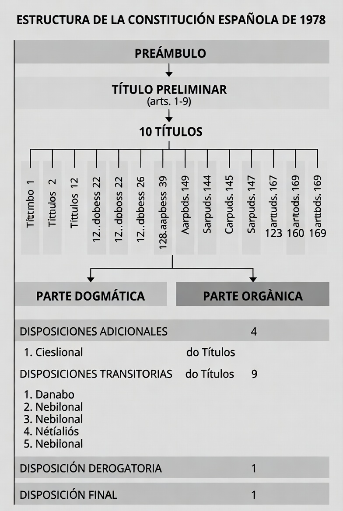
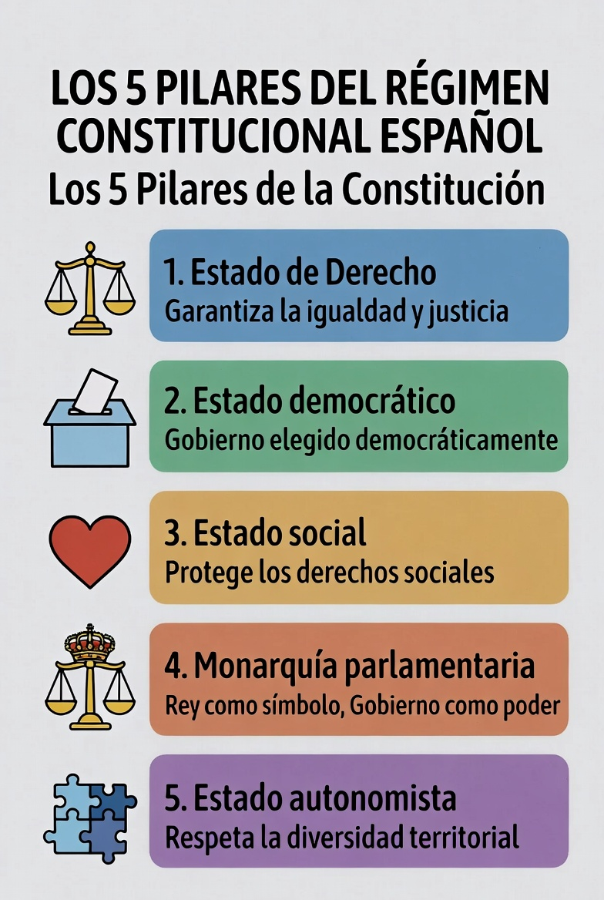
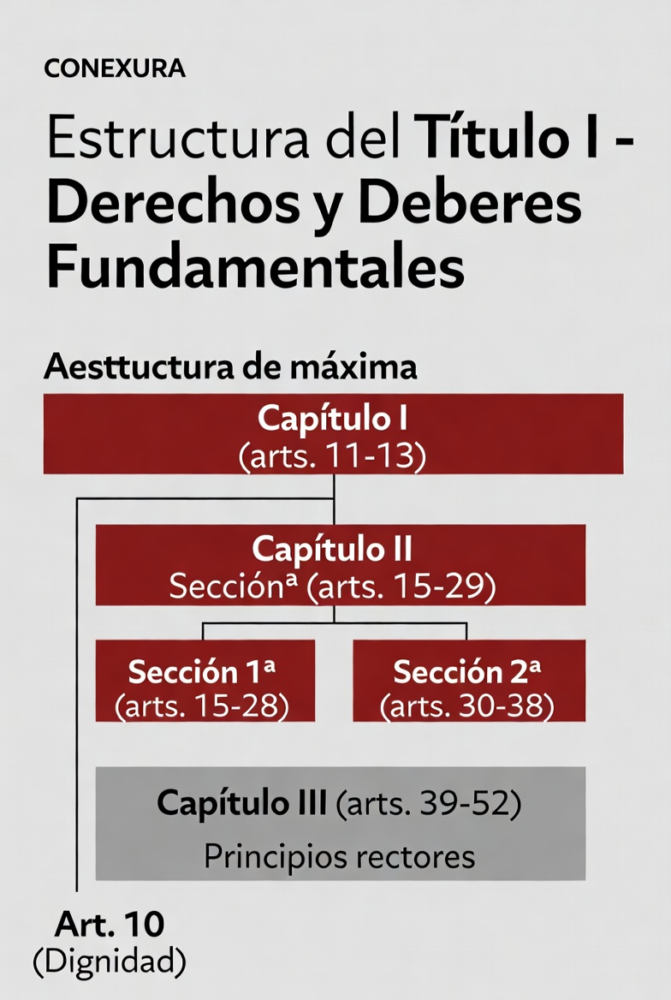
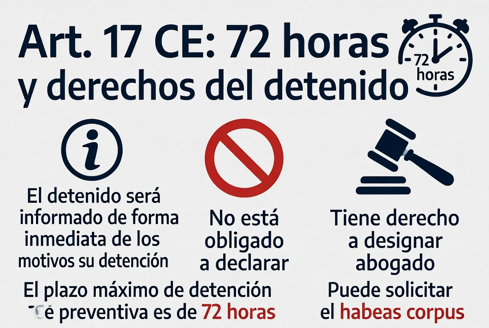
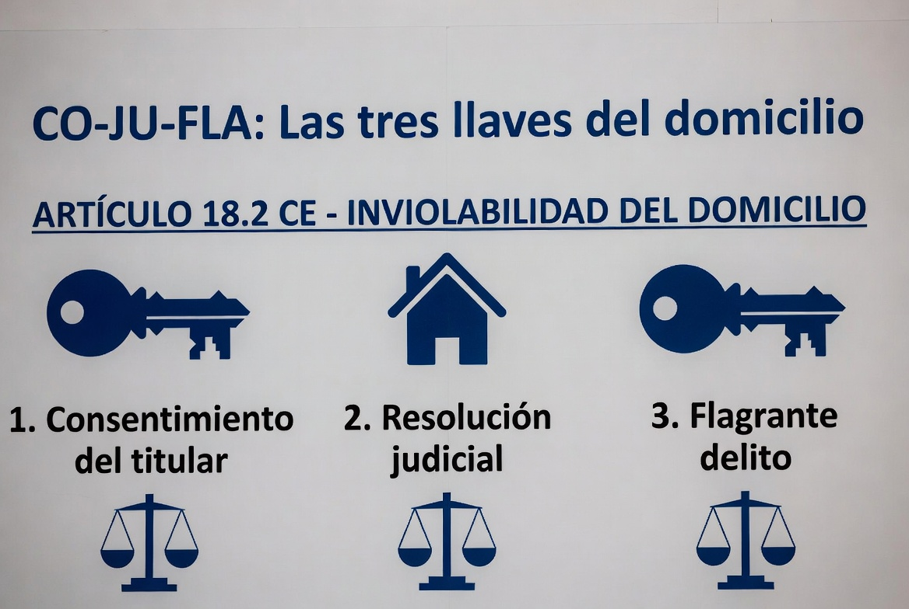
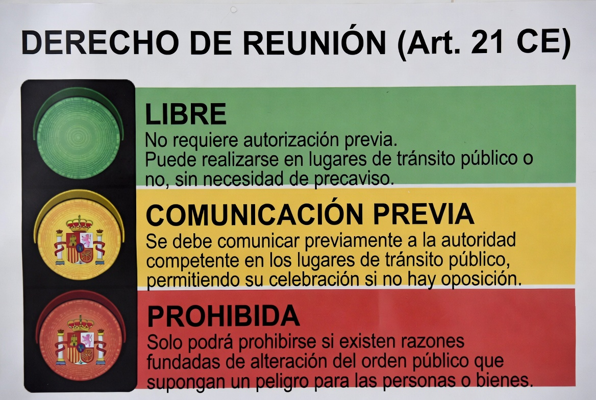
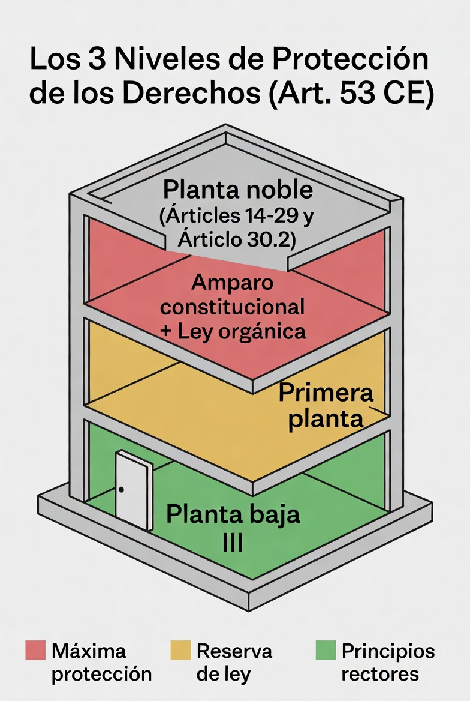
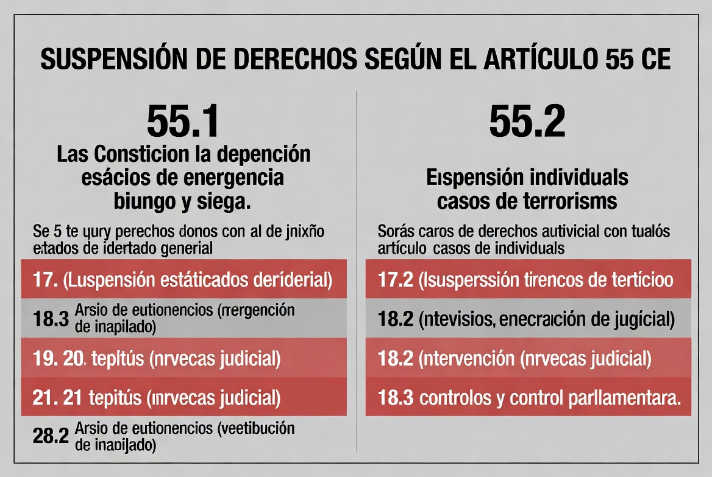
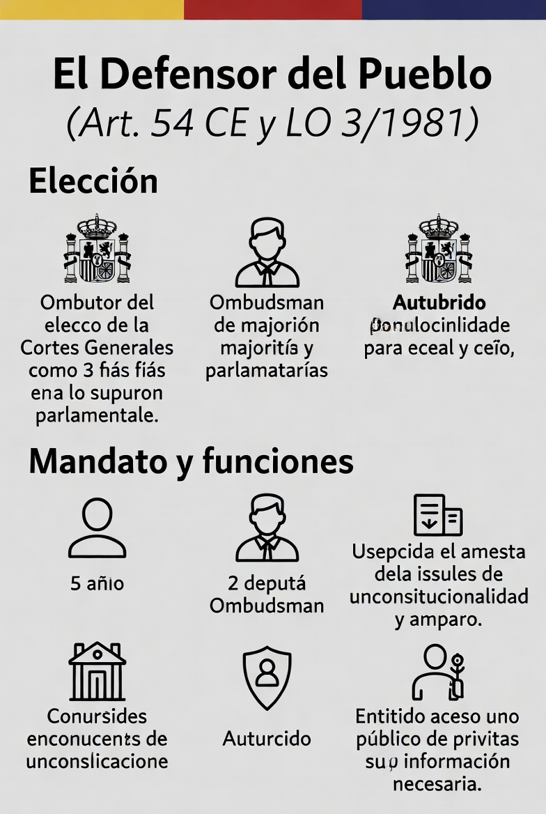

# TEMA 2 · LA CONSTITUCIÓN ESPAÑOLA (I)
### Policía Nacional · Escala Básica · Bloque A: Ciencias Jurídicas
🛡️ **ACADEMIA EN VIGOR** · *El temario que nunca descansa*
📄 **Versión EL PARTE** — lo esencial, al grano, para repasar rápido. Su hermana mayor, **EL ATESTADO**, desarrolla este tema a fondo con todo el detalle. [¿Qué es esto?](../../docs/parte-y-atestado.md)

---

# 📋 MAPA DEL TEMA

**Qué vas a estudiar:** la norma suprema por dentro. Cómo está construida la CE de 1978, sus valores y principios, el catálogo de derechos y deberes fundamentales (el corazón del tema y de tu futura profesión), sus garantías, cuándo pueden suspenderse, y el Defensor del Pueblo.

**Peso en el examen:** 3-5 preguntas entre este tema y el 3. La estructura del Título I y las garantías del art. 53 son de las preguntas más repetidas de TODO el examen.

**Normativa clave:**
| Norma | Qué regula aquí |
|---|---|
| CE 1978 (estructura general) | Partes 1 |
| CE arts. 1-2 | Valores y principios |
| CE Título I (arts. 10-55) | Derechos y deberes fundamentales |
| CE arts. 53-54 | Garantías; Defensor del Pueblo |
| CE art. 55 | Suspensión de derechos |
| LO 3/1981 | Defensor del Pueblo |
| RGPD (UE) 2016/679 y LO 3/2018 | Protección de datos (referencia; se desarrolla en el tema 26) |

**Estructura del tema (3 partes ≈ 3 audios):**
```
LA CONSTITUCIÓN (I)
├── PARTE 1 · La Constitución por fuera
│   ├── 1. Estructura y caracteres
│   ├── 2. Los valores de la Constitución
│   └── 3. Los principios del régimen constitucional
├── PARTE 2 · Los derechos, uno a uno
│   ├── 4. Estructura del Título I
│   └── 5. Derechos fundamentales y libertades públicas
└── PARTE 3 · Escudos y excepciones
    ├── 6. Las garantías de los derechos (art. 53)
    ├── 7. La suspensión de derechos (art. 55)
    ├── 8. Protección de datos y derechos digitales
    └── 9. El Defensor del Pueblo
```

---
---

# 🟦 PARTE 1 · LA CONSTITUCIÓN POR FUERA

# 📖 1. ESTRUCTURA Y CARACTERES DE LA CONSTITUCIÓN DE 1978

## 1.1. Datos esenciales (⭐ caen como fechas sueltas)


| Hito | Fecha |
|---|---|
| Aprobación por las Cortes | 31 de octubre de 1978 |
| **Referéndum de ratificación** | **6 de diciembre de 1978** |
| Sanción por el Rey | 27 de diciembre de 1978 |
| **Publicación en el BOE y entrada en vigor** | **29 de diciembre de 1978** |

## 1.2. Estructura
📅 **Ha caído:** 2025-2 · 2023 · 2022 — estructura, elaboración y protagonistas de la CE.


- **Preámbulo** (sin valor normativo directo, sí interpretativo)
- **Título Preliminar** (arts. 1-9)
- **10 Títulos** (del I al X)
- **169 artículos** en total
- **4** disposiciones adicionales
- **9** disposiciones transitorias
- **1** disposición derogatoria
- **1** disposición final

Se distingue una **parte dogmática** (Título Preliminar y Título I: valores, principios, derechos) y una **parte orgánica** (Títulos II a X: organización de los poderes del Estado).

⭐ Mnemotecnia de las disposiciones: **"4-9-1-1"** (Adicionales-Transitorias-Derogatoria-Final): *"el teléfono de la Constitución"*.

## 1.3. Caracteres

- **Escrita y codificada** en un texto único.
- **Extensa:** de las más largas de nuestra historia (169 artículos).
- **Consensuada:** fruto del acuerdo de las principales fuerzas políticas de la Transición.
- **Rígida:** su reforma exige procedimientos agravados (arts. 166-169), más exigentes que los de una ley ordinaria.
- **Derivada:** se inspira en otras constituciones (la alemana, la italiana...).
- **Monárquica:** forma política = Monarquía parlamentaria.
- **Normativa:** es norma jurídica directamente aplicable, no un mero programa (así lo garantiza el Tribunal Constitucional).

> 💡 **EN CRISTIANO**
> La Constitución tiene dos mitades: la dogmática dice *qué* protege el Estado (tus derechos, los valores), y la orgánica dice *quién* manda y cómo se reparte el poder. Y "rígida" no significa que no se pueda cambiar, sino que cambiarla es deliberadamente difícil: no se toca la norma suprema con la misma facilidad que una ley de presupuestos.

---

# 📖 2. LOS VALORES DE LA CONSTITUCIÓN

**Art. 1.1 CE:** "España se constituye en un **Estado social y democrático de Derecho**, que propugna como **valores superiores** de su ordenamiento jurídico la **libertad, la justicia, la igualdad y el pluralismo político**."

⭐ Son exactamente **cuatro** y en este orden: **L-J-I-P** (*"La Justicia Iguala al Pueblo"*).

⚠️ **Trampa clásica:** colar "la dignidad" o "la solidaridad" como valor superior del art. 1.1. La dignidad de la persona está en el **art. 10.1** como fundamento del orden político y de la paz social — no es "valor superior" del 1.1.

---

# 📖 3. LOS PRINCIPIOS DEL RÉGIMEN CONSTITUCIONAL


## 3.1. Estado de Derecho
Imperio de la ley: todos los poderes públicos y los ciudadanos están sometidos a la Constitución y al resto del ordenamiento (art. 9.1). División de poderes y garantía de los derechos.

## 3.2. Estado democrático
**Art. 1.2:** "La soberanía nacional reside en el **pueblo español**, del que emanan los poderes del Estado." Participación política, sufragio, pluralismo.

## 3.3. Estado social
Los poderes públicos deben promover las condiciones para que la libertad y la igualdad sean **reales y efectivas** (art. 9.2). No basta con reconocer derechos: hay que remover obstáculos.

## 3.4. Monarquía parlamentaria
**Art. 1.3:** "La forma política del Estado español es la Monarquía parlamentaria." El Rey reina pero no gobierna: es Jefe del Estado con funciones tasadas (se desarrolla en el tema 3).

## 3.5. Estado autonomista
**Art. 2:** la Constitución se fundamenta en la **indisoluble unidad de la Nación española**, y reconoce y garantiza el **derecho a la autonomía de las nacionalidades y regiones** que la integran y la **solidaridad** entre todas ellas.

> 💡 **EN CRISTIANO**
> Los cinco principios son las cinco patas de la mesa: la ley manda sobre todos (Derecho), el pueblo es el jefe (democrático), el Estado no se queda mirando ante la desigualdad (social), el Rey preside pero no decide (Monarquía parlamentaria), y España es una pero descentralizada (autonomista). El art. 2 es un equilibrio de tres palabras: **unidad + autonomía + solidaridad**.

> 🚔 **EN LA CALLE**
> El Estado de Derecho no es teoría para ti: es la razón por la que tus actuaciones exigen cobertura legal. Un policía no puede hacer todo lo que no está prohibido (como un ciudadano), sino solo lo que la ley le habilita a hacer. El art. 9.1 es el fundamento último de que cada identificación, cacheo o entrada tenga que apoyarse en una norma.

---
---

# 🟦 PARTE 2 · LOS DERECHOS, UNO A UNO

# 📖 4. ESTRUCTURA DEL TÍTULO I (arts. 10-55) ⭐⭐


Dominar este esquema vale varias preguntas de examen. El Título I se llama **"De los derechos y deberes fundamentales"**:

```
TÍTULO I (arts. 10-55)
│
├── Art. 10 — Dignidad de la persona (pórtico del Título)
│
├── CAPÍTULO I (11-13) — Españoles y extranjeros
│   (nacionalidad, mayoría de edad a los 18, extranjería, asilo)
│
├── CAPÍTULO II — Derechos y libertades
│   ├── Art. 14 — Igualdad ante la ley
│   ├── SECCIÓN 1ª (15-29) — «Derechos fundamentales
│   │    y libertades públicas» ← MÁXIMA PROTECCIÓN
│   └── SECCIÓN 2ª (30-38) — Derechos y deberes de los ciudadanos
│
├── CAPÍTULO III (39-52) — Principios rectores de la política
│    social y económica (no son derechos directamente exigibles)
│
├── CAPÍTULO IV (53-54) — Garantías de las libertades
│    y derechos fundamentales
│
└── CAPÍTULO V (55) — Suspensión de derechos y libertades
```

**Art. 10.1:** la dignidad de la persona, los derechos inviolables que le son inherentes, el libre desarrollo de la personalidad, el respeto a la ley y a los derechos de los demás son **fundamento del orden político y de la paz social**.
**Art. 10.2:** los derechos fundamentales se interpretarán conforme a la **Declaración Universal de Derechos Humanos** y los tratados ratificados por España.

---

# 📖 5. DERECHOS FUNDAMENTALES Y LIBERTADES PÚBLICAS (Sección 1ª, arts. 15-29)
📅 **Ha caído:** 2025-2 · 2022 — derechos concretos del Título I y su ubicación.

Los de máxima protección. Repaso artículo a artículo (⭐ = de los más preguntados):

- **Art. 15 ⭐** — Derecho a la **vida** y a la **integridad física y moral**; prohibición de la tortura y de penas o tratos inhumanos o degradantes. **Abolición de la pena de muerte**, "salvo lo que puedan disponer las leyes penales militares para tiempos de guerra" (hoy abolida también en ese ámbito por LO 11/1995).
- **Art. 16** — Libertad **ideológica, religiosa y de culto**. Nadie podrá ser obligado a declarar sobre su ideología, religión o creencias. **Ninguna confesión tendrá carácter estatal** (aconfesionalidad).
- **Art. 17 ⭐⭐** — Derecho a la **libertad y seguridad**. La **detención preventiva** no podrá durar más del tiempo estrictamente necesario y, **en todo caso, máximo 72 horas**, transcurridas las cuales el detenido debe ser puesto en libertad o a disposición judicial. Derechos del detenido (17.3): información inmediata y comprensible de sus derechos y de las razones de la detención; no obligación de declarar; asistencia de abogado. **Habeas corpus** (17.4).

- **Art. 18 ⭐⭐** — **Honor, intimidad personal y familiar y propia imagen** (18.1). **Inviolabilidad del domicilio** (18.2): ninguna entrada o registro sin **consentimiento del titular, resolución judicial o flagrante delito**. **Secreto de las comunicaciones** (18.3), salvo resolución judicial. Limitación del uso de la informática (18.4) — semilla de la protección de datos.

- **Art. 19** — Libertad de **residencia y circulación** por el territorio nacional; libre entrada y salida de España.
- **Art. 20** — Libertades de **expresión e información** [literaria, artística, científica y técnica; libertad de cátedra; información veraz]. Prohibida la **censura previa**. El **secuestro de publicaciones** solo por resolución judicial. Límites: los derechos del Título I, especialmente honor, intimidad, propia imagen y **protección de la juventud y de la infancia**.
- **Art. 21 ⭐** — Derecho de **reunión** pacífica y sin armas: **no necesita autorización previa**. Las reuniones en lugares de tránsito público y manifestaciones requieren **comunicación previa a la autoridad**, que solo podrá prohibirlas cuando existan **razones fundadas de alteración del orden público, con peligro para personas o bienes**.

- **Art. 22** — Derecho de **asociación**. Las asociaciones que persigan fines o utilicen medios **tipificados como delito son ilegales**. Solo podrán ser disueltas o suspendidas por **resolución judicial motivada**. Prohibidas las asociaciones **secretas y las de carácter paramilitar**.
- **Art. 23** — Participación en asuntos públicos, directamente o por representantes elegidos por **sufragio universal**, y acceso a cargos y funciones públicas. 📅 *2025*
- **Art. 24 ⭐** — **Tutela judicial efectiva** sin indefensión. Derechos procesales: juez ordinario predeterminado por la ley, defensa y asistencia letrada, ser informado de la acusación, proceso público sin dilaciones indebidas, prueba, no declarar contra sí mismo, no confesarse culpable y **presunción de inocencia**.
- **Art. 25** — **Principio de legalidad penal** (nadie condenado por acciones que al cometerse no fueran delito). Las penas privativas de libertad estarán orientadas a la **reeducación y reinserción social**. La Administración civil **no podrá imponer sanciones que impliquen privación de libertad**.
- **Art. 26** — Prohibición de los **Tribunales de Honor** en la Administración civil y organizaciones profesionales.
- **Art. 27** — Derecho a la **educación** y libertad de enseñanza.
- **Art. 28** — **Libertad sindical** y derecho de **huelga** (con mantenimiento de servicios esenciales).
- **Art. 29** — Derecho de **petición** individual y colectiva, por escrito.

**Sección 2ª (30-38), lo esencial:** defensa de España y **objeción de conciencia** (30.2 ⭐, protegida por amparo), deber de tributar (31), matrimonio (32), propiedad privada (33), fundación (34), trabajo (35), colegios profesionales (36), negociación colectiva (37), libertad de empresa (38).

**Capítulo III (39-52), principios rectores:** protección de la familia y la infancia (39), redistribución de la renta y pleno empleo (40), Seguridad Social (41), salud (43), cultura (44), **medio ambiente (45)**, vivienda (47), juventud (48), discapacidad (49), tercera edad (50), consumidores (51). ⚠️ Solo pueden alegarse ante los tribunales **de acuerdo con lo que dispongan las leyes que los desarrollen** (art. 53.3): no son derechos directamente exigibles.

> 💡 **EN CRISTIANO**
> El Título I es un edificio de tres plantas con distinta seguridad. Planta noble (14-29 + 30.2): alarma, blindaje y escolta — ley orgánica, amparo, máxima protección. Primera planta (resto del Cap. II): puerta blindada — reserva de ley y recurso de inconstitucionalidad. Planta baja (Cap. III, principios rectores): son objetivos que guían al legislador, no derechos que puedas reclamar directamente en un juzgado. Cuando el test pregunte "¿qué protección tiene el derecho X?", primero ubica en qué planta vive.

> 🚔 **EN LA CALLE**
> Tu trabajo diario ES el Título I aplicado: el 17 marca tus plazos de detención y la lectura de derechos; el 18.2 te dice cuándo puedes entrar en un domicilio (consentimiento, auto judicial o flagrancia — grábatelo a fuego); el 21 es la base de todo dispositivo de manifestaciones: no piden permiso, comunican — y solo se prohíben con razones fundadas de alteración del orden público con peligro para personas o bienes. Esa frase literal cae en el examen y la aplicarás en la calle.

---
---

# 🟦 PARTE 3 · ESCUDOS Y EXCEPCIONES

# 📖 6. LAS GARANTÍAS DE LOS DERECHOS (art. 53) ⭐⭐


Tres niveles de protección según el derecho:

| Derechos | Garantías |
|---|---|
| **Sección 1ª (15-29) + art. 14 + objeción (30.2)** | · Vinculan a todos los poderes públicos · Reserva de **ley orgánica** (81) para su desarrollo · Respeto de su **contenido esencial** · **Procedimiento preferente y sumario** ante tribunales ordinarios · **Recurso de amparo** ante el TC (para 14-29 y 30.2) · Reforma agravada del art. 168 |
| **Resto Capítulo II (30-38)** | · Vinculan a los poderes públicos · Reserva de **ley** (respeto del contenido esencial) · Recurso de **inconstitucionalidad** |
| **Capítulo III (39-52)** | · Informan la legislación, la práctica judicial y la actuación de los poderes públicos · Solo alegables según las leyes que los desarrollen |

⚠️ **Matiz de examen:** el amparo protege los arts. **14 a 29 más la objeción de conciencia del 30.2**. Ni el 13 ni el 33 ni el 38 tienen amparo.

# 📖 7. LA SUSPENSIÓN DE DERECHOS (art. 55)


## 7.1. Suspensión general (55.1) — estados de excepción y de sitio
Podrán suspenderse: **17** (libertad; en excepción NO se suspende el 17.3 — derechos del detenido—, solo en sitio), **18.2 y 18.3** (domicilio y comunicaciones), **19** (circulación), **20.1.a) y d) y 20.5** (expresión e información, secuestro de publicaciones), **21** (reunión), **28.2** (huelga) y **37.2** (medidas de conflicto colectivo).
⚠️ En el estado de **alarma NO se suspenden derechos** (pueden limitarse, no suspenderse).

## 7.2. Suspensión individual (55.2)
Una **ley orgánica** puede determinar la forma y los casos en que, **de forma individual y con la necesaria intervención judicial y el adecuado control parlamentario**, pueden suspenderse los derechos del **17.2** (plazo de detención), **18.2** y **18.3** para personas relacionadas con **investigaciones sobre bandas armadas o elementos terroristas**. La utilización injustificada o abusiva genera **responsabilidad penal**.

> 💡 **EN CRISTIANO**
> El 55.1 es el botón de emergencia colectivo (solo en excepción y sitio, nunca en alarma); el 55.2 es el bisturí individual antiterrorista: permite, con juez y Parlamento vigilando, alargar la detención e intervenir domicilio y comunicaciones de sospechosos concretos de terrorismo. Tres números para el test: 17.2, 18.2 y 18.3.

> 🚔 **EN LA CALLE**
> El 55.2 se traduce hoy en la LECrim: la detención por terrorismo puede prorrogarse **48 horas más** sobre las 72 (hasta 120 horas en total) con autorización judicial, y cabe la incomunicación. Cuando estudies el tema 21 de procesal, esta pieza encajará sola.

# 📖 8. PROTECCIÓN DE DATOS Y DERECHOS DIGITALES

Del art. 18.4 CE ("la ley limitará el uso de la informática...") derivan:
- **Normativa comunitaria:** Reglamento (UE) 2016/679, **RGPD** — aplicable desde el 25 de mayo de 2018.
- **Normativa nacional:** **LO 3/2018**, de Protección de Datos Personales y **garantía de los derechos digitales**; y **LO 7/2021** para el ámbito penal-policial.
- El TC ha reconocido la protección de datos como **derecho fundamental autónomo** (STC 292/2000): el *habeas data*.

(Desarrollo completo en el **tema 26**; aquí basta con ubicar el fundamento constitucional y las normas.)

# 📖 9. EL DEFENSOR DEL PUEBLO (art. 54 y LO 3/1981)
📅 **Ha caído:** 2023 · 2021 — el Defensor del Pueblo y su ley orgánica.


- **Alto comisionado de las Cortes Generales** para la defensa de los derechos del Título I; supervisa la actividad de la **Administración**, dando cuenta a las Cortes.
- **Elección:** por las Cortes Generales, mayoría de **3/5** de cada Cámara. Mandato: **5 años** (no coincide con la legislatura: refuerza su independencia).
- Auxiliado por **dos Adjuntos**.
- Goza de **inviolabilidad e inmunidad** en el ejercicio de su cargo.
- ⭐ Está **legitimado para interponer recurso de inconstitucionalidad y recurso de amparo** (arts. 162 CE) y para instar el procedimiento de *habeas corpus*.
- Puede actuar **de oficio o a instancia de parte**; toda persona natural o jurídica que invoque un interés legítimo puede dirigirse a él, **sin restricción alguna**, incluso los internos en centros penitenciarios.
- Presenta un **informe anual** a las Cortes.

> 💡 **EN CRISTIANO**
> Es el "abogado gratuito del ciudadano frente a la Administración": no dicta sentencias ni anula actos, pero investiga, recomienda, publica y puede llevar leyes al Constitucional. Sus tres números de examen: **3/5, 5 años, 2 adjuntos**.

---

# 🎯 LO QUE CAE
## 📅 Así lo preguntaron
**8 preguntas en los exámenes oficiales cargados (promociones 37-42, convocatorias 2021-2025)**:
- **2025-2:** Tipo de sufragio en el derecho de participación (art. 23 CE); Composición de la Constitución Española (títulos, artículos y disposiciones).
- **2023:** Persona que NO fue uno de los 'padres de la Constitución'; Plazo máximo para presentar una queja ante el Defensor del Pueblo (un año).
- **2022:** Ubicación del derecho a la propiedad y la herencia en la CE (derechos y deberes de los ciudadanos, art. 33); Quién aprueba y ratifica la CE según el Preámbulo (las Cortes aprueban, el pueblo ratifica).
- **2021:** Número de miembros de la Junta de Coordinación del Defensor del Pueblo (cuatro); Artículo de la CE sobre la seguridad pública como competencia exclusiva (art. 149.1.29).

<!-- 📅 pendiente: sumar el examen de la pareja 2024/2025-1 cuando se confirme su etiqueta -->

## Puntos calientes
1. Fechas de la CE: referéndum **6-D**, publicación y vigencia **29-D** de 1978.
2. Estructura: preámbulo + título preliminar + 10 títulos + **169 artículos** + disposiciones **4-9-1-1**.
3. Valores superiores (art. 1.1): **libertad, justicia, igualdad, pluralismo político** — solo esos cuatro.
4. Esquema del Título I: capítulos, secciones y qué artículo abre y cierra cada uno.
5. Art. 17: **72 horas** máximo de detención preventiva; derechos del detenido; habeas corpus.
6. Art. 18.2: **consentimiento, resolución judicial o flagrante delito.**
7. Art. 21: reunión **sin autorización previa**; comunicación previa para lugares de tránsito público.
8. Garantías art. 53: amparo = **14-29 + 30.2**.
9. Suspensión 55.1 (nunca en alarma) y 55.2 (17.2, 18.2, 18.3 — terrorismo).
10. Defensor del Pueblo: **3/5 de cada Cámara, 5 años, 2 adjuntos**, legitimado para inconstitucionalidad y amparo.

## Trampas del tribunal
- ⚠️ "La CE entró en vigor el 6 de diciembre" → NO: ese fue el referéndum; vigencia el **29**.
- ⚠️ Colar "dignidad" (art. 10) o "solidaridad" como valor superior del 1.1.
- ⚠️ "El derecho de reunión requiere autorización previa" → NO: **comunicación** (y solo para tránsito público).
- ⚠️ Incluir el art. 33 (propiedad) o el 38 (empresa) entre los protegidos por amparo.
- ⚠️ "En el estado de alarma se suspenden derechos" → NO: solo limitación.
- ⚠️ Defensor del Pueblo elegido "por el Congreso" → NO: por **las Cortes Generales** (ambas Cámaras, 3/5 cada una).

## Mnemotecnias
- Valores del 1.1: **"La Justicia Iguala al Pueblo"** (Libertad, Justicia, Igualdad, Pluralismo).
- Disposiciones: **4-9-1-1**, "el teléfono de la Constitución".
- Entrada en domicilio (18.2): **"CO-JU-FLA"** → COnsentimiento, resolución JUdicial, FLAgrante delito.
- Suspensión individual 55.2: **"17-18-18"** (17.2, 18.2, 18.3).
- Defensor: **"3/5 · 5 · 2"** (elección, años, adjuntos).

## Mini-test (10 preguntas)

1. La Constitución Española fue ratificada en referéndum el:
   a) 31 de octubre de 1978   b) 6 de diciembre de 1978 ✅   c) 27 de diciembre de 1978   d) 29 de diciembre de 1978

2. Los valores superiores del ordenamiento jurídico (art. 1.1 CE) son:
   a) Libertad, justicia, igualdad y solidaridad
   b) Libertad, justicia, igualdad y pluralismo político ✅
   c) Libertad, dignidad, igualdad y pluralismo político
   d) Justicia, seguridad, igualdad y pluralismo político

3. La duración máxima de la detención preventiva es, en todo caso:
   a) 24 horas   b) 48 horas   c) 72 horas ✅   d) 120 horas

4. La entrada en un domicilio SIN consentimiento del titular exige:
   a) Siempre resolución judicial
   b) Resolución judicial o flagrante delito ✅
   c) Autorización del Delegado del Gobierno
   d) Solo orden del Ministerio Fiscal

5. El derecho de reunión en lugares de tránsito público exige:
   a) Autorización previa de la autoridad
   b) Comunicación previa a la autoridad ✅
   c) Autorización judicial
   d) Nada: es libre en todo caso

6. El recurso de amparo protege los derechos de los artículos:
   a) 14 a 38   b) 15 a 29   c) 14 a 29 más la objeción de conciencia del 30.2 ✅   d) 10 a 55

7. En el estado de alarma:
   a) Se suspenden los derechos del art. 55.1
   b) No se suspenden derechos, aunque pueden limitarse ✅
   c) Se suspende únicamente el derecho de huelga
   d) Se suspende el art. 17.3

8. La suspensión individual del art. 55.2 afecta a los artículos:
   a) 17.2, 18.2 y 18.3 ✅   b) 17, 18 y 19   c) 15, 16 y 17   d) 18.2, 18.3 y 21

9. El Defensor del Pueblo es elegido por:
   a) El Congreso por mayoría absoluta
   b) El Gobierno
   c) Las Cortes Generales, por mayoría de 3/5 de cada Cámara ✅
   d) El Consejo General del Poder Judicial

10. Los principios rectores del Capítulo III del Título I:
    a) Son directamente exigibles ante cualquier tribunal
    b) Están protegidos por recurso de amparo
    c) Solo pueden alegarse conforme a las leyes que los desarrollen ✅
    d) Vinculan solo al poder judicial

---

*Tema 2 · v1.0 · 3 partes dimensionadas para audio-repasos. Pendiente de revisión final por el autor contra el texto consolidado de la CE y la LO 3/1981.*
