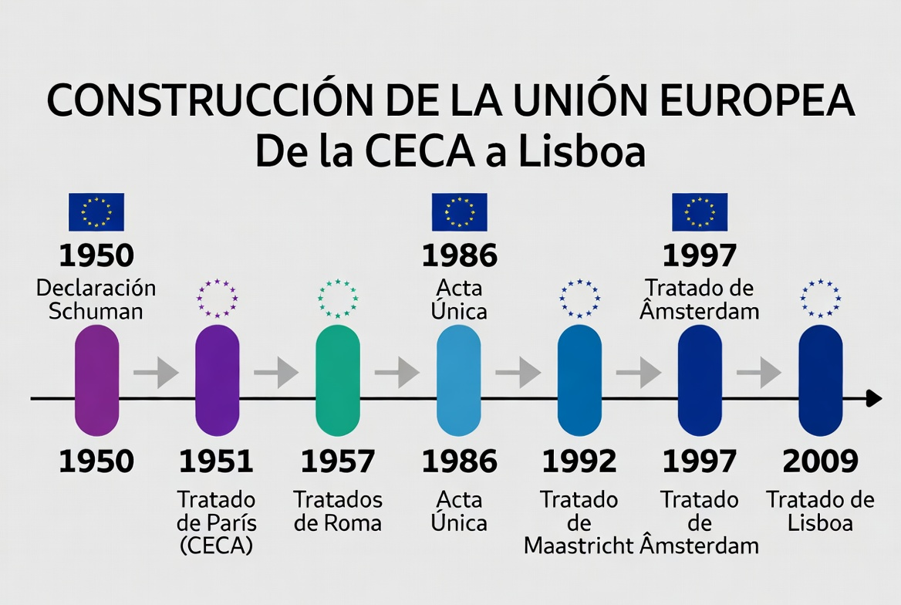
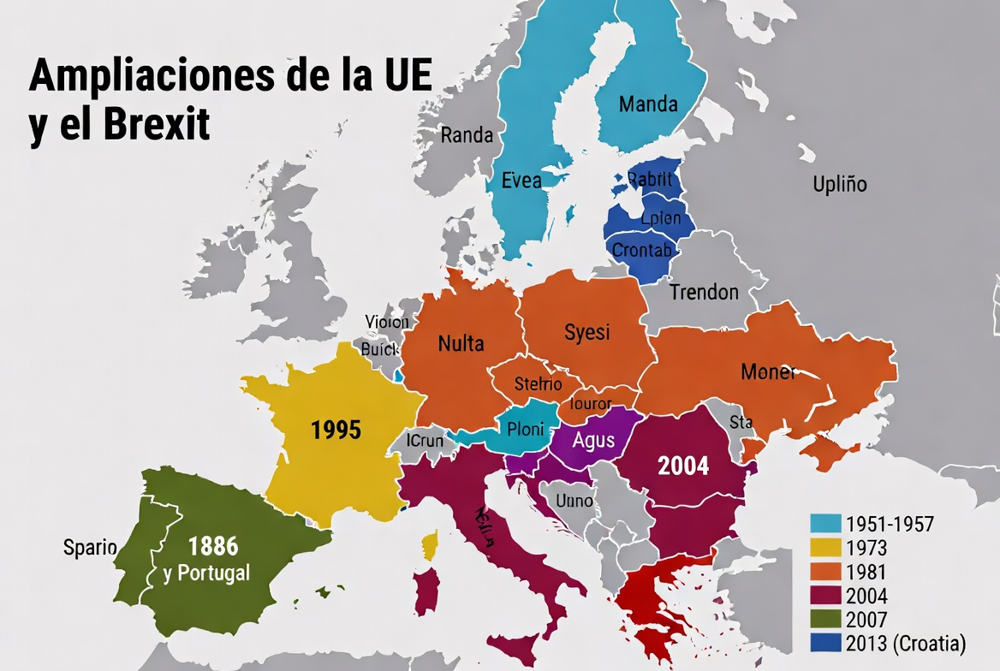
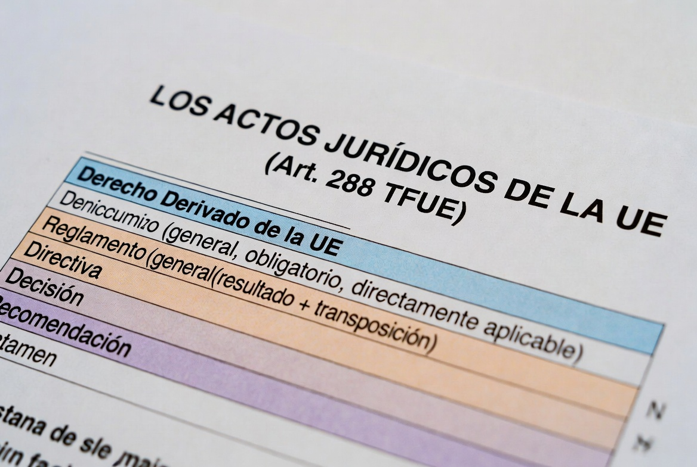
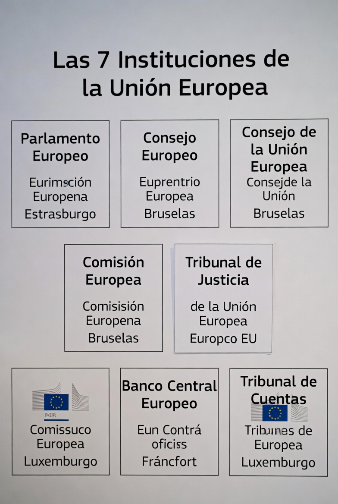
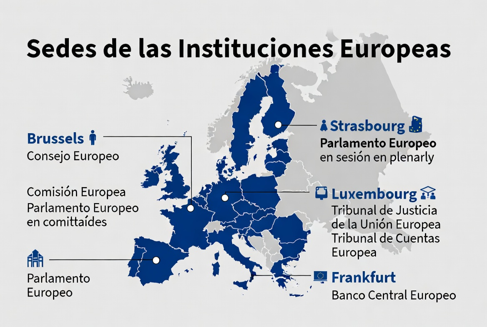
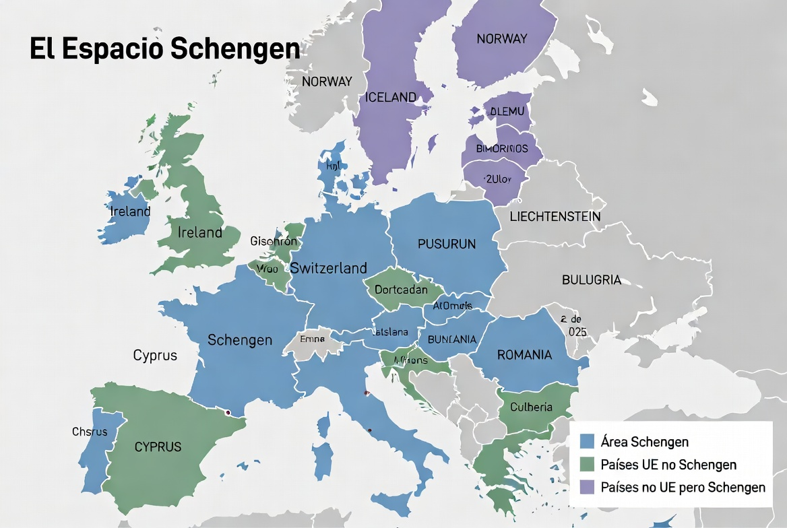
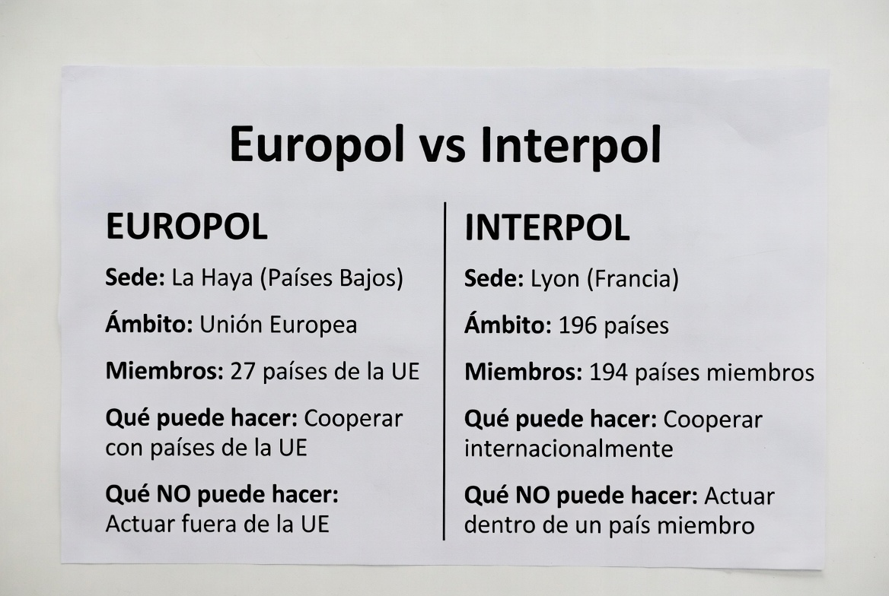
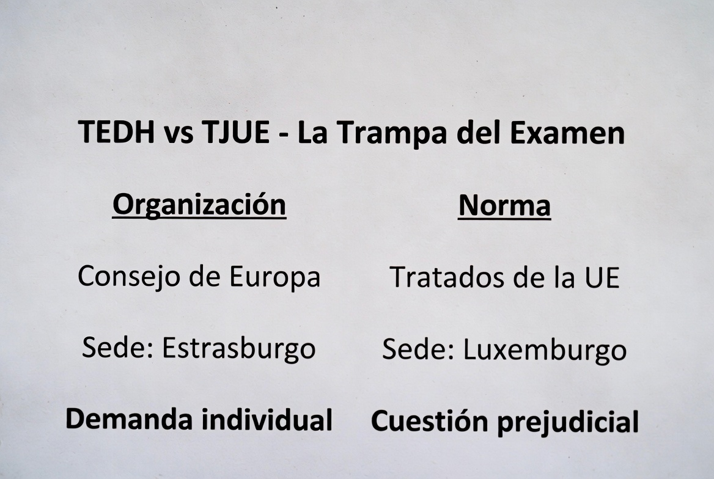

# TEMA 4 · LA UNIÓN EUROPEA
### Policía Nacional · Escala Básica · Bloque A: Ciencias Jurídicas
🛡️ **ACADEMIA EN VIGOR** · *El temario que nunca descansa*
📄 **Versión EL PARTE** — lo esencial, al grano, para repasar rápido. Su hermana mayor, **EL ATESTADO**, desarrolla este tema a fondo con todo el detalle. [¿Qué es esto?](../../docs/parte-y-atestado.md)

---

# 📋 MAPA DEL TEMA

**Qué vas a estudiar:** el club al que pertenece España desde 1986. Cómo se construyó la UE tratado a tratado, qué normas dicta y cómo obligan (reglamentos, directivas...), quién manda en Bruselas (las 7 instituciones), y la parte más policial del tema: Schengen, Europol, Interpol y la cooperación internacional, con la trampa estrella del examen — distinguir el TEDH del TJUE.

**Peso en el examen:** presencia constante — hay preguntas de UE en todos los exámenes oficiales cargados, normalmente 2-4 por convocatoria. Los favoritos del tribunal: fundadores y miembros, símbolos, el art. 288 (tipos de actos jurídicos), sedes de las instituciones y composición del TJUE.

**Normativa clave:**
| Norma | Qué regula aquí |
|---|---|
| TUE (Tratado de la Unión Europea) | Valores, instituciones, marco general |
| TFUE (Tratado de Funcionamiento) | Competencias, actos jurídicos (art. 288), TJUE (art. 252) |
| Carta de Derechos Fundamentales de la UE | Derechos, con valor de Tratado desde Lisboa |
| CEDH (Convenio Europeo de DDHH, 1950) | Sistema del Consejo de Europa y su TEDH |
| Convenio de aplicación de Schengen (1990) | Espacio de libre circulación, SIS |

**Estructura del tema (4 partes ≈ 4 audios):**
```
LA UNIÓN EUROPEA
├── PARTE 1 · La construcción europea
│   ├── 1. Referencia histórica: de la CECA a Lisboa
│   ├── 2. Las ampliaciones y el Brexit
│   └── 3. Símbolos de la Unión
├── PARTE 2 · El Derecho de la UE
│   └── 4. Derecho originario y derivado (art. 288 TFUE)
├── PARTE 3 · Las instituciones
│   └── 5. Las 7 instituciones y los órganos consultivos
└── PARTE 4 · La Europa policial y sus tribunales
    ├── 6. Schengen y los sistemas de información
    ├── 7. Europol, Interpol y la cooperación policial
    └── 8. TEDH y TJUE: la trampa estrella
```

---
---

# 🟦 PARTE 1 · LA CONSTRUCCIÓN EUROPEA

# 📖 1. REFERENCIA HISTÓRICA: DE LA CECA A LISBOA
📅 **Ha caído:** 2025-2 · 2023 · 2022 — fundadores, países miembros, lema y Nobel de la Paz.


## 1.1. El origen
- **9 de mayo de 1950 — Declaración Schuman:** el ministro francés de Exteriores, Robert Schuman, propone poner la producción francoalemana de carbón y acero bajo una autoridad común. Es la partida de nacimiento de la Europa comunitaria (por eso el 9 de mayo es el **Día de Europa**).
- **1951 — Tratado de París: la CECA** (Comunidad Europea del Carbón y del Acero). ⭐ La firman **los Seis fundadores: Alemania, Francia, Italia, Bélgica, Países Bajos y Luxemburgo**. Se pactó por **50 años**, por lo que **expiró en 2002**.
- **1957 — Tratados de Roma:** nacen la **CEE** (Comunidad Económica Europea) y el **EURATOM** (energía atómica). Mismos seis países.
- **1965 — Tratado de fusión (Bruselas):** una sola Comisión y un solo Consejo para las tres Comunidades.

## 1.2. Los grandes tratados de reforma
- **1986 — Acta Única Europea:** primera gran reforma; objetivo, el **mercado interior** (conseguido en 1993).
- **1992 — Tratado de Maastricht (TUE):** ⭐ **nace la UNIÓN EUROPEA**. Crea la estructura de **tres pilares** (comunitario; política exterior y de seguridad común; justicia e interior), la **ciudadanía europea** y el camino hacia la **moneda única**. En vigor el 1-11-1993.
- **1997 — Tratado de Ámsterdam:** integra el **acervo de Schengen** en el marco de la UE.
- **2001 — Tratado de Niza:** reforma institucional para preparar la gran ampliación al Este.
- **2004 — Tratado Constitucional:** firmado pero **fracasó** (referendos negativos en Francia y Países Bajos). Nunca entró en vigor.
- **2007 — Tratado de LISBOA** (en vigor el **1-12-2009**): ⭐ el marco actual. Sus aportaciones de examen:
  - La UE adquiere **personalidad jurídica única** y desaparecen los pilares.
  - Dos textos: **TUE + TFUE** (el TFUE sustituye al Tratado CE).
  - La **Carta de los Derechos Fundamentales** adquiere **el mismo valor jurídico que los Tratados**.
  - El **Consejo Europeo** pasa a ser institución, con **Presidente estable**.
  - Se crea el **Alto Representante para Asuntos Exteriores y Política de Seguridad**.
  - **Iniciativa ciudadana europea:** un millón de firmas de ciudadanos de un número significativo de Estados.

# 📖 2. LAS AMPLIACIONES Y EL BREXIT


| Año | Entran | Total |
|---|---|---|
| 1951/57 | Los Seis fundadores | 6 |
| 1973 | Reino Unido, Irlanda, Dinamarca | 9 |
| 1981 | Grecia | 10 |
| **1986** | **ESPAÑA y Portugal** ⭐ | 12 |
| 1995 | Austria, Finlandia, Suecia | 15 |
| 2004 | La gran ampliación al Este (10 países: Polonia, Chequia, Hungría, Eslovaquia, Eslovenia, Estonia, Letonia, Lituania, Malta, Chipre) | 25 |
| 2007 | Bulgaria y Rumanía | 27 |
| 2013 | **Croacia** (la última en entrar) | 28 |
| 2020 | **BREXIT**: sale el Reino Unido (31-1-2020) | **27 actuales** |

- **España:** firmó el **Acta de Adhesión el 12 de junio de 1985** e ingresó el **1 de enero de 1986**, junto a Portugal.
- **Países candidatos** (a fecha de redacción): Albania, Bosnia y Herzegovina, Georgia, Moldavia, Macedonia del Norte, Montenegro, Serbia, Turquía y **Ucrania**.
- ⚠️ **Trampa recurrente:** países europeos que **NO** son UE: **Noruega, Suiza, Islandia, Reino Unido** (y microestados como Andorra o Mónaco). Noruega cayó literalmente en el examen.

# 📖 3. SÍMBOLOS DE LA UNIÓN
- **Bandera:** círculo de **12 estrellas** doradas sobre fondo azul (12 = símbolo de perfección, NO el número de miembros).
- **Himno:** el **"Himno a la Alegría"** de la 9ª sinfonía de Beethoven.
- **Lema:** ⭐ **"Unida en la diversidad"** (cayó en 2023).
- **Día de Europa:** **9 de mayo** (Declaración Schuman).
- **Moneda:** el euro (en circulación desde el 1-1-2002).
- ⭐ La UE recibió el **Premio Nobel de la Paz en 2012** (cayó en 2022).

> 💡 **EN CRISTIANO**
> La historia de la UE es una escalera de confianza: primero compartir el carbón y el acero para que Francia y Alemania no pudieran volver a hacerse la guerra (CECA), luego compartir el mercado (Roma), luego la moneda y la ciudadanía (Maastricht), y finalmente un "reglamento interno" moderno (Lisboa). Para el examen, quédate con el esqueleto: **1951 París-CECA con 6 · 1957 Roma · 1992 Maastricht nace la UE · 2009 Lisboa el marco actual**. Y los Seis fundadores sin España ni Portugal, que llegamos tarde a la foto pero en 1986 entramos juntos.

> 🚔 **EN LA CALLE**
> ¿Por qué te importa esto en comisaría? Porque la etiqueta "ciudadano UE" cambia tu actuación entera: régimen de entrada y residencia distinto (lo verás en el tema 10), imposibilidad de expulsión salvo casos tasados, y libre circulación. Saber de memoria quién es UE y quién no (¿Rumanía? sí; ¿Noruega? no, pero es Schengen; ¿Reino Unido? ya no) es lo primero que aplicas ante un pasaporte.

---
---

# 🟦 PARTE 2 · EL DERECHO DE LA UE

# 📖 4. DERECHO ORIGINARIO Y DERIVADO
📅 **Ha caído:** 2022 — características de los reglamentos europeos.


## 4.1. Derecho originario
Los **Tratados** (TUE, TFUE, tratados de adhesión) y la **Carta de Derechos Fundamentales**. Es la "constitución" de la UE: todo el derecho derivado se subordina a él.

## 4.2. Derecho derivado (art. 288 TFUE) ⭐⭐
Los actos jurídicos que las instituciones adoptan para ejercer las competencias:

| Acto | Alcance | Obligatoriedad | Aplicación |
|---|---|---|---|
| **REGLAMENTO** | **General** | Obligatorio **en todos sus elementos** | **Directamente aplicable** en cada Estado (sin transposición) |
| **DIRECTIVA** | Estados destinatarios | Obliga **en cuanto al resultado** | Requiere **transposición** nacional (los Estados eligen forma y medios) |
| **DECISIÓN** | Concreto | Obligatoria en todos sus elementos | Si designa destinatarios, **solo obliga a estos** |
| **RECOMENDACIÓN** | — | **No vinculante** | — |
| **DICTAMEN** | — | **No vinculante** | — |

## 4.3. Principios de relación con el derecho nacional
- **Primacía:** el Derecho de la UE prevalece sobre el nacional (jurisprudencia *Costa/ENEL*, 1964).
- **Efecto directo:** los particulares pueden invocar normas europeas ante sus jueces (*Van Gend en Loos*, 1963).
- Publicación: **Diario Oficial de la Unión Europea (DOUE)**.

> 💡 **EN CRISTIANO**
> El reglamento es un email "a todos" que entra en vigor tal cual: aterriza igual en Sevilla que en Varsovia, sin que nadie lo retoque (el RGPD de protección de datos es el ejemplo perfecto). La directiva es un encargo: "consigue este resultado antes de esta fecha, hazlo a tu manera" — cada país aprueba su propia ley para cumplirla. La decisión es una carta certificada con nombre y apellidos. Y recomendaciones y dictámenes son consejos: se agradecen, no obligan. Mnemotecnia del reglamento: **"Reglamento = las 3 G"** — General, obliGatorio entero, lleGa directo.

---
---

# 🟦 PARTE 3 · LAS INSTITUCIONES

# 📖 5. LAS 7 INSTITUCIONES (art. 13 TUE)
📅 **Ha caído:** 2022 · 2021 — Presidente del Consejo Europeo, mayorías del Consejo y sede del BCE.



## 5.1. Parlamento Europeo
- Representa a **los ciudadanos**; elegido por sufragio universal directo cada **5 años**.
- Máximo **750 escaños más el Presidente** (Lisboa); actualmente **720** eurodiputados (**61 de España**).
- Sede oficial: **Estrasburgo** (plenos); trabajo de comisiones en Bruselas, secretaría en Luxemburgo.
- Funciones: colegislador con el Consejo, presupuesto, control político (elige al Presidente de la Comisión, censura a la Comisión).

## 5.2. Consejo Europeo ⭐
- **Jefes de Estado o de Gobierno** de los 27 + su Presidente + el Presidente de la Comisión.
- Define las **orientaciones y prioridades políticas generales**. ⚠️ **NO ejerce función legislativa.**
- **Presidente:** elegido por el propio Consejo Europeo **por mayoría cualificada**, mandato de **2 años y medio, renovable una sola vez** (cayó en 2022).

## 5.3. Consejo (de la Unión Europea)
- Un **ministro por Estado** según la materia. Representa a **los Gobiernos**.
- **Presidencia rotatoria semestral** entre los Estados.
- Regla general de voto: ⭐ **mayoría cualificada** (cayó en 2021) = **55% de los Estados (15 de 27) que representen al menos el 65% de la población**. La unanimidad queda para materias sensibles (fiscalidad, exterior...).
- ⚠️ No confundir: **Consejo Europeo** (cumbres de líderes) ≠ **Consejo de la UE** (ministros) ≠ **Consejo de Europa** (organización ajena a la UE, la del TEDH).

## 5.4. Comisión Europea
- **27 comisarios** (uno por Estado), mandato de **5 años**.
- **Monopolio de la iniciativa legislativa**, **"guardiana de los Tratados"** (puede llevar a los Estados ante el TJUE), ejecuta el presupuesto.
- Su Presidente: propuesto por el Consejo Europeo y **elegido por el Parlamento**.

## 5.5. Tribunal de Justicia de la UE (TJUE) — sede en **Luxemburgo**
Se desarrolla en la Parte 4 (§8), junto al TEDH.

## 5.6. Banco Central Europeo ⭐
- Sede: **Fráncfort del Meno** (cayó en 2021). Política monetaria del euro; independiente.

## 5.7. Tribunal de Cuentas
- Sede: **Luxemburgo**. Fiscaliza las cuentas de la Unión. Un miembro por Estado.

## 5.8. Órganos consultivos y figuras
- **Comité Económico y Social Europeo** y **Comité Europeo de las Regiones** (consultivos, Bruselas).
- **Defensor del Pueblo Europeo:** elegido por el Parlamento; investiga la mala administración de las instituciones de la UE.
- **Alto Representante** para Asuntos Exteriores: dirige la PESC y preside el Consejo de Asuntos Exteriores; es a la vez Vicepresidente de la Comisión.

> 💡 **EN CRISTIANO**
> Piensa en una comunidad de vecinos gigante: el **Consejo Europeo** son los dueños reunidos en junta marcando el rumbo (pero no redactan las normas); el **Consejo de la UE** y el **Parlamento** son los dos que aprueban las normas (los Gobiernos y los ciudadanos); la **Comisión** es el administrador de fincas: propone, gestiona y denuncia al vecino moroso; el **TJUE** es el juez; el **BCE** cuida la caja; y el **Tribunal de Cuentas** revisa las facturas. Sedes en cuatro ciudades: **B**ruselas (motor), **E**strasburgo (plenos y... ojo, también el TEDH, que NO es UE), **LU**xemburgo (justicia y cuentas), **F**ráncfort (banco).

---
---

# 🟦 PARTE 4 · LA EUROPA POLICIAL Y SUS TRIBUNALES

# 📖 6. SCHENGEN Y LOS SISTEMAS DE INFORMACIÓN


- **Acuerdo de Schengen (1985)** + **Convenio de aplicación (CAAS, 1990)**, aplicándose desde **1995**: supresión de controles en las fronteras interiores y refuerzo de la frontera exterior común.
- **España** se adhirió en **1991** y lo aplica desde el **26 de marzo de 1995**.
- Composición actual: **29 países** — 25 de la UE (**fuera: Irlanda y Chipre**) + **4 asociados no UE: Noruega, Islandia, Suiza y Liechtenstein**. ⭐ **Bulgaria y Rumanía son miembros de pleno derecho desde el 1 de enero de 2025** (dato de actualidad con papeletas de examen).
- Compensación policial de la libre circulación:
  - **SIS II (Sistema de Información de Schengen):** la mayor base de datos de seguridad de Europa — descripciones de personas buscadas, desaparecidas, vehículos y objetos. Cada Estado tiene una oficina **SIRENE** para el intercambio de información complementaria (en España, en la Secretaría de Estado de Seguridad).
  - **VIS** (visados), **EURODAC** (impresiones dactilares de solicitantes de asilo) y el nuevo **SES/EES** (Sistema de Entradas y Salidas de nacionales de terceros países, operativo desde octubre de 2025).
  - **Persecución en caliente y vigilancia transfronteriza** (arts. 40-41 CAAS).

# 📖 7. EUROPOL, INTERPOL Y LA COOPERACIÓN POLICIAL


## 7.1. EUROPOL
- Agencia de la UE para la cooperación policial. Sede: **La Haya** (Países Bajos).
- Apoya a los Estados con **intercambio de información, inteligencia criminal y coordinación operativa** contra la delincuencia grave transfronteriza y el terrorismo.
- ⚠️ **No tiene poderes ejecutivos:** no detiene ni registra; sus agentes pueden participar en equipos conjuntos, pero las medidas coercitivas son de las policías nacionales.
- Cada Estado tiene una **Unidad Nacional de Europol** (en España, en la estructura de cooperación internacional policial).

## 7.2. INTERPOL
- Organización internacional de policía criminal — **196 países** (no es de la UE). Sede: **Lyon** (Francia).
- Cada país cuenta con una **Oficina Central Nacional (OCN)**.
- Sistema de **notificaciones por colores**: **roja** (búsqueda para detención y extradición), amarilla (desaparecidos), azul (localizar/identificar), negra (cadáveres), verde (advertencia), naranja (peligro inminente), morada (modus operandi).

## 7.3. Otras piezas del puzle
- **CEPOL** (Agencia de la UE para la formación policial): **Budapest**.
- **FRONTEX** (Guardia Europea de Fronteras y Costas): **Varsovia**.
- **EUROJUST** (cooperación judicial penal): **La Haya**.
- **Tratado de Prüm (2005):** intercambio automatizado de **perfiles de ADN, datos dactiloscópicos y matrículas de vehículos** entre Estados.
- **Orden Europea de Detención y Entrega ("euroorden")**: Decisión Marco 2002/584/JAI (en España, Ley 23/2014): entrega directa entre autoridades judiciales, sustituyendo a la extradición clásica dentro de la UE.
- **Equipos conjuntos de investigación (ECI):** investigadores de varios Estados trabajando juntos en un caso concreto.

# 📖 8. TEDH Y TJUE: LA TRAMPA ESTRELLA ⭐⭐
📅 **Ha caído:** 2021 — composición del TJUE y número de abogados generales.


| | **TEDH** | **TJUE** |
|---|---|---|
| Organización | **Consejo de Europa** (46 Estados — ¡NO es la UE!) | **Unión Europea** |
| Sede | **Estrasburgo** | **Luxemburgo** |
| Norma que aplica | **CEDH** (Convenio Europeo de DDHH, Roma 1950) | Los **Tratados y el Derecho de la UE** |
| Composición | Un juez por Estado del Consejo de Europa (46) | **TJ:** un juez por Estado (27) + **abogados generales**; y el **Tribunal General** |
| Acceso típico | **Demanda individual** contra un Estado, agotada la vía interna | **Cuestión prejudicial** de los jueces nacionales; recursos de incumplimiento, anulación... |

- **TJUE — detalles de examen:** el Tribunal de Justicia se compone de **un juez por Estado miembro**, asistido por **abogados generales** (⭐ el art. 252 TFUE fija **ocho**, ampliables por el Consejo **por unanimidad** a petición del Tribunal — cayó tal cual en 2021; en la actualidad son once). El **Tribunal General** conoce en primera instancia de determinados recursos.
- **España** ratificó el CEDH en **1979** (miembro del Consejo de Europa desde 1977).

> 💡 **EN CRISTIANO**
> Hay dos "Europas" con tribunal propio y el examen ADORA cruzarlas. La Europa grande (Consejo de Europa, 46 países, incluye a Suiza, Noruega, Turquía...) protege derechos humanos con el **TEDH en Estrasburgo**. La Europa del euro y las directivas (UE, 27) tiene su juez en el **TJUE de Luxemburgo**. Regla de memoria: **"EstrasburgO = COnsejo de Europa; LUxemburgo = LUE"**. Si la pregunta dice "demanda de un ciudadano contra España por vulnerar el Convenio de derechos humanos" → TEDH. Si dice "un juez español duda de cómo interpretar una directiva" → cuestión prejudicial al TJUE.

> 🚔 **EN LA CALLE**
> Esta parte del tema la usarás de verdad: una **señal del SIS** te salta en una identificación rutinaria y de repente estás ejecutando una euroorden dictada en Alemania; una **notificación roja de Interpol** aparece al reseñar a un detenido; el intercambio **Prüm** conecta una huella de tu inspección ocular con un perfil registrado en Francia. La cooperación internacional no es el capítulo exótico del temario: es una pantalla más de tu terminal.

---

# 🎯 LO QUE CAE

## Puntos calientes
1. **CECA 1951, Tratado de París, los Seis fundadores** — y quién NO estaba (Portugal cayó en 2025).
2. Maastricht 1992 = nace la UE; **Lisboa (en vigor 1-12-2009)** = marco actual, TUE + TFUE, Carta con valor de Tratado.
3. España: **firma 12-6-1985, ingreso 1-1-1986**, con Portugal. Croacia 2013, la última. Brexit 31-1-2020 → **27**.
4. Países europeos NO UE: **Noruega** (cayó en 2025), Suiza, Islandia, Reino Unido.
5. Símbolos: lema **"Unida en la diversidad"** (2023), **Nobel de la Paz 2012** (2022), Día de Europa 9 de mayo.
6. **Art. 288 TFUE:** reglamento (general, obligatorio entero, directamente aplicable — 2022) vs directiva (resultado + transposición); recomendaciones y dictámenes NO vinculan.
7. Consejo Europeo: orientaciones políticas, **sin función legislativa**; su Presidente: **mayoría cualificada, 2,5 años renovable una vez** (2022).
8. Consejo de la UE: regla general **mayoría cualificada 55% Estados + 65% población** (2021).
9. Sedes: BCE **Fráncfort** (2021), TJUE y Tribunal de Cuentas **Luxemburgo**, Parlamento **Estrasburgo**, Europol y Eurojust **La Haya**, Interpol **Lyon**, CEPOL **Budapest**, Frontex **Varsovia**.
10. TJUE: un juez por Estado + abogados generales (**art. 252: ocho, ampliables por unanimidad** — 2021); Tribunal General.
11. **TEDH ≠ TJUE**: Consejo de Europa/Estrasburgo/CEDH vs UE/Luxemburgo/Tratados.
12. Schengen: 29 miembros; **fuera de la UE-Schengen: Irlanda y Chipre**; asociados no UE: Noruega, Islandia, Suiza, Liechtenstein; **Bulgaria y Rumanía plenas desde el 1-1-2025**.

## Trampas del tribunal
- ⚠️ Colar a **España o Portugal entre los fundadores** de 1951 (o a Portugal como no-fundador correcto, como en 2025).
- ⚠️ "El Consejo Europeo aprueba las leyes europeas" → NO: orientaciones políticas, sin función legislativa.
- ⚠️ Cruzar **Consejo Europeo / Consejo de la UE / Consejo de Europa** — tres cosas distintas, una ni siquiera es UE.
- ⚠️ "La directiva es directamente aplicable" → NO: eso es el **reglamento**; la directiva exige transposición.
- ⚠️ Situar el **TEDH en Luxemburgo** o hacerlo institución de la UE → Estrasburgo, Consejo de Europa.
- ⚠️ "El TJUE tiene 27 jueces y 27 abogados generales" → jueces uno por Estado, pero abogados generales: **ocho según el art. 252** (hoy once).
- ⚠️ "Irlanda no es de la UE" → SÍ es UE (cayó en el examen); lo que no es, es Schengen.
- ⚠️ La bandera: 12 estrellas fijas, **no** una por Estado miembro.

## Mnemotecnias
- Fundadores: **"FAI + Benelux"** → Francia, Alemania, Italia + Bélgica, Países Bajos, Luxemburgo.
- Reglamento: **"las 3 G"** → General, obliGatorio entero, lleGa directo.
- Tribunales: **"EstrasburgO-COnsejo de Europa / LUxemburgo-LUE"**.
- Mayoría cualificada del Consejo: **"55-65"** (Estados-población).
- Sedes policiales: **"La Haya opera (Europol), Lyon avisa (Interpol), Budapest enseña (CEPOL), Varsovia vigila (Frontex)"**.

## Mini-test (10 preguntas)

1. La CECA se creó por el Tratado de París de 1951, firmado por seis países entre los que NO estaba:
   a) Luxemburgo   b) Italia   c) Portugal ✅

2. La Unión Europea, como tal, nace con el Tratado de:
   a) Roma (1957)   b) Maastricht (1992) ✅   c) Lisboa (2007)

3. El acto jurídico de la UE con alcance general, obligatorio en todos sus elementos y directamente aplicable es:
   a) La directiva   b) El reglamento ✅   c) La decisión

4. El Presidente del Consejo Europeo es elegido por mayoría cualificada para un mandato de:
   a) 5 años no renovable   b) 2 años y medio, renovable una sola vez ✅   c) 4 años renovable

5. Como regla general, el Consejo de la Unión Europea se pronuncia por:
   a) Unanimidad   b) Mayoría simple   c) Mayoría cualificada ✅

6. La sede del Banco Central Europeo se encuentra en:
   a) Bruselas   b) Fráncfort del Meno ✅   c) Luxemburgo

7. Según el art. 252 TFUE, el Tribunal de Justicia estará asistido por:
   a) Ocho abogados generales, ampliables por el Consejo por unanimidad ✅
   b) Once abogados generales, ampliables por mayoría cualificada
   c) Un abogado general por Estado miembro

8. La sede del Tribunal Europeo de Derechos Humanos está en:
   a) Estrasburgo ✅   b) Luxemburgo   c) La Haya

9. ¿Cuál de los siguientes países pertenece a la Unión Europea?
   a) Noruega   b) Irlanda ✅   c) Suiza

10. El intercambio automatizado de perfiles de ADN, datos dactiloscópicos y matrículas entre Estados se estableció en:
    a) El Convenio de aplicación de Schengen   b) El Tratado de Prüm ✅   c) El Reglamento de Europol

## 📅 Así lo preguntaron
**9 preguntas en los exámenes oficiales validados (2021-2025)** — presencia en todas las convocatorias:
- **2025-2:** país que NO fue fundador de las Comunidades en 1951 (Portugal); país que NO forma parte de la UE (Noruega).
- **2023:** lema de la Unión Europea (Unida en la diversidad).
- **2022:** características de los reglamentos europeos (obligatorios y de aplicación directa y uniforme); galardón recibido por la UE en 2012 (Nobel de la Paz); elección y mandato del Presidente del Consejo Europeo (mayoría cualificada, 2 años y medio).
- **2021:** mayoría con que se pronuncia el Consejo de la UE (cualificada, salvo excepción); composición del TJUE (un juez por Estado y abogados generales); número de abogados generales del art. 252 TFUE (ocho, ampliables por unanimidad); sede del BCE (Fráncfort del Meno).

<!-- 📅 pendiente: sumar el examen de la pareja 2024/2025-1 cuando se confirme su etiqueta (incluye: actos jurídicos del TFUE, Irlanda como Estado miembro, sede del TJUE y Tratado de Prüm) -->

---

*Tema 4 · v1.0 · 4 partes dimensionadas para audio-repasos. Datos institucionales (nº de eurodiputados, candidatos, Schengen) verificados a julio de 2026. Pendiente de revisión final por el autor.*
