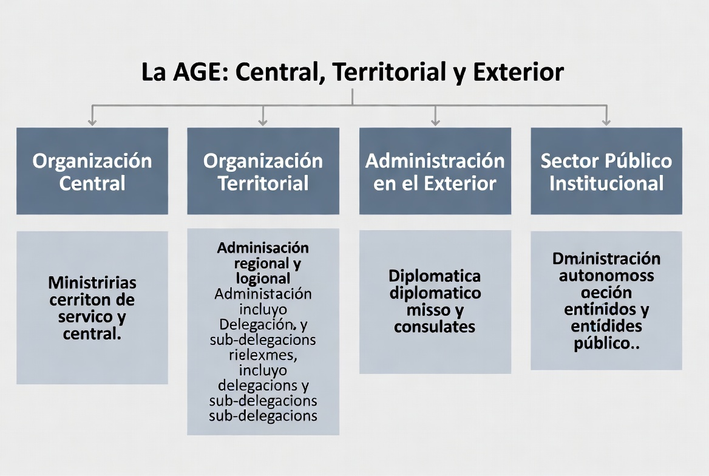
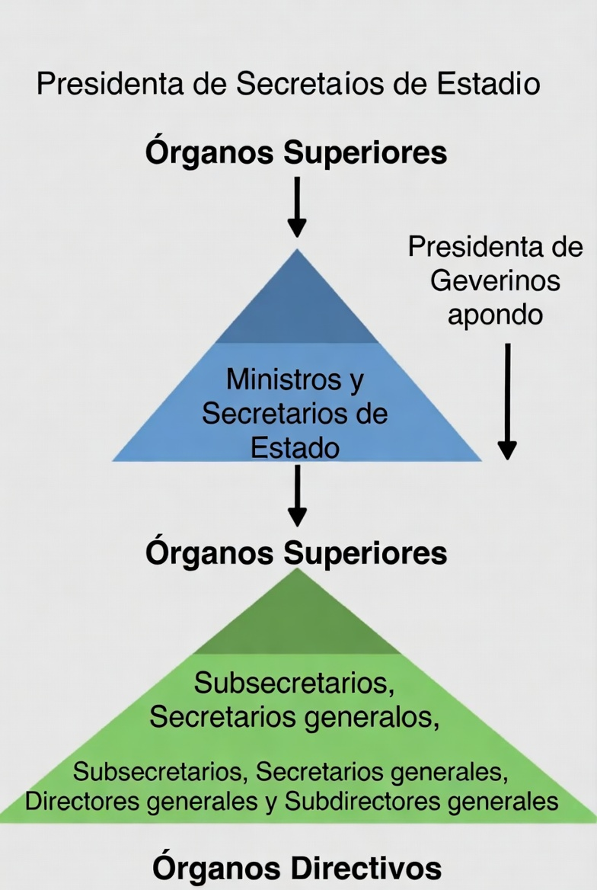
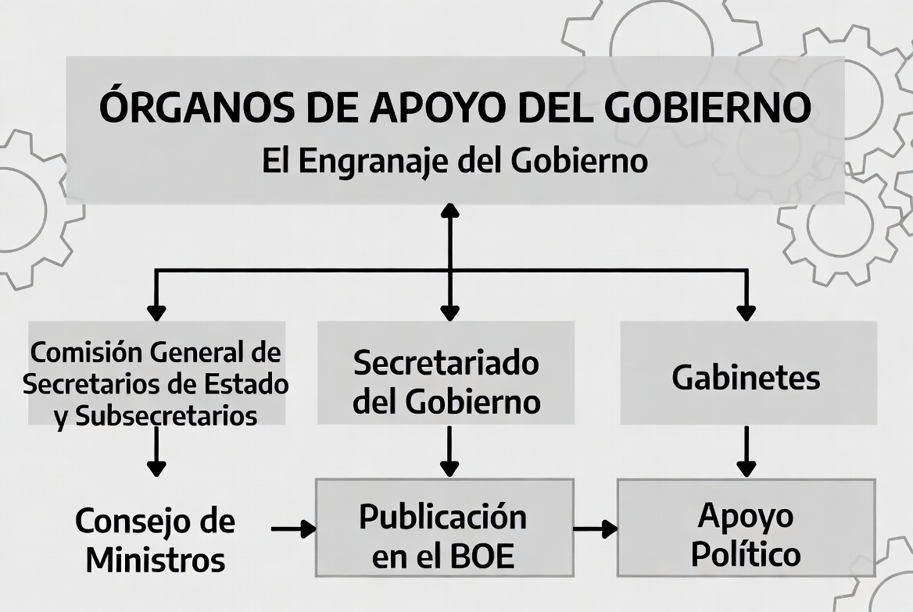
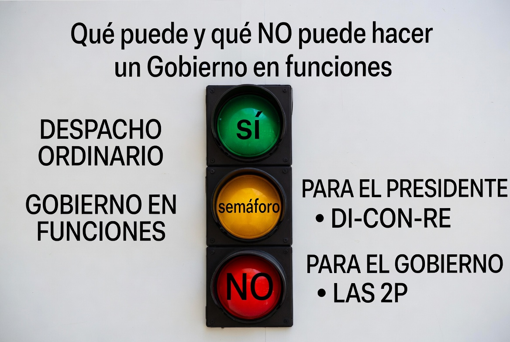

# TEMA 5 · LA ADMINISTRACIÓN GENERAL DEL ESTADO Y EL GOBIERNO
### Policía Nacional · Escala Básica · Bloque A: Ciencias Jurídicas
🛡️ **ACADEMIA EN VIGOR** · *El temario que nunca descansa*
📄 **Versión EL PARTE** — lo esencial, al grano, para repasar rápido. Su hermana mayor, **EL ATESTADO**, desarrolla este tema a fondo con todo el detalle. [¿Qué es esto?](../../docs/parte-y-atestado.md)

---

# 📋 MAPA DEL TEMA

**Qué vas a estudiar:** la maquinaria del Estado por dentro. Cómo se organiza la Administración General del Estado (quién es órgano superior y quién directivo, qué rango tiene cada cual y quién lo nombra), cómo funciona el Gobierno (Consejo de Ministros, comisiones, órganos de apoyo), y una estrella absoluta del examen: qué puede y qué NO puede hacer un **Gobierno en funciones**.

**Peso en el examen:** de los más rentables del temario — 14 preguntas en los exámenes validados 2021-2025, con presencia en todas las convocatorias. Los favoritos del tribunal: los límites del Gobierno en funciones (ha caído DOS veces con la misma respuesta), las deliberaciones del Consejo de Ministros, el Consejo de Estado y los rangos de la organización territorial.

**Normativa clave:**
| Norma | Qué regula aquí |
|---|---|
| CE, Título IV (arts. 97-107) | El Gobierno y la Administración |
| **Ley 40/2015**, de Régimen Jurídico del Sector Público | Principios y organización de la AGE; órganos superiores y directivos |
| **Ley 50/1997**, del Gobierno | Composición, funcionamiento y Gobierno en funciones |
| Ley 39/2015, del Procedimiento Administrativo Común | Relaciones con los ciudadanos (referencia) |

**Estructura del tema (3 partes ≈ 3 audios):**
```
LA AGE Y EL GOBIERNO
├── PARTE 1 · La Administración General del Estado
│   ├── 1. Principios de organización y funcionamiento
│   └── 2. Órganos superiores y directivos ⭐
├── PARTE 2 · El Gobierno
│   ├── 3. Composición y órganos
│   ├── 4. Órganos de colaboración y apoyo
│   └── 5. El Consejo de Estado
└── PARTE 3 · El Gobierno en funciones ⭐⭐
    └── 6. Cese y limitaciones
```

---
---

# 🟦 PARTE 1 · LA ADMINISTRACIÓN GENERAL DEL ESTADO

# 📖 1. PRINCIPIOS DE ORGANIZACIÓN, FUNCIONAMIENTO Y RELACIONES CON LOS CIUDADANOS
📅 **Ha caído:** 2021 — el art. 103 CE: la Administración sirve con objetividad los intereses generales.

## 1.1. El punto de partida constitucional
**Art. 103 CE:** la Administración Pública **sirve con objetividad los intereses generales** y actúa con **eficacia, jerarquía, descentralización, desconcentración y coordinación**, con sometimiento pleno a la ley y al Derecho (la mnemotecnia del tema 3: *"Es Justo Darle Dos Cafés"*).

## 1.2. Los principios de la Ley 40/2015 (art. 3)
Las Administraciones Públicas deberán respetar en su actuación, entre otros:
- **Servicio efectivo a los ciudadanos** — el principio-cabecera.
- **Simplicidad, claridad y proximidad** a los ciudadanos.
- **Participación, objetividad y transparencia** de la actuación administrativa.
- **Racionalización y agilidad** de los procedimientos.
- **Buena fe, confianza legítima y lealtad institucional**.
- **Responsabilidad** por la gestión pública.
- **Planificación y dirección por objetivos** y control de la gestión.
- **Eficacia** en el cumplimiento de los objetivos fijados.
- **Economía, suficiencia y adecuación estricta de los medios a los fines**.
- **Eficiencia** en la asignación y utilización de los recursos públicos.
- **Cooperación, colaboración y coordinación** entre las Administraciones.
Además, las AAPP se relacionarán entre sí y con los ciudadanos **preferentemente por medios electrónicos**.

## 1.3. Cómo se estructura la AGE (art. 55 Ley 40/2015)

- **Organización CENTRAL:** los Ministerios y sus órganos.
- **Organización TERRITORIAL:** Delegaciones y Subdelegaciones del Gobierno.
- **Administración en el EXTERIOR:** embajadas y representaciones.
- (Junto a ella, el **sector público institucional**: organismos autónomos, entidades públicas empresariales, etc.)
- ⭐ **La determinación del número, denominación y ámbito de competencia de los Ministerios y Secretarías de Estado se establece por Real Decreto del PRESIDENTE del Gobierno** — por eso cada cambio de Gobierno reordena los ministerios sin pasar por las Cortes. Las competencias concretas de cada ministerio (cayeron en 2022: familia → Derechos Sociales; cambio climático → Transición Ecológica) hay que repasarlas con la estructura VIGENTE en cada momento — este temario la vigila y actualiza.

# 📖 2. ÓRGANOS SUPERIORES Y ÓRGANOS DIRECTIVOS ⭐
📅 **Ha caído:** 2022 — jefatura de las FCSE por el Delegado del Gobierno; ministerios competentes por materia.


## 2.1. En la organización central
| Categoría | Órganos | Nombramiento |
|---|---|---|
| **ÓRGANOS SUPERIORES** | **Ministros** y **Secretarios de Estado** | Ministros: el Rey a propuesta del Presidente. Secretarios de Estado: RD del Consejo de Ministros |
| **ÓRGANOS DIRECTIVOS** | **Subsecretarios** y **Secretarios generales** · **Secretarios generales técnicos** y **Directores generales** · **Subdirectores generales** | Los cuatro primeros: **RD del Consejo de Ministros**. Subdirectores: por el Ministro o Secretario de Estado |

- Los órganos **superiores** establecen los planes de actuación; los **directivos** los desarrollan y ejecutan.
- Todo lo demás (servicios, secciones...) está **bajo la dependencia** de un órgano superior o directivo.
- Regla de memoria: superiores = **"MiSE"** (MInistros y SEcretarios de Estado); todo lo que suene a "sub-" o "general" es directivo.

## 2.2. En la organización territorial ⭐
- **Delegado del Gobierno** en cada Comunidad Autónoma: **órgano directivo con rango de Subsecretario**; nombrado por **RD del Consejo de Ministros a propuesta del Presidente del Gobierno**. Representa al Gobierno en la CCAA y dirige la AGE en su territorio.
- ⭐ Le corresponde **proteger el libre ejercicio de los derechos y libertades y garantizar la seguridad ciudadana**, ejerciendo la **jefatura de las Fuerzas y Cuerpos de Seguridad del Estado** en su ámbito (bajo la dependencia funcional del Ministerio del Interior) — cayó en 2022 y es de tu mundo.
- **Subdelegado del Gobierno** en cada provincia: rango de **Subdirector general**; nombrado **por el Delegado** entre funcionarios de carrera del subgrupo A1.

> 💡 **EN CRISTIANO**
> La AGE es una pirámide con dos pisos de mando: arriba los que deciden la política (Ministros y Secretarios de Estado — los "superiores"), debajo los que la ejecutan profesionalmente (Subsecretarios, Directores generales... — los "directivos"). El truco de los rangos territoriales: **el Delegado "es" un Subsecretario y el Subdelegado "es" un Subdirector** — dos escalones de distancia, igual que Comunidad y provincia.

> 🚔 **EN LA CALLE**
> El Delegado del Gobierno no es una figura decorativa para ti: es quien ejerce la jefatura de las FCSE en la Comunidad, quien prohíbe o condiciona manifestaciones (¿recuerdas el art. 21 CE del tema 2?), y quien firma sanciones graves de la LO 4/2015. Cuando en una concentración conflictiva "se consulta arriba", ese arriba suele ser la Delegación del Gobierno.

---
---

# 🟦 PARTE 2 · EL GOBIERNO

# 📖 3. COMPOSICIÓN Y ÓRGANOS (CE art. 98 y Ley 50/1997)
📅 **Ha caído:** 2025-2 · 2023 · 2021 — funciones del Consejo de Ministros, carácter secreto de sus deliberaciones, Secretariado del Gobierno y decretos-leyes.

## 3.1. Composición
- **Art. 98 CE / art. 1 Ley 50/1997:** el Gobierno se compone del **Presidente**, del **Vicepresidente o Vicepresidentes, en su caso**, y de los **Ministros**. ⚠️ El Vicepresidente NO es obligatorio ("en su caso").
- Requisitos para ser miembro: español, mayor de edad, disfrutar de los derechos de sufragio activo y pasivo y no estar inhabilitado por sentencia firme.

## 3.2. El Presidente del Gobierno (art. 2 Ley 50/1997)
**Dirige la acción del Gobierno y coordina las funciones de los demás miembros.** Le corresponde, entre otras cosas: representar al Gobierno; establecer el programa político; proponer al Rey la disolución de las Cámaras; **plantear la cuestión de confianza**; proponer el **referéndum consultivo**; dirigir la política de defensa; **crear, modificar y suprimir por Real Decreto los Ministerios y Secretarías de Estado**; resolver los conflictos entre Ministros; e impartir instrucciones a los demás miembros del Gobierno.

## 3.3. El Consejo de Ministros ⭐
Órgano colegiado del Gobierno. Funciones (art. 5 Ley 50/1997) — cayó en 2025 en negativo ("cuál NO le corresponde"):
- Aprobar los **proyectos de ley** y su remisión a las Cortes, y el proyecto de **Ley de Presupuestos Generales del Estado**.
- Aprobar los **Reales Decretos-leyes** y los **Reales Decretos Legislativos**.
- Acordar la **negociación y firma de Tratados internacionales** y su aplicación provisional; remitirlos a las Cortes.
- ⭐ **Declarar los estados de ALARMA y de EXCEPCIÓN y PROPONER al Congreso la declaración del estado de SITIO** (cuadra con el 116 CE del tema 3 — trampa típica: invertir qué declara y qué propone).
- Disponer la **emisión de Deuda Pública** o contraer crédito, cuando haya sido autorizado por una ley.
- Aprobar los **reglamentos** para el desarrollo y la ejecución de las leyes.
- Crear, modificar y suprimir los **órganos directivos** de los departamentos.
- ⭐ **Sus deliberaciones son SECRETAS** (cayó en 2023).
- A sus reuniones pueden asistir los Secretarios de Estado y excepcionalmente otros altos cargos, **cuando sean convocados**.

## 3.4. Las Comisiones Delegadas del Gobierno
- Órganos colegiados para asuntos que afectan a varios ministerios. Su **creación, modificación y supresión** se acuerda por **Real Decreto del Consejo de Ministros, a propuesta del Presidente**. Sus deliberaciones también son secretas.
- ⭐ Norma que dicta el Gobierno en caso de **extraordinaria y urgente necesidad: el Real Decreto-LEY** (art. 86 CE — cayó en 2021; recuerda del tema 3: convalidación por el Congreso en 30 días).

# 📖 4. ÓRGANOS DE COLABORACIÓN Y APOYO


- **Los Secretarios de Estado:** órganos superiores directamente responsables de la ejecución de la acción del Gobierno en un sector de actividad.
- **Comisión General de Secretarios de Estado y Subsecretarios:** ⭐ **prepara las sesiones del Consejo de Ministros** — todos los asuntos que vayan al Consejo deben ser examinados antes por ella (salvo excepciones tasadas). ⚠️ **En ningún caso puede adoptar decisiones o acuerdos por delegación del Gobierno.** La preside un Vicepresidente o, en su defecto, el Ministro de la Presidencia.
- **El Secretariado del Gobierno:** órgano de apoyo integrado en el Ministerio de la Presidencia. ⭐ Entre sus funciones: asistencia al Ministro-Secretario del Consejo de Ministros, remisión de convocatorias y archivo de actas, y **velar por la correcta y fiel PUBLICACIÓN EN EL BOE** de las disposiciones y normas del Gobierno (cayó en 2021).
- **Los Gabinetes:** órganos de **apoyo político y técnico** del Presidente, Vicepresidentes, Ministros y Secretarios de Estado. Sus miembros realizan tareas de confianza y asesoramiento especial, **sin poder adoptar actos o resoluciones que correspondan legalmente a los órganos de la AGE**.

# 📖 5. EL CONSEJO DE ESTADO ⭐
📅 **Ha caído:** 2025-2 — el supremo órgano consultivo del Gobierno.
- **Art. 107 CE:** el Consejo de Estado es el **SUPREMO ÓRGANO CONSULTIVO DEL GOBIERNO**. Una ley orgánica regula su composición y competencia (LO 3/1980).
- Emite **dictámenes** (preceptivos o facultativos, pero **no vinculantes** como regla general) sobre reglamentos, tratados, conflictos... Su presidente es nombrado por Real Decreto del Consejo de Ministros.
- ⚠️ Trampa de examen: "el supremo órgano consultivo es el Consejo de Ministros" → NO, el Consejo de Ministros gobierna; el que **aconseja** es el Consejo de **Estado**.

> 💡 **EN CRISTIANO**
> El engranaje semanal del Gobierno: los lunes-jueves la **Comisión General de Secretarios de Estado y Subsecretarios** hace de "cocina" — revisa todos los expedientes pero no decide nada —; el martes (tradicionalmente) el **Consejo de Ministros** decide a puerta cerrada (secretas las deliberaciones, siempre); el **Secretariado del Gobierno** se encarga de que lo aprobado salga bien publicado en el BOE; y cuando el asunto es jurídicamente delicado, se pide opinión al sabio de la casa, el **Consejo de Estado**, que aconseja pero no manda.

---
---

# 🟦 PARTE 3 · EL GOBIERNO EN FUNCIONES ⭐⭐

# 📖 6. CESE Y LIMITACIONES (art. 101 CE y art. 21 Ley 50/1997)
📅 **Ha caído:** 2025-2 · 2022 — la facultad vedada al Presidente en funciones (¡dos veces la misma pregunta!).


## 6.1. El cese
El Gobierno cesa (art. 101 CE): tras la celebración de **elecciones generales**, por **pérdida de la confianza parlamentaria** (cuestión de confianza fracasada o moción de censura triunfante), y por **dimisión o fallecimiento de su Presidente**. El Gobierno cesante **continúa EN FUNCIONES hasta la toma de posesión del nuevo Gobierno**.

## 6.2. Qué hace un Gobierno en funciones
- **Facilita el normal desarrollo del proceso de formación del nuevo Gobierno y el traspaso de poderes.**
- Limita su gestión al **DESPACHO ORDINARIO de los asuntos públicos**, absteniéndose de adoptar cualesquiera otras medidas, **salvo casos de urgencia debidamente acreditados o por razones de interés general** cuya acreditación expresa así lo justifique.

## 6.3. Lo que NO puede hacer ⭐⭐ (esto ES la pregunta de examen)
**El PRESIDENTE en funciones no puede:**
- Proponer al Rey la **DIsolución** de alguna de las Cámaras o de las Cortes Generales.
- Plantear la cuestión de **CONfianza** ← la respuesta que ha caído en 2022 y en 2025.
- Proponer al Rey la convocatoria de un **REferéndum** consultivo.
→ Mnemotecnia: **"DI-CON-RE"** — *en funciones, ni DIsuelve, ni CONfía, ni REferéndum.*

**El GOBIERNO en funciones no puede:**
- Aprobar el **Proyecto de Ley de Presupuestos** Generales del Estado.
- **Presentar proyectos de ley** al Congreso o al Senado.
→ Mnemotecnia: **"las 2 P"** — ni Presupuestos ni Proyectos.

**Además:** las **delegaciones legislativas** otorgadas por las Cortes quedan **en suspenso** mientras el Gobierno esté en funciones.

> 💡 **EN CRISTIANO**
> Un Gobierno en funciones es un portero de noche: mantiene el edificio funcionando (despacho ordinario), atiende emergencias reales, pero no puede hacer reformas ni firmar contratos nuevos. Todo lo prohibido tiene la misma lógica: son decisiones que comprometen el futuro (presupuestos, leyes) o que juegan con la confianza parlamentaria que ya no tiene (disolución, confianza, referéndum). Si entiendes la lógica, no necesitas memorizar la lista... pero memoriza igualmente el **DI-CON-RE**, que el tribunal la pregunta cada pocos años, literal.

> 🚔 **EN LA CALLE**
> ¿Y esto a un policía qué? Pues que España ha pasado largas temporadas con Gobiernos en funciones, y en esos períodos las oposiciones, las ofertas de empleo público y los nombramientos de altos cargos policiales se congelan o se complican — el despacho ordinario da para poco más. Cuando oigas "no hay OEP porque el Gobierno está en funciones", ahora ya sabes el artículo exacto que lo explica: el 21 de la Ley 50/1997.

---

# 🎯 LO QUE CAE

## Puntos calientes
1. Art. 103 CE: la Administración **sirve con objetividad los intereses generales** (2021).
2. Órganos **superiores** (Ministros y Secretarios de Estado) vs **directivos** (Subsecretarios, Secretarios generales, SGT, Directores y Subdirectores generales).
3. Rangos territoriales: Delegado del Gobierno = **Subsecretario**; Subdelegado = **Subdirector general**. El Delegado ejerce la **jefatura de las FCSE** en su territorio (2022).
4. Los Ministerios se crean, modifican y suprimen por **RD del PRESIDENTE del Gobierno**.
5. Composición del Gobierno: Presidente, Vicepresidente(s) **en su caso**, y Ministros.
6. Consejo de Ministros: funciones del art. 5 — declara **alarma y excepción**, **propone** el **sitio**; deliberaciones **SECRETAS** (2023, y funciones en negativo en 2025).
7. Real Decreto-**ley** = extraordinaria y urgente necesidad (2021).
8. Comisión General de Secretarios de Estado y Subsecretarios: **prepara** el Consejo, **nunca decide por delegación**.
9. Secretariado del Gobierno: vela por la **publicación en el BOE** (2021).
10. **Consejo de Estado = supremo órgano consultivo del Gobierno**, art. 107 CE (2025).
11. Gobierno en funciones: despacho ordinario; Presidente **DI-CON-RE**; Gobierno **las 2 P**; delegaciones legislativas en suspenso (2022 y 2025).

## Trampas del tribunal
- ⚠️ "El Vicepresidente es miembro necesario del Gobierno" → NO: "en su caso".
- ⚠️ Colocar a los Secretarios de Estado como órganos directivos → son **SUPERIORES**.
- ⚠️ "Los Ministerios se crean por RD del Consejo de Ministros" → NO: del **Presidente**.
- ⚠️ Invertir el 116: el Consejo de Ministros **declara** alarma y excepción y **propone** el sitio (que declara el Congreso).
- ⚠️ "La Comisión General de Secretarios de Estado puede adoptar acuerdos por delegación" → **jamás**.
- ⚠️ "El supremo órgano consultivo es el Consejo de Ministros" → es el Consejo de **ESTADO**.
- ⚠️ Meter "dirigir la política de defensa" entre lo vedado en funciones → eso SÍ puede (y debe); lo vedado es DI-CON-RE.

## Mnemotecnias
- Superiores: **"MiSE"** → MInistros y SEcretarios de Estado.
- Rangos territoriales: **"Delegado-Subsecretario, Subdelegado-Subdirector"** (dos escalones, como CCAA-provincia).
- Presidente en funciones: **"DI-CON-RE"** → ni DIsolución, ni CONfianza, ni REferéndum.
- Gobierno en funciones: **"las 2 P"** → ni Presupuestos ni Proyectos de ley.
- Consejo de Ministros y el 116: **"declara A-E, propone S"**.

## Mini-test (10 preguntas)

1. Según el art. 103 CE, la Administración Pública sirve con objetividad:
   a) Al Gobierno de la Nación   b) Los intereses generales ✅   c) Al interés del Estado

2. Son órganos SUPERIORES de la organización central de la AGE:
   a) Ministros y Subsecretarios   b) Ministros y Secretarios de Estado ✅   c) Secretarios de Estado y Directores generales

3. El Delegado del Gobierno en la Comunidad Autónoma tiene rango de:
   a) Secretario de Estado   b) Subsecretario ✅   c) Director general

4. La creación, modificación y supresión de los Ministerios se establece mediante:
   a) Ley orgánica   b) Real Decreto del Consejo de Ministros   c) Real Decreto del Presidente del Gobierno ✅

5. Las deliberaciones del Consejo de Ministros son:
   a) Públicas   b) Secretas ✅   c) Reservadas durante 25 años

6. Corresponde al Consejo de Ministros, conforme a la Ley 50/1997:
   a) Declarar el estado de sitio
   b) Declarar los estados de alarma y excepción y proponer al Congreso el de sitio ✅
   c) Proponer al Congreso los estados de alarma y excepción

7. La Comisión General de Secretarios de Estado y Subsecretarios:
   a) Prepara las sesiones del Consejo de Ministros y nunca decide por delegación ✅
   b) Puede adoptar acuerdos por delegación del Gobierno
   c) Aprueba los reglamentos de desarrollo de las leyes

8. Velar por la correcta y fiel publicación en el BOE de las normas del Gobierno corresponde a:
   a) La Comisión General de Secretarios de Estado   b) El Secretariado del Gobierno ✅   c) El Gabinete de la Presidencia

9. El supremo órgano consultivo del Gobierno es:
   a) El Consejo de Gobierno   b) El Consejo de Ministros   c) El Consejo de Estado ✅

10. El Presidente del Gobierno en funciones NO puede:
    a) Dirigir la política de defensa   b) Plantear la cuestión de confianza ✅   c) Presidir el Consejo de Ministros

## 📅 Así lo preguntaron
**14 preguntas en los exámenes oficiales validados (2021-2025)** — presencia en todas las convocatorias:
- **2025-2:** facultad vedada al Presidente en funciones (cuestión de confianza); supremo órgano consultivo (Consejo de Estado); mayoría de la cuestión de confianza (simple, art. 112); función que NO corresponde al Consejo de Ministros (Ley 50/1997); función del Ayuntamiento (gobierno y administración municipal).
- **2023:** carácter de las deliberaciones del Consejo de Ministros (secretas).
- **2022:** facultad vedada al Gobierno en funciones (cuestión de confianza); ministerio competente en familia, menor y juventud; competencia del Delegado del Gobierno en seguridad ciudadana (jefatura de las FCSE); ministerio competente en cambio climático.
- **2021:** contenido del art. 103 CE; función del Secretariado del Gobierno (publicación en el BOE); norma dictada por urgente necesidad (Decreto-ley); plazo para votar la moción de censura (5 días).

<!-- 📅 pendiente: sumar el examen de la pareja 2024/2025-1 cuando se confirme su etiqueta (incluye: control de los actos del Gobierno art. 29 Ley 50/1997; órganos superiores del art. 55 Ley 40/2015) -->

---

*Tema 5 · v1.0 · 3 partes dimensionadas para audio-repasos. Las competencias concretas de cada ministerio dependen de la estructura vigente (RD del Presidente) — repasar con la estructura actualizada. Pendiente de revisión final por el autor.*
