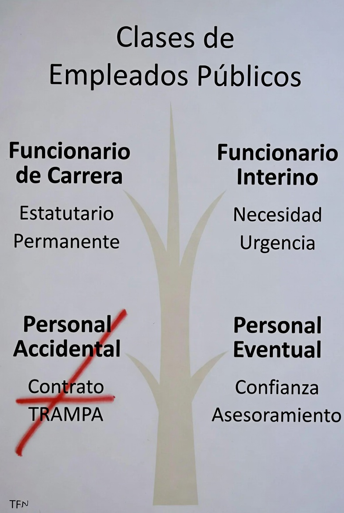
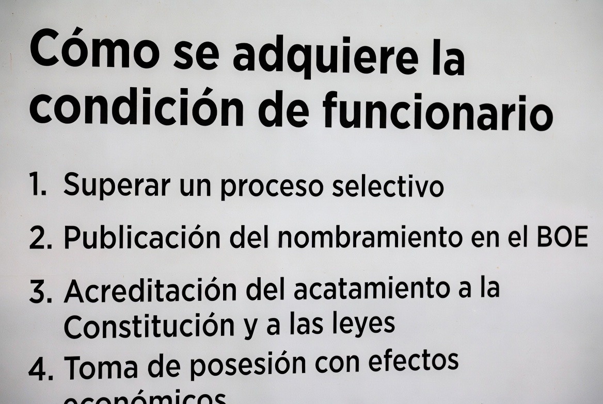
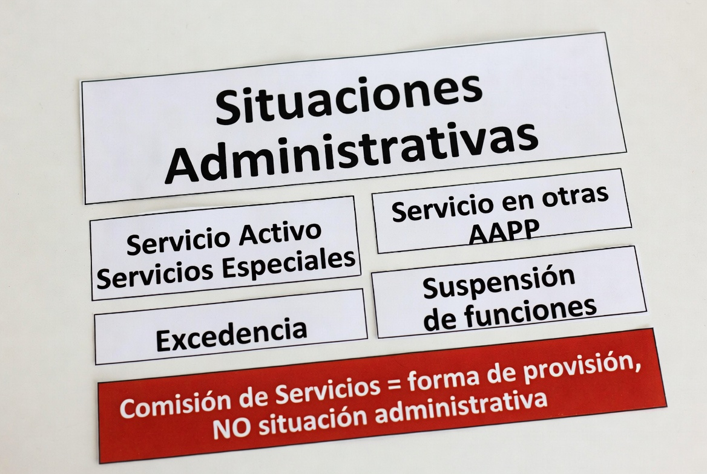

# TEMA 6 · LOS FUNCIONARIOS PÚBLICOS
### Policía Nacional · Escala Básica · Bloque A: Ciencias Jurídicas
🛡️ **ACADEMIA EN VIGOR** · *El temario que nunca descansa*
📄 **Versión EL PARTE** — lo esencial, al grano, para repasar rápido. Su hermana mayor, **EL ATESTADO**, desarrolla este tema a fondo con todo el detalle. [¿Qué es esto?](../../docs/parte-y-atestado.md)

---

# 📋 MAPA DEL TEMA

**Qué vas a estudiar:** el estatuto de la profesión que quieres conseguir. Quién es empleado público y de qué clase (funcionario de carrera, interino, laboral, eventual), cómo se **adquiere** la condición de funcionario (el proceso que tú mismo vas a recorrer: oposición → nombramiento → acatamiento → toma de posesión) y cómo se **pierde**. Y una tercera parte con lo que el tribunal pregunta aunque no esté en el epígrafe oficial: situaciones administrativas, carrera y permisos.

**Peso en el examen:** 11 preguntas en los exámenes validados 2021-2025 — presencia en todas las convocatorias. Ojo al dato: la mitad de esas preguntas salen de FUERA de los dos epígrafes oficiales (excedencias, promoción interna, permisos), por eso este tema incluye ese material.

**Normativa clave:**
| Norma | Qué regula aquí |
|---|---|
| **RDL 5/2015 (TREBEP)** — texto refundido del Estatuto Básico del Empleado Público | Todo el tema |
| LO 9/2015, de Régimen de Personal de la Policía Nacional | El régimen específico del PN (remite; se desarrolla en el tema 8) |

**Estructura del tema (3 partes ≈ 3 audios):**
```
LOS FUNCIONARIOS PÚBLICOS
├── PARTE 1 · Concepto y clases
│   ├── 1. Los empleados públicos y sus clases (arts. 8-13)
│   └── 2. A quién se aplica el TREBEP (y a quién no: FCS) ⭐
├── PARTE 2 · Adquisición y pérdida
│   ├── 3. Requisitos de acceso y adquisición (arts. 56 y 62)
│   └── 4. Pérdida de la condición y rehabilitación (arts. 63-68)
└── PARTE 3 · Lo que el tribunal pregunta de propina
    ├── 5. Carrera y promoción interna
    ├── 6. Situaciones administrativas
    └── 7. Permisos: el esencial
```

---
---

# 🟦 PARTE 1 · CONCEPTO Y CLASES

# 📖 1. LOS EMPLEADOS PÚBLICOS Y SUS CLASES (arts. 8-13 TREBEP)
📅 **Ha caído:** 2025-2 · 2022 — la figura que NO existe ("personal accidental") y el personal eventual.


**Empleado público** (art. 8): quien desempeña funciones retribuidas en las Administraciones Públicas al servicio de los intereses generales. **Clases — son exactamente CUATRO:**

| Clase | Rasgo definitorio |
|---|---|
| **Funcionario de CARRERA** | Vinculación **estatutaria** (por ley, no contrato), regulada por Derecho Administrativo, para servicios profesionales retribuidos **de carácter permanente** |
| **Funcionario INTERINO** | Nombrado **por razones justificadas de necesidad y urgencia** para funciones propias de funcionarios de carrera, en 4 supuestos tasados |
| **Personal LABORAL** | Contrato de trabajo (fijo, por tiempo indefinido o temporal) |
| **Personal EVENTUAL** | Solo funciones **expresamente calificadas de CONFIANZA o ASESORAMIENTO ESPECIAL** ⭐ |

⚠️ **La trampa que cayó en 2025:** el "personal accidental" **NO EXISTE** en el TREBEP. Si aparece en un test como clase de empleado público, es el distractor.

**Detalle de cada figura:**
- **Interinos (art. 10)** — los 4 supuestos: (a) **plazas vacantes** que no puedan cubrirse por funcionarios de carrera (máximo **3 años**); (b) **sustitución transitoria** de los titulares; (c) **programas de carácter temporal** (máx. 3 años, ampliables 12 meses por ley autonómica); (d) **exceso o acumulación de tareas** (máx. **9 meses dentro de un período de 18**). ⭐ Las plazas vacantes desempeñadas por interinos **deberán incluirse en la Oferta de Empleo Público** del ejercicio de su nombramiento o, si no, del siguiente (cayó en 2021).
- **Eventual (art. 12):** nombramiento y cese **LIBRES**; **cesa automáticamente cuando cesa la autoridad** a la que presta la confianza; su condición **no constituye mérito** para el acceso a la función pública ni para la promoción interna.
- **Personal directivo (art. 13):** figura aparte (no es una quinta clase): desarrolla funciones directivas profesionales, designación por idoneidad y mérito.

# 📖 2. A QUIÉN SE APLICA EL TREBEP... Y A QUIÉN NO ⭐
📅 **Ha caído:** 2021 — el personal con legislación específica propia.

- El TREBEP se aplica al personal funcionario y laboral de la AGE, CCAA, entidades locales, organismos públicos y universidades.
- **Art. 4 — personal con LEGISLACIÓN ESPECÍFICA PROPIA** (el Estatuto solo se les aplica directamente **cuando así lo disponga su legislación específica**): personal de las Cortes y asambleas legislativas; de los órganos constitucionales; **Jueces, Magistrados y Fiscales**; **personal militar de las Fuerzas Armadas**; ⭐ **personal de las FUERZAS Y CUERPOS DE SEGURIDAD**; personal retribuido por arancel; personal del **CNI**; y personal del Banco de España y el FROB.

> 💡 **EN CRISTIANO**
> Las cuatro clases se distinguen por dos preguntas: ¿es permanente? y ¿cómo entra? El de carrera es el titular fijo por oposición; el interino es el "suplente legal" para huecos concretos y con fecha de caducidad; el laboral tiene contrato como en una empresa; y el eventual es el asesor de confianza del político — entra y sale con él, a dedo. Y la lista del art. 4 es "los cuerpos con reglamento propio": jueces, militares, espías... y policías.

> 🚔 **EN LA CALLE**
> Tú estás (estarás) en esa lista del art. 4: la Policía Nacional tiene su propio estatuto, la **LO 9/2015**, y el TREBEP se te aplica solo de forma supletoria. Consecuencias reales: en la PN **no hay funcionarios interinos ni personal laboral patrullando** — solo funcionarios de carrera (y alumnos en prácticas) —, tu jubilación y tus situaciones administrativas tienen reglas propias, y el acceso exige **nacionalidad española** sin la apertura a comunitarios del art. 57, porque ejerce potestades públicas.

---
---

# 🟦 PARTE 2 · ADQUISICIÓN Y PÉRDIDA

# 📖 3. REQUISITOS DE ACCESO Y ADQUISICIÓN DE LA CONDICIÓN
📅 **Ha caído:** 2025-2 — el momento de los efectos económicos (toma de posesión).


## 3.1. Requisitos generales de acceso (art. 56)
- Tener la **nacionalidad española** (los nacionales UE pueden acceder, art. 57, **salvo** a empleos que impliquen ejercicio de potestades públicas o salvaguardia de intereses del Estado — por eso **las FCS son solo para españoles**).
- Poseer la **capacidad funcional** para las tareas.
- Tener **16 años cumplidos** y no exceder la edad máxima de jubilación forzosa.
- **No haber sido separado** mediante expediente disciplinario del servicio de ninguna Administración, **ni hallarse en inhabilitación** absoluta o especial.
- Poseer la **titulación exigida**.
- Selección conforme a los principios de **igualdad, mérito y capacidad** (más publicidad, transparencia, imparcialidad y profesionalidad de los tribunales — art. 55).

## 3.2. Adquisición de la condición de funcionario de carrera (art. 62) ⭐
Se adquiere por el **cumplimiento SUCESIVO** de estos requisitos — y el ORDEN es materia de examen:
1. **Superación del proceso selectivo.**
2. **Nombramiento** por el órgano o autoridad competente, **publicado en el Diario Oficial** correspondiente.
3. **Acto de acatamiento de la Constitución** y, en su caso, del Estatuto de Autonomía y del resto del ordenamiento.
4. **TOMA DE POSESIÓN** dentro del plazo que se establezca.
⭐ **Los efectos económicos plenos comienzan con la TOMA DE POSESIÓN** — no con el nombramiento ni con el acatamiento (cayó en 2025; y "el último requisito" cayó en el examen pendiente de confirmar).

# 📖 4. PÉRDIDA DE LA CONDICIÓN Y REHABILITACIÓN (arts. 63-68)
📅 **Ha caído:** 2023 — el plazo para resolver la rehabilitación (6 meses).

## 4.1. Causas de pérdida (art. 63) — son CINCO
1. **Renuncia** a la condición de funcionario.
2. **Pérdida de la nacionalidad.**
3. **Jubilación total.**
4. **Sanción disciplinaria de SEPARACIÓN DEL SERVICIO** con carácter firme.
5. **Pena principal o accesoria de INHABILITACIÓN** absoluta o especial con carácter firme.

## 4.2. Detalle de cada causa
- **Renuncia (art. 64):** debe manifestarse **por escrito** y ser **aceptada expresamente** por la Administración. ⚠️ **NO será aceptada** si el funcionario está **sujeto a expediente disciplinario** o ha sido dictado contra él **auto de procesamiento o de apertura de juicio oral** por delito. La renuncia **no inhabilita para un nuevo ingreso** (podría volver a opositar).
- **Jubilación (art. 67):** voluntaria (a solicitud, con los requisitos de Seguridad Social/Clases Pasivas), **forzosa al cumplir la edad legalmente establecida** (con posible prolongación hasta los 70 en los términos legales), y por **incapacidad permanente**.
- **Rehabilitación (art. 68):** quien perdió la condición por **pérdida de nacionalidad o jubilación por incapacidad** puede ser **rehabilitado** cuando desaparezca la causa. Quien la perdió por **separación o inhabilitación** solo puede obtenerla **con carácter EXCEPCIONAL**, atendiendo a las circunstancias, por el órgano de gobierno competente. ⭐ El procedimiento debe resolverse en el plazo de **6 MESES**, y el silencio es **negativo** (cayó en 2023).

> 💡 **EN CRISTIANO**
> Entrar tiene cuatro peldaños en orden fijo — apruebas, te nombran (y sale en el boletín), juras la Constitución y tomas posesión — y **la nómina empieza en el último peldaño**, no antes. Salir tiene cinco puertas: dos voluntarias o naturales (renuncia, jubilación) y tres "de castigo o circunstancia" (perder la nacionalidad, separación disciplinaria, inhabilitación penal). Y el matiz fino de la renuncia: no puedes "dimitir para esquivar" un expediente o un juicio — la Administración no te la acepta.

---
---

# 🟦 PARTE 3 · LO QUE EL TRIBUNAL PREGUNTA DE PROPINA

*Los epígrafes oficiales acaban en la pérdida de la condición, pero los exámenes reales preguntan más TREBEP. Lo esencial, comprimido:*

# 📖 5. CARRERA Y PROMOCIÓN INTERNA
📅 **Ha caído:** 2022 · 2021 — antigüedad para la promoción interna y consolidación de grado.
- **Promoción interna (art. 18):** exige **DOS AÑOS de servicio activo en el inferior Subgrupo** (o Grupo, en ausencia de subgrupos), superar las pruebas y poseer la titulación (cayó en 2021 — y es la misma regla que vivirás en la PN para ascender de escala).
- **Grado personal:** se consolida por el desempeño de puestos del nivel correspondiente durante **2 años continuados (o 3 con interrupción)** — la pregunta de 2022 sobre consolidar un nivel 20 jugaba con este cómputo.

# 📖 6. SITUACIONES ADMINISTRATIVAS (art. 85)
📅 **Ha caído:** 2022 · 2021 — la falsa situación (comisión de servicios) y la excedencia por interés particular.


Las situaciones administrativas de los funcionarios de carrera son **CINCO**:
1. **Servicio activo.**
2. **Servicios especiales** (cargos políticos, etc. — se reserva plaza y computa a efectos de ascensos y derechos pasivos).
3. **Servicio en otras Administraciones Públicas.**
4. **Excedencia:** voluntaria **por interés particular** ⭐ (requiere **5 años** de servicios efectivos inmediatamente anteriores y su concesión queda **SUBORDINADA A LAS NECESIDADES DEL SERVICIO** — cayó en 2021; no computa ni reserva plaza); voluntaria por agrupación familiar; por **cuidado de familiares** (hasta 3 años, con reserva); y por razón de **violencia de género o violencia terrorista**.
5. **Suspensión de funciones.**

⚠️ **Trampa que cayó en 2022:** la **COMISIÓN DE SERVICIOS NO es una situación administrativa** — es una forma temporal de **provisión de puestos**. Si aparece en la lista de situaciones, es el distractor.

# 📖 7. PERMISOS: EL ESENCIAL
📅 **Ha caído:** 2023 — el permiso por nacimiento.
- **Permiso por nacimiento** (art. 49): **16 SEMANAS** tanto para la madre biológica como para el progenitor distinto de la madre — duraciones **igualadas e intransferibles** (las 6 primeras semanas, inmediatas y a jornada completa). Cayó en 2023 preguntando por la equiparación.
- Del art. 48, los clásicos: fallecimiento/enfermedad grave de familiar (3 días / 5 si es en distinta localidad — según redacción vigente), traslado de domicilio (1 día), deber inexcusable, **asuntos particulares** (los famosos "moscosos").

> 🚔 **EN LA CALLE**
> Esta parte 3 es tu futuro cotidiano: la promoción interna del TREBEP es el espejo de tus futuros ascensos de escala; la excedencia y los permisos los tramitarás alguna vez en tu carrera; y el permiso de nacimiento de 16 semanas se aplica igual en la PN — con el matiz de que tu régimen concreto (segunda actividad en lugar de jubilación ordinaria, situaciones propias) lo fija la LO 9/2015, que estudiarás a fondo en el tema 8.

---

# 🎯 LO QUE CAE

## Puntos calientes
1. Las clases de empleado público son **4**: carrera, interino, laboral, eventual — y **"accidental" NO existe** (2025).
2. Eventual = **confianza o asesoramiento especial**; cese libre y automático con la autoridad; no es mérito (2022).
3. Interinos: 4 supuestos con sus plazos (3 años / 3+1 / **9 de 18**); sus vacantes van a la **OEP** (2021).
4. Art. 4: las **FCS** tienen legislación específica propia — TREBEP solo supletorio (2021).
5. Adquisición en **orden**: proceso selectivo → nombramiento publicado → acatamiento CE → **toma de posesión** = efectos económicos (2025).
6. Pérdida: las **5 causas**; la renuncia no se acepta con expediente o procesamiento abierto.
7. Rehabilitación: por nacionalidad/incapacidad cuando cese la causa; por separación/inhabilitación solo **excepcional**; plazo de resolución **6 meses**, silencio negativo (2023).
8. Promoción interna: **2 años** de servicio activo en el subgrupo inferior (2021).
9. Situaciones administrativas: **5** — y la **comisión de servicios no lo es** (2022).
10. Excedencia por interés particular: 5 años previos y **subordinada a las necesidades del servicio** (2021).
11. Permiso por nacimiento: **16 semanas** igualadas e intransferibles (2023).

## Trampas del tribunal
- ⚠️ Colar "personal accidental" o "personal directivo" como quinta clase de empleado público.
- ⚠️ "Los efectos económicos comienzan con el nombramiento" → NO: con la **toma de posesión**.
- ⚠️ "La renuncia inhabilita para volver a ingresar" → NO inhabilita.
- ⚠️ "La comisión de servicios es una situación administrativa" → es forma de **provisión**.
- ⚠️ "La excedencia por interés particular es un derecho automático" → queda **subordinada a las necesidades del servicio**.
- ⚠️ "Los interinos por acumulación de tareas: máximo 6 meses" → **9 meses dentro de 18**.
- ⚠️ Ofrecer el TREBEP como régimen directo de la Policía Nacional → art. 4: legislación específica (LO 9/2015).

## Mnemotecnias
- Clases: **"CILE"** → Carrera, Interino, Laboral, Eventual (y el "accidental", al cubo de la basura).
- Adquisición: **"A-N-A-T"** → Apruebo, Nombramiento, Acato, Tomo posesión (*"la nómina llega con la T"*).
- Pérdida: **"Re-Na-Ju-Se-In"** → REnuncia, NAcionalidad, JUbilación, SEparación, INhabilitación.
- Interino por acumulación: **"9 de 18"** (como un parcial aprobado a medias).
- Promoción interna: **"2 abajo para subir 1"** → 2 años en el subgrupo inferior.

## Mini-test (10 preguntas)

1. Según el TREBEP, NO es una clase de empleado público:
   a) El personal eventual   b) El funcionario interino   c) El personal accidental ✅

2. El personal que desempeña funciones expresamente calificadas de confianza o asesoramiento especial es:
   a) Personal directivo   b) Personal eventual ✅   c) Personal laboral de alta dirección

3. El nombramiento de funcionarios interinos por exceso o acumulación de tareas tendrá una duración máxima de:
   a) 6 meses dentro de un período de 12   b) 9 meses dentro de un período de 18 ✅   c) 12 meses dentro de un período de 24

4. El TREBEP se aplica al personal de las Fuerzas y Cuerpos de Seguridad:
   a) Directamente y en su integridad
   b) Solo cuando así lo disponga su legislación específica ✅
   c) Únicamente en materia retributiva

5. Los efectos económicos plenos del funcionario de carrera comienzan desde:
   a) La publicación del nombramiento   b) El acto de acatamiento   c) La toma de posesión ✅

6. La renuncia a la condición de funcionario NO será aceptada cuando:
   a) El funcionario tenga más de 60 años
   b) Esté sujeto a expediente disciplinario o exista auto de procesamiento o apertura de juicio oral ✅
   c) No haya transcurrido un año desde la toma de posesión

7. El procedimiento de rehabilitación de la condición de funcionario debe resolverse en:
   a) 3 meses, con silencio positivo   b) 6 meses, con silencio negativo ✅   c) 12 meses, con silencio negativo

8. Para la promoción interna se exige haber prestado servicio activo en el inferior Subgrupo durante al menos:
   a) 1 año   b) 2 años ✅   c) 3 años

9. NO es una situación administrativa de los funcionarios de carrera:
   a) Los servicios especiales   b) La comisión de servicios ✅   c) La suspensión de funciones

10. La concesión de la excedencia voluntaria por interés particular:
    a) Es automática si se acreditan 5 años de servicios
    b) Queda subordinada a las necesidades del servicio ✅
    c) Requiere informe favorable del Consejo de Estado

## 📅 Así lo preguntaron
**11 preguntas en los exámenes oficiales validados (2021-2025)** — presencia en todas las convocatorias:
- **2025-2:** momento de los efectos económicos (toma de posesión); figura inexistente como empleado público (personal accidental).
- **2023:** plazo de resolución de la rehabilitación (6 meses); permiso por nacimiento (16 semanas igualadas, TREBEP).
- **2022:** consolidación de grado (nivel 20 desde grado 17); el personal de confianza no permanente (eventual); la falsa situación administrativa (comisión de servicios).
- **2021:** excedencia por interés particular (subordinada a las necesidades del servicio); personal con legislación específica (CNI, FFAA, FCS); antigüedad para promoción interna (2 años); vacantes de interinos a la OEP.

<!-- 📅 pendiente: sumar el examen de la pareja 2024/2025-1 cuando se confirme su etiqueta (incluye: clases de empleados públicos del art. 8; el último requisito de adquisición — toma de posesión) -->

---

*Tema 6 · v1.0 (pasada rápida) · 3 partes dimensionadas para audio-repasos. La v2 desarrollará: derechos y deberes, código de conducta, régimen retributivo, provisión de puestos y detalle de situaciones. Pendiente de revisión final por el autor.*
