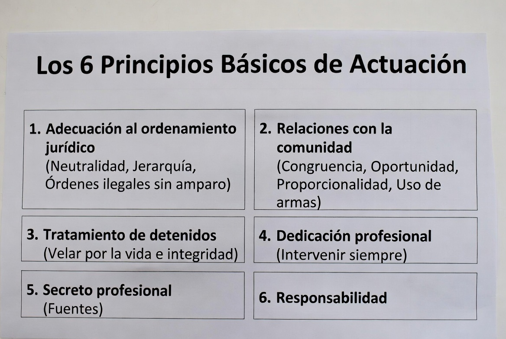
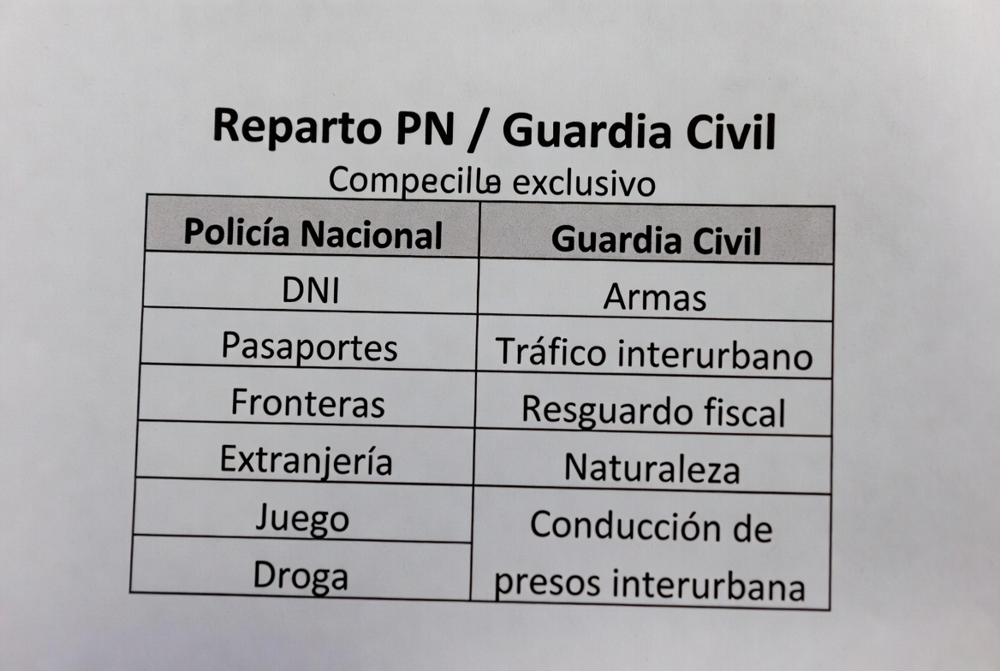
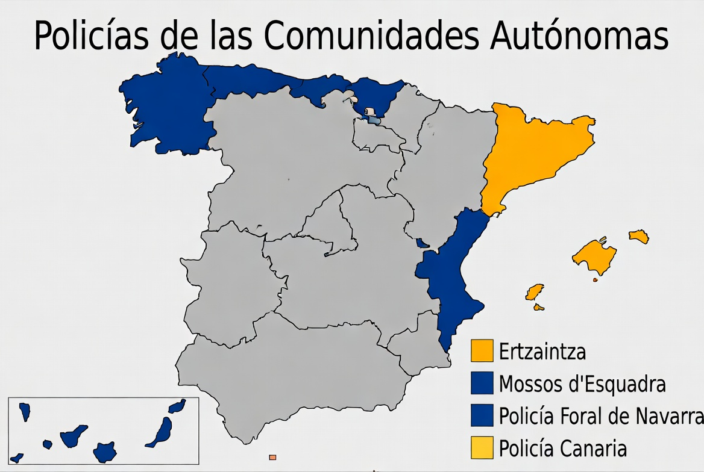
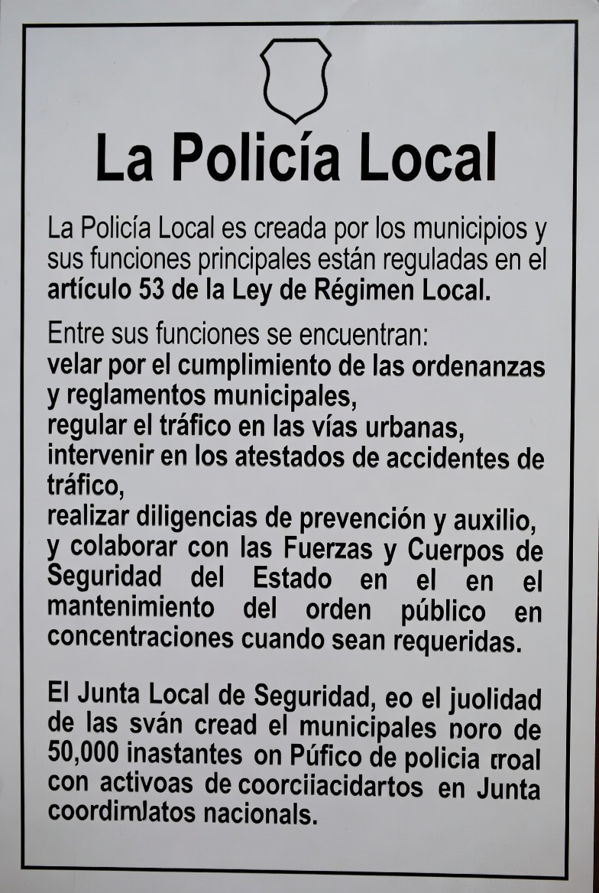

# TEMA 9 · LA LEY ORGÁNICA 2/1986, DE FUERZAS Y CUERPOS DE SEGURIDAD
### Policía Nacional · Escala Básica · Bloque A: Ciencias Jurídicas
🛡️ **ACADEMIA EN VIGOR** · *El temario que nunca descansa*
📄 **Versión EL PARTE** — lo esencial, al grano, para repasar rápido. Su hermana mayor, **EL ATESTADO**, desarrolla este tema a fondo con todo el detalle. [¿Qué es esto?](../../docs/parte-y-atestado.md)

---

# 📋 MAPA DEL TEMA

**Qué vas a estudiar:** la ley madre de tu profesión. La LO 2/1986 es el desarrollo del art. 104 CE (¿recuerdas el tema 3?) y regula: quién es Fuerza y Cuerpo de Seguridad, los **principios básicos de actuación** (tu código deontológico — juramento incluido), el reparto de competencias entre **Policía Nacional y Guardia Civil**, la representación (el **Consejo de Policía**), las **policías autonómicas** y las **locales**, y los órganos de coordinación entre todos.

**Peso en el examen:** 12 preguntas validadas 2021-2025 — de los cinco temas más preguntados, con presencia en todas las convocatorias. Los imanes: los principios del art. 5 (con trampa de ubicación), el reparto PN/GC del art. 12 y el Consejo de Política de Seguridad.

**Normativa clave:**
| Norma | Qué regula aquí |
|---|---|
| **LO 2/1986, de 13 de marzo, de Fuerzas y Cuerpos de Seguridad** | Todo el tema |
| CE, arts. 104 y 149.1.29ª | Fundamento constitucional |

**Estructura del tema (4 partes ≈ 4 audios):**
```
LA LO 2/1986
├── PARTE 1 · Los cimientos y el código
│   ├── 1. Disposiciones generales: la seguridad pública
│   ├── 2. Los principios básicos de actuación (art. 5) ⭐⭐
│   └── 3. Las disposiciones estatutarias comunes (arts. 6-8)
├── PARTE 2 · Las FCSE: PN y Guardia Civil
│   ├── 4. Funciones comunes y reparto de competencias (arts. 11-12) ⭐⭐
│   └── 5. Representación: el Consejo de Policía
├── PARTE 3 · Las policías de las Comunidades Autónomas
│   └── 6. Vías, competencias y coordinación ⭐
└── PARTE 4 · Las Policías Locales
    └── 7. Funciones y coordinación local
```

---
---

# 🟦 PARTE 1 · LOS CIMIENTOS Y EL CÓDIGO

# 📖 1. DISPOSICIONES GENERALES: LA SEGURIDAD PÚBLICA (arts. 1-4)
📅 **Ha caído:** 2025-2 · 2023 — competencia exclusiva del Estado y mantenimiento por el Gobierno.

- **Art. 1.1:** la seguridad pública es **competencia EXCLUSIVA del ESTADO**. Su **mantenimiento corresponde al GOBIERNO de la Nación** (⭐ las dos mitades de este artículo han caído por separado: "competencia" → Estado, 2023; "mantenimiento" → Gobierno, 2025).
- Las **CCAA y las Corporaciones Locales PARTICIPAN** en el mantenimiento de la seguridad pública, en los términos de sus Estatutos, de la Ley de Bases de Régimen Local y de esta ley.
- **Son Fuerzas y Cuerpos de Seguridad (art. 2):**
  1. Las **FCS del ESTADO** (Policía Nacional y Guardia Civil), dependientes del Gobierno.
  2. Los cuerpos de policía de las **CCAA**.
  3. Los cuerpos de policía de las **Corporaciones Locales**.
- **Cooperación recíproca y coordinación** (arts. 3-4): todos los cuerpos deben auxiliarse; todos deben colaborar con la Administración de Justicia.

# 📖 2. LOS PRINCIPIOS BÁSICOS DE ACTUACIÓN (art. 5) ⭐⭐
📅 **Ha caído:** 2025-2 · 2022 · 2021 — la ubicación exacta de cada deber dentro de los SEIS apartados.


El código deontológico de TODOS los miembros de las FCS. Son **SEIS apartados**, y el examen no pregunta "¿cuáles son?" sino **"¿DÓNDE está tal deber?"** — apréndete el contenido de cada cajón:

**1. ADECUACIÓN AL ORDENAMIENTO JURÍDICO:** respeto a la Constitución; actuar con **absoluta neutralidad política e imparcialidad** y sin discriminación; con **integridad y dignidad** (abstenerse de todo acto de corrupción y oponerse a él resueltamente); **principio de jerarquía y subordinación** — pero ⚠️ la obediencia debida **no ampara órdenes que constituyan delito o sean contrarias a la Constitución o a las leyes**; colaboración con la Administración de Justicia.

**2. RELACIONES CON LA COMUNIDAD:** impedir prácticas abusivas, arbitrarias o discriminatorias que entrañen violencia; trato **correcto y esmerado** con los ciudadanos, a quienes auxiliarán y protegerán e informarán sobre las causas de cualquier intervención; actuar con **decisión** y sin demora cuando de ello dependa evitar un daño grave, rigiéndose por los principios de **CONGRUENCIA, OPORTUNIDAD Y PROPORCIONALIDAD**; ⭐⭐ y **EL USO DE ARMAS**: solo en situaciones de **riesgo racionalmente grave para su vida, su integridad física o las de terceras personas**, o grave riesgo para la seguridad ciudadana (cayó en 2022: el uso de armas vive AQUÍ, no en un apartado propio).

**3. TRATAMIENTO DE DETENIDOS:** ⭐ identificarse debidamente como agentes en el momento de la detención; **VELAR POR LA VIDA E INTEGRIDAD FÍSICA de las personas a quienes detuvieren** y respetar su honor y dignidad (cayó en 2025: "velar por la integridad del detenido" está en ESTE apartado); dar cumplimiento y observar con la debida diligencia los **trámites, plazos y requisitos** exigidos por el ordenamiento.

**4. DEDICACIÓN PROFESIONAL:** deber de intervenir **en todo tiempo y lugar, se hallaren o no de servicio**, en defensa de la ley y de la seguridad ciudadana.

**5. SECRETO PROFESIONAL:** ⭐ guardar riguroso secreto de las informaciones que conozcan por razón de su función; **no están obligados a revelar sus FUENTES de información, salvo que el ejercicio de sus funciones o las disposiciones de la ley les impongan actuar de otra manera** (cayó en 2021, literal).

**6. RESPONSABILIDAD:** son responsables **personal y directamente** de sus actos, sin perjuicio de la responsabilidad **patrimonial** de las Administraciones.

# 📖 3. DISPOSICIONES ESTATUTARIAS COMUNES (arts. 6-8)
📅 **Ha caído:** 2025-2 — los principios de la promoción profesional.
- **Formación y perfeccionamiento** continuos. ⭐ Los poderes públicos promoverán las condiciones más favorables para una adecuada **promoción profesional, social y humana** según los principios de **OBJETIVIDAD, IGUALDAD DE OPORTUNIDADES, MÉRITO Y CAPACIDAD** (cayó literal en 2025 — mnemotecnia: *"O-I-M-C: Oposita, Iguala, Merece, Consigue"*).
- **Carácter de AGENTES DE LA AUTORIDAD** en el ejercicio de sus funciones (art. 7.1); cuando sufran delito de **atentado con armas u otros medios peligrosos**, tendrán a efectos de su **protección penal la consideración de AUTORIDAD**.
- Jurisdicción **ORDINARIA** para los delitos que cometan (art. 8).
- **No pueden ejercer el derecho de HUELGA** ni acciones sustitutivas que alteren el normal funcionamiento de los servicios.

> 💡 **EN CRISTIANO**
> El art. 5 es un armario con 6 cajones y el examen te pregunta en qué cajón está cada camiseta. Los dos que más confunden: **las ARMAS están en el cajón 2 (comunidad)** — porque disparar es la relación más extrema con la comunidad — y **el DETENIDO tiene su cajón propio (el 3)**. El resto, por lógica: neutralidad y órdenes ilegales → cajón 1 (la ley); intervenir fuera de servicio → cajón 4 (dedicación); no revelar fuentes → cajón 5 (secreto); pagar los platos rotos → cajón 6 (responsabilidad).

> 🚔 **EN LA CALLE**
> Congruencia, oportunidad y proporcionalidad no son palabras de examen: son las tres preguntas que te harás antes de cada uso de la fuerza, y las tres que te hará después un juez si algo sale mal. Y el 5.3 (velar por la vida e integridad del detenido) es la razón por la que un detenido que se golpea en el calabozo genera diligencias automáticas: desde que le pones los grilletes, su integridad es tu responsabilidad.

---
---

# 🟦 PARTE 2 · LAS FCSE: POLICÍA NACIONAL Y GUARDIA CIVIL

# 📖 4. FUNCIONES COMUNES Y REPARTO DE COMPETENCIAS (arts. 11-12) ⭐⭐
📅 **Ha caído:** 2025-2 · 2022 — la expedición del DNI y el control de entrada y salida.


- **Funciones COMUNES (art. 11.1):** velar por el cumplimiento de las leyes; auxiliar y proteger a las personas y asegurar la conservación de bienes en peligro; vigilar y proteger edificios e instalaciones públicas; velar por la protección de altas personalidades; mantener y restablecer el orden y la seguridad ciudadana; **prevenir la comisión de actos delictivos; investigar los delitos, descubrir y detener a los presuntos culpables**; captar, recibir y analizar datos de interés para el orden y la seguridad; colaborar con protección civil.
- **Distribución TERRITORIAL:** la **Policía Nacional** ejerce en las **capitales de provincia y en los términos municipales y núcleos urbanos que el Gobierno determine**; la **Guardia Civil, en el resto del territorio nacional y su MAR TERRITORIAL**.

**Reparto de competencias EXCLUSIVAS (art. 12.1) — memoriza la tabla:**

| 🔵 POLICÍA NACIONAL | 🟢 GUARDIA CIVIL |
|---|---|
| ⭐ **Expedición del DNI y de los pasaportes** (2025) | **Armas y explosivos** (¡aunque la intervención del art. 28 LO 4/2015 la ejercen AMBAS DG — tema 14!) |
| ⭐ **Control de entrada y salida del territorio nacional** de españoles y extranjeros (2022) | **Resguardo fiscal del Estado**; contrabando |
| Extranjería, refugio y asilo, extradición, expulsión, emigración e inmigración | **Tráfico, tránsito y transporte** en vías públicas INTERURBANAS |
| Vigilancia e inspección del **juego** | Custodia de **vías de comunicación terrestre, costas, fronteras, puertos y aeropuertos** |
| Investigación y persecución de los delitos relacionados con la **droga** | **Conservación de la naturaleza** y medio ambiente (Seprona) |
| **Colaboración con policías de otros países** (Interpol, Europol — temas 4 y 8) | ⭐ **Conducción INTERURBANA de presos y detenidos** (distractor clásico contra la PN) |
| Control de las **entidades y servicios privados de seguridad** | |

# 📖 5. REPRESENTACIÓN: EL CONSEJO DE POLICÍA
📅 **Ha caído:** 2025-2 — el máximo órgano de representación (cayó desde el tema 8, vive aquí).
- La PN, como instituto armado de **naturaleza CIVIL**, reconoce a sus miembros el derecho de **SINDICACIÓN** (solo sindicatos de ámbito nacional formados exclusivamente por policías — no pueden federarse con otros ajenos). La Guardia Civil, de naturaleza militar, NO se sindica (asociaciones profesionales).
- ⭐ **El CONSEJO DE POLICÍA**, bajo la presidencia del **Ministro del Interior** o persona en quien delegue: **composición PARITARIA** entre representantes de la Administración y de los miembros de la PN (elegidos por escalas, un representante por cada 6.000 funcionarios o fracción).
- Funciones: mediación en conflictos colectivos, participación en el establecimiento de las condiciones de prestación del servicio, informe de los proyectos normativos que afecten al estatuto profesional y emitir informes en los **expedientes disciplinarios por faltas muy graves** contra representantes sindicales.

---
---

# 🟦 PARTE 3 · LAS POLICÍAS DE LAS COMUNIDADES AUTÓNOMAS

# 📖 6. VÍAS, COMPETENCIAS Y COORDINACIÓN (arts. 37-48) ⭐
📅 **Ha caído:** 2025-2 (×2) · 2022 · 2021 — unidades adscritas, Consejo de Política de Seguridad y su Comité de Expertos.


**Las tres vías del art. 37:**
1. **Crear cuerpo propio** si su Estatuto lo prevé: **Ertzaintza** (País Vasco), **Mossos d'Esquadra** (Cataluña), **Policía Foral** (Navarra), Policía Canaria.
2. ⭐ **UNIDADES ADSCRITAS de la Policía Nacional:** las CCAA sin cuerpo propio pueden solicitar la adscripción de unidades de la PN. Doble dependencia de examen: **dependen FUNCIONALMENTE de las autoridades de la COMUNIDAD AUTÓNOMA** (cayó en 2025) y **orgánicamente del Ministerio del Interior**.
3. Los que no tengan ninguna de las anteriores: coordinación vía Junta de Seguridad.

**Los órganos de coordinación** (¡no los confundas!):
- ⭐ **CONSEJO DE POLÍTICA DE SEGURIDAD** (art. 48) — nivel NACIONAL: presidido por el **Ministro del Interior**, integrado por los Consejeros de Interior de las CCAA e igual número de representantes del Estado. ⭐ **Aprueba los planes de coordinación** en materia de seguridad (2021) y coordina las políticas de seguridad Estado-CCAA (2022). Dentro de él funciona el **COMITÉ DE EXPERTOS: OCHO miembros — CUATRO del Estado y CUATRO de las CCAA** (cayó literal en 2025; mnemotecnia: *"el 4-4 de los expertos"*).
- **JUNTA DE SEGURIDAD** (art. 50) — nivel de CADA CCAA con cuerpo propio: coordinación entre las FCSE y la policía autonómica, con representación paritaria Estado-Comunidad.

---
---

# 🟦 PARTE 4 · LAS POLICÍAS LOCALES

# 📖 7. FUNCIONES Y COORDINACIÓN LOCAL (arts. 51-54)


- Los **municipios** pueden crear cuerpos de policía propios; institutos armados de **naturaleza civil**, con estructura y organización jerarquizada. Solo actúan en su **ámbito territorial** (salvo situaciones de emergencia, previo requerimiento de las autoridades).
- **Funciones (art. 53):** proteger a las autoridades de las Corporaciones Locales y vigilar sus edificios; **ordenar, señalizar y dirigir el TRÁFICO en el casco URBANO**; instruir atestados por accidentes de circulación en el casco urbano; **policía administrativa** (ordenanzas, bandos); **participar en las funciones de policía judicial** como colaboradores; auxilio en accidentes, catástrofes y calamidades; prevención y actuaciones para evitar delitos (**diligencias de prevención**, que comunicarán a las FCS competentes); vigilar espacios públicos y **colaborar en la protección de manifestaciones y el mantenimiento del orden en grandes concentraciones CUANDO SEAN REQUERIDAS**; cooperar en la resolución de conflictos privados cuando sean requeridos.
- **Junta LOCAL de Seguridad:** en los municipios con cuerpo de policía propio, para coordinar la actuación de todos los cuerpos que operan en el municipio.

> 💡 **EN CRISTIANO**
> Tres niveles de coordinación con tres mesas distintas: la **nacional** (Consejo de Política de Seguridad, con su comité 4+4 de expertos), la **autonómica** (Junta de Seguridad, en las CCAA con policía propia) y la **municipal** (Junta Local). Truco: el nombre te dice el nivel — "Consejo" suena a Estado; "Junta de Seguridad" a Comunidad; "Junta LOCAL", obvio. Y en tráfico, el reparto perfecto: local = casco urbano; Guardia Civil = interurbano; y las policías autonómicas, donde tienen competencia, su territorio.

> 🚔 **EN LA CALLE**
> Esta ley la vivirás cada turno compartido: la Local que te entrega unas diligencias de prevención, los Mossos o la Ertzaintza con quienes coordinas en un dispositivo, la unidad adscrita que responde ante la Comunidad pero viste tu mismo uniforme. La LO 2/1986 es el manual de convivencia de todos los que llevamos placa — por eso el examen la mima tanto.

---

# 🎯 LO QUE CAE

## Puntos calientes
1. Art. 1: seguridad pública = competencia exclusiva del **ESTADO** (2023); mantenimiento = **GOBIERNO** de la Nación (2025); CCAA y locales **participan**.
2. Art. 5, la ubicación de cada deber: **armas → relaciones con la comunidad** (2022); **velar por el detenido → tratamiento de detenidos** (2025); **fuentes → secreto profesional** (2021); órdenes delictivas sin amparo → adecuación al ordenamiento.
3. Congruencia, **oportunidad** y proporcionalidad — el trío del uso de la fuerza.
4. Promoción profesional: **objetividad, igualdad de oportunidades, mérito y capacidad** (2025).
5. Agentes de la autoridad siempre; **consideración de AUTORIDAD** (protección penal) ante atentado con armas o medios peligrosos.
6. Art. 12: **DNI/pasaportes y entrada-salida = PN** (2025 y 2022); armas, tráfico interurbano, resguardo fiscal, naturaleza y **conducción interurbana de presos = GC**.
7. Territorial: PN capitales y núcleos que determine el Gobierno; GC resto + **mar territorial**.
8. **Consejo de Policía:** preside el Ministro del Interior, composición **paritaria** (2025).
9. **Unidades adscritas: dependencia FUNCIONAL de la CCAA**, orgánica del Ministerio (2025).
10. **Consejo de Política de Seguridad:** preside el Ministro, aprueba los planes de coordinación (2021-2022); **Comité de Expertos 4+4** (2025).
11. Policía Local: tráfico en casco **urbano**, atestados de accidentes urbanos, diligencias de prevención, y orden en grandes concentraciones **cuando sean requeridas**.

## Trampas del tribunal
- ⚠️ "El uso de armas es un principio básico independiente" → está DENTRO de **relaciones con la comunidad**.
- ⚠️ "Velar por la integridad del detenido → adecuación al ordenamiento" → NO: **tratamiento de detenidos**.
- ⚠️ "La seguridad pública es competencia del Gobierno" → competencia del **ESTADO**; el Gobierno la **mantiene**.
- ⚠️ Darle a la PN la conducción interurbana de presos o el resguardo fiscal → **Guardia Civil**.
- ⚠️ "Las unidades adscritas dependen funcionalmente del Ministerio del Interior" → de las autoridades de la **CCAA**.
- ⚠️ Confundir Consejo de Política de Seguridad (nacional) con la Junta de Seguridad (autonómica) o la Junta Local.
- ⚠️ Comité de Expertos "4 del Estado y 4 de las Corporaciones Locales" → 4 del Estado y 4 de las **CCAA**.
- ⚠️ "Los miembros de las FCS tienen siempre la consideración de autoridad" → son **agentes** de la autoridad; la consideración de autoridad es solo a efectos de **protección penal ante atentados con armas o medios peligrosos**.

## Mnemotecnias
- Los 6 principios del art. 5: **"A-Re-Tra-De-Se-Res"** → *"¡A REtratarse, DEtenido, SEcreto RESuelto!"* → Adecuación, RElaciones, TRAtamiento, DEdicación, SEcreto, RESponsabilidad.
- Uso de la fuerza: **"C-O-P"** → Congruencia, Oportunidad, Proporcionalidad (*un COP usa la fuerza como un buen cop*).
- Promoción: **"O-I-M-C: Oposita, Iguala, Merece, Consigue"**.
- Reparto del 12: **"la PN mueve PAPELES y personas (DNI, fronteras, extranjería, juego, droga); la GC mueve por CARRETERA y campo (tráfico, armas, fiscal, naturaleza, presos)"**.
- Comité de Expertos: **"el 4-4 de los expertos"** (Estado-CCAA).

## Mini-test (10 preguntas)

1. La seguridad pública es competencia exclusiva:
   a) Del Gobierno de la Nación   b) Del Estado ✅   c) Del Ministerio del Interior

2. El uso de las armas por los miembros de las FCS se regula dentro del principio básico de:
   a) Adecuación al ordenamiento jurídico   b) Relaciones con la comunidad ✅   c) Dedicación profesional

3. Velar por la vida e integridad física de las personas detenidas se recoge en el apartado:
   a) Tratamiento de detenidos ✅   b) Relaciones con la comunidad   c) Responsabilidad

4. Los miembros de las FCS, respecto de sus fuentes de información:
   a) Deben revelarlas siempre que se lo requiera un superior
   b) No están obligados a revelarlas, salvo que sus funciones o la ley impongan otra cosa ✅
   c) Solo pueden revelarlas ante el Ministerio Fiscal

5. La promoción profesional de los miembros de las FCS se rige por los principios de:
   a) Objetividad, igualdad de oportunidades, mérito y capacidad ✅
   b) Objetividad, mérito, igualdad de oportunidades y antigüedad
   c) Publicidad, mérito, capacidad y jerarquía

6. Es competencia exclusiva de la Policía Nacional:
   a) La conducción interurbana de presos   b) El resguardo fiscal del Estado   c) La expedición del DNI ✅

7. La Guardia Civil ejerce sus competencias en:
   a) Todo el territorio nacional
   b) El resto del territorio no asignado a la PN y su mar territorial ✅
   c) Los municipios de menos de 20.000 habitantes exclusivamente

8. Las Unidades de la PN adscritas a las Comunidades Autónomas dependen funcionalmente de:
   a) Las autoridades de la Comunidad Autónoma ✅   b) El Ministerio del Interior   c) La Delegación del Gobierno

9. El Comité de Expertos del Consejo de Política de Seguridad está integrado por:
   a) Cuatro representantes del Estado y cuatro de las CCAA ✅
   b) Cuatro del Estado y cuatro de las Corporaciones Locales
   c) Ocho representantes designados por el Ministro del Interior

10. Ordenar, señalizar y dirigir el tráfico en el casco urbano corresponde a:
    a) La Guardia Civil   b) La Policía Local ✅   c) La Policía Nacional en todo caso

## 📅 Así lo preguntaron
**12 preguntas en los exámenes oficiales validados (2021-2025)** — presencia en todas las convocatorias:
- **2025-2 (6):** principios de la promoción profesional (O-I-M-C); mantenimiento de la seguridad pública (Gobierno); dependencia funcional de las unidades adscritas (CCAA); competencia exclusiva PN (DNI); Comité de Expertos (4+4); velar por el detenido (tratamiento de detenidos).
- **2023:** competencia exclusiva sobre la seguridad pública (Estado).
- **2022 (3):** competencia exclusiva PN (control de entrada y salida); órgano de coordinación Estado-CCAA (Consejo de Política de Seguridad); el uso de armas dentro de "relaciones con la comunidad".
- **2021 (2):** alcance del secreto profesional (las fuentes); órgano que aprueba los planes de coordinación (Consejo de Política de Seguridad).

<!-- 📅 pendiente: sumar el examen de la pareja 2024/2025-1 cuando se confirme su etiqueta (incluye: contenido de la adecuación al ordenamiento jurídico; funciones por escalas — la supervisión corresponde a la Subinspección; la consideración de autoridad de los miembros de las FCS) -->

---

*Tema 9 · v1.0 (El Parte) · 4 partes dimensionadas para audio-repasos. El Atestado desarrollará: el articulado completo de los principios, las policías autonómicas una a una con sus competencias estatutarias, la organización de la Policía Judicial (arts. 29-36, que se cruza con el tema 21) y el régimen de la Guardia Civil.*
