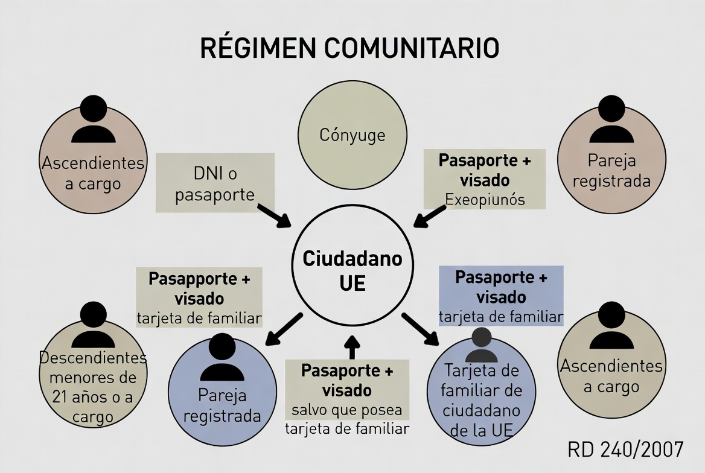
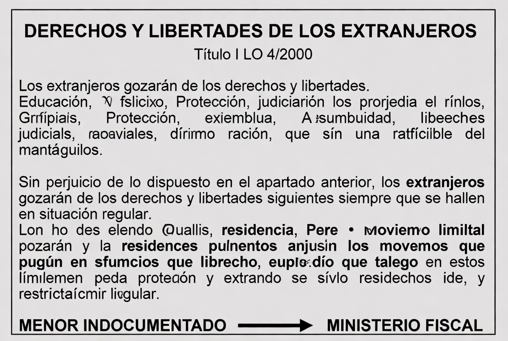
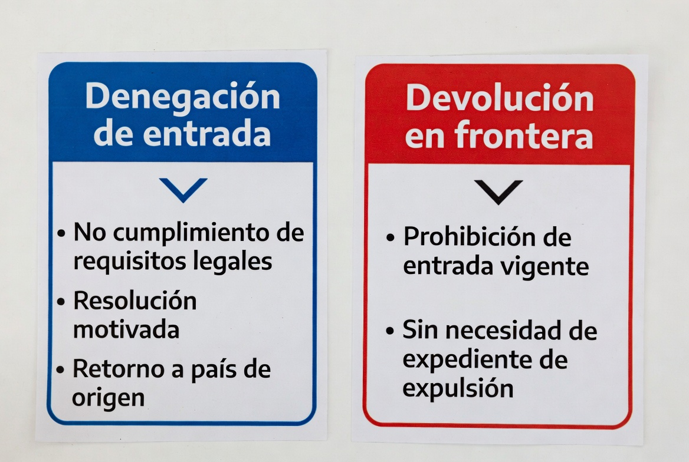
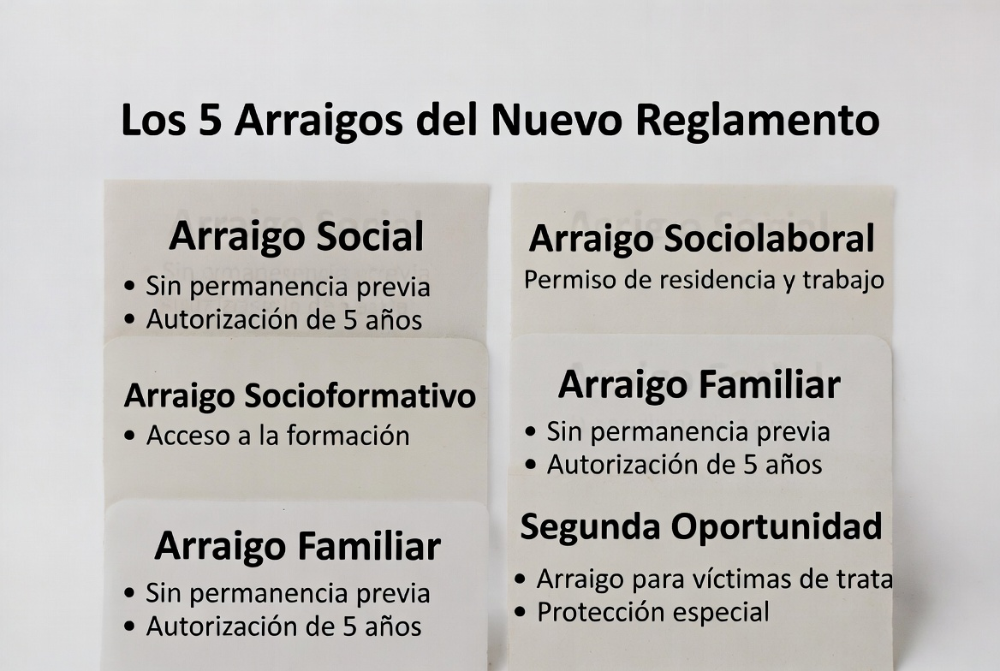

# TEMA 10 · ENTRADA, LIBRE CIRCULACIÓN Y RESIDENCIA EN ESPAÑA
### Policía Nacional · Escala Básica · Bloque A: Ciencias Jurídicas
🛡️ **ACADEMIA EN VIGOR** · *El temario que nunca descansa*
📄 **Versión EL PARTE** — lo esencial, al grano, para repasar rápido. Su hermana mayor, **EL ATESTADO**, desarrolla este tema a fondo con todo el detalle. [¿Qué es esto?](../../docs/parte-y-atestado.md)

---

# 📋 MAPA DEL TEMA

**Qué vas a estudiar:** las dos puertas de España. La puerta VIP de los **ciudadanos de la UE y sus familiares** (RD 240/2007: régimen comunitario) y la puerta general de los **demás extranjeros** (LO 4/2000 y su Reglamento): derechos, requisitos de entrada, y el catálogo de estancias y residencias — con los arraigos como plato estrella.

**⚡ ATENCIÓN, TEMA RECIÉN REFORMADO:** desde el **20 de mayo de 2025** rige el **NUEVO Reglamento de Extranjería, RD 1155/2024**, que sustituyó al histórico RD 557/2011: reordenó los arraigos (ahora CINCO modalidades), acortó la permanencia exigida a **2 años** y amplió el visado de búsqueda de empleo a **12 meses**. El tribunal ya pregunta la versión nueva (dos preguntas en octubre de 2025) — los temarios sin actualizar responden con cifras muertas.

**Peso en el examen:** 13 preguntas validadas 2021-2025 — top 5 del examen, presente en todas las convocatorias. Los imanes: el RD 240/2007 (la entrada del familiar de comunitario), la pareja devolución/denegación de entrada, la TIE y los plazos de las autorizaciones.

**Normativa clave:**
| Norma | Qué regula aquí |
|---|---|
| **RD 240/2007** | Régimen de ciudadanos UE/EEE/Suiza y sus familiares |
| **LO 4/2000 (LOEX)** | Derechos y libertades de los extranjeros; entrada y salida |
| **RD 1155/2024** 🆕 | Reglamento de Extranjería vigente (desde 20-5-2025) |

**Estructura del tema (4 partes ≈ 4 audios):**
```
ENTRADA, CIRCULACIÓN Y RESIDENCIA
├── PARTE 1 · La puerta VIP: el régimen comunitario ⭐
│   └── 1. RD 240/2007: quiénes, entrada y residencia
├── PARTE 2 · Derechos y libertades de los extranjeros
│   └── 2. El Título I de la LOEX, lo esencial
├── PARTE 3 · La frontera: entrada y salida
│   └── 3. Requisitos, denegación de entrada y devolución ⭐
└── PARTE 4 · Estancia y residencia (RD 1155/2024) ⭐⭐
    ├── 4. Estancia, estudios y la TIE
    └── 5. Residencia temporal: trabajo, arraigos 🆕 y larga duración
```

---
---

# 🟦 PARTE 1 · LA PUERTA VIP: EL RÉGIMEN COMUNITARIO ⭐

# 📖 1. EL RD 240/2007: QUIÉNES, ENTRADA Y RESIDENCIA
📅 **Ha caído:** 2023 (×2) · 2022 — a quién se aplica y cómo entra el familiar de comunitario.


## 1.1. A quién se aplica ⭐
- A los ciudadanos de los Estados de la **UE y del EEE** (Islandia, Noruega, Liechtenstein) y, por acuerdo, **Suiza**.
- ⭐ Y a sus **FAMILIARES**, cualquiera que sea su nacionalidad (cayó en 2022), cuando le acompañen o se reúnan con él:
  - El **cónyuge** (no separado legalmente) y la **pareja registrada** en registro público.
  - Los **descendientes** directos (propios o del cónyuge) **menores de 21 años o mayores a su cargo**, o con discapacidad.
  - Los **ascendientes** directos (propios o del cónyuge) **que vivan a su cargo**.

## 1.2. La entrada ⭐⭐ (la pregunta favorita)
- **El ciudadano UE:** entra con su **DNI o pasaporte** válido y en vigor. Sin visado, sin justificar nada.
- **El familiar nacional de un tercer país:** necesita **PASAPORTE + VISADO de entrada** (cayó en 2023)... **SALVO** que sea titular de una **TARJETA DE RESIDENCIA DE FAMILIAR de ciudadano de la Unión** (española o de otro Estado que aplique plenamente Schengen): entonces queda ⭐ **EXENTO de visado Y de la obligación de estampar sello** de entrada/salida en el pasaporte (cayó en 2023, literal).

## 1.3. La residencia
- Estancias de **hasta 3 meses:** basta el documento de entrada.
- Más de 3 meses: el ciudadano UE se inscribe en el **Registro Central de Extranjeros** (obtiene el **certificado de registro**); el familiar de tercer país solicita la **tarjeta de residencia de familiar** (validez general de 5 años).
- **Residencia PERMANENTE:** tras **5 años** de residencia legal continuada.

> 💡 **EN CRISTIANO**
> El régimen comunitario es la fila rápida del aeropuerto, y arrastra a la familia: el ciudadano UE pasa con su DNI, y su familia extracomunitaria pasa con visado... salvo que ya tenga "el carné de familia" (la tarjeta de residencia de familiar), que funciona como un pase VIP: ni visado ni sello. El examen adora esa tarjeta — apréndete sus dos superpoderes.

> 🚔 **EN LA CALLE**
> Esto es control de fronteras puro: en el puesto distinguirás en segundos si aplicas régimen comunitario o general, porque cambia TODO — documentación exigible, sellado, y hasta las medidas posibles (a un comunitario no se le deniega la entrada ni se le expulsa salvo razones graves de orden público tasadas). El RD 240/2007 es de las normas que más aplicarás si tu destino es Extranjería y Fronteras.

---
---

# 🟦 PARTE 2 · DERECHOS Y LIBERTADES DE LOS EXTRANJEROS

# 📖 2. EL TÍTULO I DE LA LOEX, LO ESENCIAL
📅 **Ha caído:** 2022 · 2021 — el menor indocumentado y los límites a la circulación.


Los extranjeros gozan en España de los derechos del Título I de la CE **en los términos de los tratados y la ley** (recuerda el art. 13 CE del tema 2). Lo más preguntado:
- **Documentación (art. 4):** derecho y **deber** de conservar la documentación que acredite su identidad y situación — no pueden ser privados de ella, salvo los supuestos legales.
- ⭐ **Libertad de circulación (art. 5):** los extranjeros en situación legal circulan libremente; las **medidas limitativas** solo caben por **resolución judicial** (como medida cautelar en procedimientos) o, con carácter general, **en los estados de EXCEPCIÓN o de SITIO** (cayó en 2021 con opciones todas incorrectas — el tribunal jugó con "estado de alarma" y con autoridades administrativas: ninguna vale).
- **Educación:** los **menores de 16 años** tienen el derecho y el DEBER (enseñanza básica obligatoria y gratuita); los menores de 18, derecho a la enseñanza posobligatoria.
- **Trabajo:** derecho a ejercer actividad remunerada cuando cuenten con la autorización correspondiente.
- **Tutela judicial efectiva y asistencia jurídica gratuita** (esta última acreditando insuficiencia de recursos, en igualdad con los españoles).
- ⭐ **Menores extranjeros no acompañados (art. 35):** cuando se localice a un extranjero **indocumentado cuya minoría de edad no pueda establecerse con seguridad**, se comunica al **MINISTERIO FISCAL**, que dispondrá la determinación de la edad (pruebas en instituciones sanitarias) — cayó en 2022, y es actuación policial diaria.

---
---

# 🟦 PARTE 3 · LA FRONTERA: ENTRADA Y SALIDA

# 📖 3. REQUISITOS, DENEGACIÓN DE ENTRADA Y DEVOLUCIÓN ⭐⭐
📅 **Ha caído:** 2022 (×2) — la pareja de conceptos que el tribunal siempre cruza.


## 3.1. Requisitos de entrada (art. 25 LOEX)
Por **puesto habilitado**, con **pasaporte o documento de viaje** válido, **visado** cuando sea exigible, acreditación de **medios económicos** y del objeto de la estancia, y **no estar sujeto a prohibición de entrada** ni suponer peligro para la salud, el orden público o las relaciones internacionales de España. La estancia de corta duración: máximo **90 días** (por período de 180).

## 3.2. La pareja de examen: DENEGACIÓN vs DEVOLUCIÓN ⭐⭐
| | **DENEGACIÓN DE ENTRADA** | **DEVOLUCIÓN** |
|---|---|---|
| Cuándo | En **frontera**: el extranjero **no cumple los requisitos de entrada** (cayó en 2022) | ⭐ Extranjeros que **contravienen una PROHIBICIÓN DE ENTRADA vigente** (cayó en 2022) o que **pretenden entrar ilegalmente** (interceptados en la frontera o sus inmediaciones) |
| Cómo | **Resolución motivada**, con información de recursos y derecho a asistencia letrada (gratuita en su caso) e intérprete | **NO requiere expediente de EXPULSIÓN** — es un procedimiento más ágil |
| Efecto | **Retorno** al punto de origen | Salida del territorio; si la devolución es por prohibición vigente, se **reinicia el plazo** de la prohibición |

⚠️ **La tercera en discordia** (para que no te la cuelen): la **EXPULSIÓN** es una **sanción** que requiere expediente y la verás en el tema 11 — no la confundas con estas dos medidas de frontera.

## 3.3. Salidas
Libres por puestos habilitados, con las excepciones legales (prohibiciones de salida acordadas judicialmente, etc.).

> 💡 **EN CRISTIANO**
> Tres palabras que parecen lo mismo y no lo son: **denegación** = "no entras" (llegaste a la ventanilla y no cumples); **devolución** = "te devuelvo sin papeleo" (tenías prohibido entrar o saltaste la valla); **expulsión** = "te sanciono con irte" (estabas dentro, expediente mediante — tema 11). De la más suave a la más grave, y solo la última es una sanción.

---
---

# 🟦 PARTE 4 · ESTANCIA Y RESIDENCIA (RD 1155/2024) ⭐⭐

# 📖 4. ESTANCIA, ESTUDIOS Y LA TIE
📅 **Ha caído:** 2022 (×2) — la TIE y el residente en formación.
- **ESTANCIA:** permanencia de hasta **90 días** (la del turista).
- **Estancia por ESTUDIOS:** para cursar estudios, formación, prácticas o voluntariado. ⭐ Habilita para trabajar en los términos reglamentarios, y a los **residentes en formación sanitaria como especialistas** (MIR y análogos) **les basta su autorización de estudios/formación** para la actividad (cayó en 2022).
- ⭐ **La TIE (Tarjeta de Identidad de Extranjero):** deben obtenerla los extranjeros con **visado o autorización para permanecer en España por MÁS DE SEIS MESES** (cayó en 2022) — la expide la Policía Nacional (¿recuerdas la División de Documentación del tema 8?).

# 📖 5. RESIDENCIA TEMPORAL: TRABAJO, ARRAIGOS 🆕 Y LARGA DURACIÓN
📅 **Ha caído:** 2025-2 (×2) · 2021 — arraigo familiar de 5 años, visado de búsqueda de empleo de 12 meses y el trabajo de temporada.


## 5.1. El mapa general
- **Residencia TEMPORAL:** autoriza a permanecer **más de 90 días y menos de 5 años**.
- **Residencia de LARGA DURACIÓN:** autoriza a residir y trabajar **indefinidamente**, en igualdad con los españoles; se accede, con carácter general, tras **5 años** de residencia temporal continuada.

## 5.2. Residencia y trabajo
- Por **cuenta ajena** y por **cuenta propia** (con sus requisitos de contrato/actividad).
- ⭐ **Trabajo de TEMPORADA** (cuenta ajena de duración determinada): hasta **NUEVE MESES dentro de un período de doce** (cayó en 2021 — el clásico de las campañas agrícolas).
- ⭐ **VISADO DE BÚSQUEDA DE EMPLEO:** 🆕 autoriza a desplazarse a España para buscar trabajo durante **DOCE MESES** (cayó en 2025 — el RD 1155/2024 lo amplió desde los antiguos tres meses: si un test viejo te ofrece "3 meses", está desactualizado).

## 5.3. Los ARRAIGOS del RD 1155/2024 🆕 ⭐⭐
El nuevo Reglamento reordenó el arraigo en **CINCO modalidades**, con una regla general de **permanencia previa continuada en España de DOS AÑOS** (antes eran tres):
1. **Arraigo SOCIAL** — vínculos y medios acreditados.
2. **Arraigo SOCIOLABORAL** — con relación laboral acreditada.
3. **Arraigo SOCIOFORMATIVO** — compromiso de formación (heredero del antiguo "arraigo para la formación").
4. ⭐ **Arraigo FAMILIAR** — para progenitores/tutores de menor español o de nacional UE, y otros vínculos cualificados: **NO exige permanencia previa** y su autorización dura **CINCO AÑOS** (cayó literal en 2025 — las demás autorizaciones de arraigo duran 1 año).
5. **Arraigo de SEGUNDA OPORTUNIDAD** — 🆕 la novedad absoluta: para quienes **tuvieron una autorización de residencia y no pudieron renovarla** en los dos años anteriores.

## 5.4. Reagrupación familiar
El residente (en general, tras un año y con autorización renovada) puede reagrupar a su cónyuge o pareja, hijos menores o con discapacidad, y ascendientes mayores de 65 a cargo cuando existan razones que la justifiquen.

> 💡 **EN CRISTIANO**
> Piensa en la residencia como una escalera: turista (90 días) → temporal (hasta 5 años, por trabajo, estudios o arraigo) → larga duración (a los 5 años, ya casi como un español). Y los arraigos son la puerta de atrás legal para quien ya lleva tiempo aquí: el nuevo Reglamento la ensanchó — **2 años de permanencia en vez de 3, cinco modalidades**, y una joya nueva: la "segunda oportunidad" para el que tuvo papeles y los perdió. La cifra estrella: **arraigo familiar = 5 años de autorización y sin permanencia previa** — es el premium de los arraigos.

> 🚔 **EN LA CALLE**
> Cuando identifiques a un extranjero en situación irregular, su abogado hablará de arraigos antes que tú de expulsión — conocer el RD 1155/2024 mejor que él marca la diferencia en cómo enfocas la propuesta. Y el dato del turno de Extranjería: la TIE que expide tu propia casa (División de Documentación) es la llave que distingue en segundos al residente del que solo dice serlo.

---

# 🎯 LO QUE CAE

## Puntos calientes
1. RD 240/2007: se aplica a UE/EEE/Suiza **y a sus familiares de cualquier nacionalidad** (2022): cónyuge/pareja, descendientes <21 o a cargo, ascendientes a cargo.
2. Familiar de tercer país: **pasaporte + visado** (2023)... salvo **tarjeta de residencia de familiar → exento de visado Y de sello** (2023).
3. Circulación de extranjeros: límites solo por **resolución judicial** o **excepción/sitio** (2021).
4. Menor indocumentado de edad incierta → **Ministerio Fiscal** (art. 35, 2022).
5. Entrada: 90 días de estancia corta; requisitos del art. 25.
6. **Denegación de entrada** (no cumple requisitos, resolución motivada, retorno) vs **DEVOLUCIÓN** (prohibición de entrada vigente o entrada ilegal, **sin expediente de expulsión**) — 2022 (×2).
7. **TIE: visado o autorización superior a SEIS MESES** (2022).
8. Temporada: **9 meses en un período de 12** (2021).
9. 🆕 **Visado de búsqueda de empleo: 12 MESES** (2025, RD 1155/2024).
10. 🆕 Los **5 arraigos** del RD 1155/2024; permanencia general de **2 años**; **arraigo familiar: sin permanencia previa y autorización de 5 AÑOS** (2025).
11. Larga duración: a los **5 años** de residencia continuada.

## Trampas del tribunal
- ⚠️ "El familiar con tarjeta de residencia de familiar necesita visado" → **exento** de visado y de sello.
- ⚠️ Cruzar la pareja: "no cumple requisitos en frontera → devolución" → NO: **denegación de entrada**; la devolución es para prohibición vigente o entrada ilegal.
- ⚠️ "La devolución requiere expediente de expulsión" → NO lo requiere.
- ⚠️ "Visado de búsqueda de empleo: 3 meses" → cifra MUERTA del reglamento antiguo; ahora **12 meses**.
- ⚠️ "Arraigo: 3 años de permanencia" → ahora **2 años** (y el familiar, ninguna).
- ⚠️ "La TIE se exige a partir de 90 días" → a partir de **6 meses**.
- ⚠️ "El menor indocumentado se comunica al Juez de Menores" → al **Ministerio Fiscal**.

## Mnemotecnias
- La entrada del familiar: **"con tarjeta, ni visado ni sello — pase VIP"**.
- La escalera: **"90 días - 5 años - para siempre"** (estancia → temporal → larga duración).
- Los 5 arraigos: **"So-So-So-Fa-Se"** → SOcial, SOciolaboral, SOcioformativo, FAmiliar, SEgunda oportunidad (*"el arraigo suena a solfeo"*).
- Cifras nuevas del 1155/2024: **"2 de permanencia, 12 de búsqueda, 5 el familiar"**.
- La pareja de frontera: **"DEniegan al que llega mal; DEvuelven al que ya estaba vetado"**.

## Mini-test (10 preguntas)

1. El RD 240/2007 se aplica a los familiares de ciudadanos de la UE:
   a) Solo si son también ciudadanos comunitarios   b) Cualquiera que sea su nacionalidad ✅   c) Solo al cónyuge y descendientes

2. El familiar de comunitario, nacional de un tercer país, titular de una tarjeta de residencia de familiar de ciudadano de la Unión:
   a) Necesita visado, pero no sello   b) Está exento de visado y de sello en el pasaporte ✅   c) Necesita visado y sello

3. La minoría de edad de un extranjero indocumentado que no pueda establecerse con seguridad se comunica a:
   a) El Juez de Menores   b) El Ministerio Fiscal ✅   c) La Delegación del Gobierno

4. Al extranjero que no reúne los requisitos de entrada en el puesto fronterizo se le aplica:
   a) La devolución   b) La denegación de entrada ✅   c) La expulsión

5. Al extranjero que pretende entrar contraviniendo una prohibición de entrada vigente se le aplica:
   a) La devolución, sin necesidad de expediente de expulsión ✅   b) La expulsión, previo expediente   c) El retorno voluntario

6. Deben obtener la Tarjeta de Identidad de Extranjero quienes cuenten con visado o autorización para permanecer en España por más de:
   a) 90 días   b) Seis meses ✅   c) Un año

7. La autorización de residencia y trabajo de temporada por cuenta ajena permite trabajar hasta:
   a) Seis meses en un período de doce   b) Nueve meses en un período de doce ✅   c) Doce meses improrrogables

8. Conforme al RD 1155/2024, el visado para la búsqueda de empleo autoriza a permanecer en España durante:
   a) Tres meses   b) Seis meses   c) Doce meses ✅

9. La autorización de residencia por arraigo familiar tiene una duración de:
   a) Un año   b) Dos años   c) Cinco años ✅

10. La regla general de permanencia previa y continuada en España para los arraigos del RD 1155/2024 es de:
    a) Dos años ✅   b) Tres años   c) Cinco años

## 📅 Así lo preguntaron
**13 preguntas en los exámenes oficiales validados (2021-2025)** — top 5 del examen:
- **2025-2 (2):** duración del arraigo familiar (5 años, RD 1155/2024); duración del visado de búsqueda de empleo (12 meses).
- **2023 (2):** entrada del familiar con tarjeta (exento de visado y sello); documentación del familiar a cargo (pasaporte + visado).
- **2022 (6):** la TIE (más de 6 meses); ámbito del RD 240/2007 (familiares); entrada en vigor del CAAS (1995 — conecta con el tema 4); residente en formación sanitaria; devolución por prohibición vigente; denegación de entrada por incumplir requisitos; menor indocumentado al Fiscal.
- **2021 (2):** trabajo de temporada (9 meses); medidas limitativas de la circulación (ninguna opción correcta: solo resolución judicial o excepción/sitio).

<!-- 📅 pendiente: sumar el examen de la pareja 2024/2025-1 cuando se confirme su etiqueta (incluye: temporada 9 de 12; arraigo para la formación del derogado RD 629/2022 — pregunta ya histórica tras el RD 1155/2024) -->

---

*Tema 10 · v1.0 (El Parte) · 4 partes dimensionadas para audio-repasos. Actualizado al RD 1155/2024 (en vigor desde el 20-5-2025) — tema bajo vigilancia del Vigía BOE (⚠️ pendiente: fijar el boe_id del RD 1155/2024 en el catálogo, sustituyendo al del RD 557/2011). El Atestado desarrollará: el catálogo completo de visados, los requisitos de cada arraigo, la reagrupación al detalle y el régimen de los estudiantes.*
